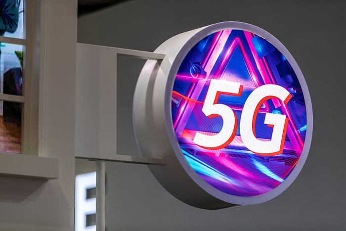
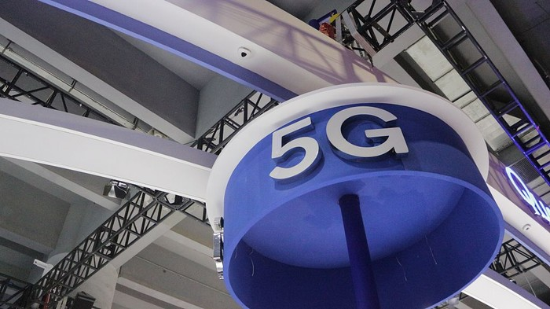

万众瞩目的5G网络到来之际，中国移动给出了5G手机售价预判：5G手机售价预计在8000元以上。对于这个预判价格，相当多的网友表示始料未及，“原本以为5G网络提速降费是一大喜事儿，却不料在终端设备上要价这么高”，“5G手机，买不起买不起”。

　　我们来看看中国移动具体的怎么说的：根据中国移动在5G创新合作峰会的预判，在2019年5G预商用阶段，测试、预商用5G终端可能在30款以上，5G手机售价预计会在8000元以上。而到了2020年5G规模商用阶段，5G手机的门槛可能降至1000元以上级别。

　　5G手机售价如此之高，一方面是因为5G网络到2019年仍处于预商用阶段，各方面部署尚未达到规模，因此前期的芯片研发、设备投入、运营费用会相对更高，因此需要通过提高终端售价以求平衡投入。另一方面，5G终端目前仍处于测试研发阶段，同样没能到达大规模量产的时间，芯片购入、网络调节的成本也较成熟的4G终端设备高得多，因此5G手机售价在2019年势必较4G手机更高。

　　在一项技术未成熟普及之前，用户除了需要承受一定的未知风险以外，高昂的价格也是不可少的一项条件。5G网络和5G手机也是如此，要想先人一步体验高速的5G网络和5G手机，就得为之支付尝鲜价格以及在使用过程中可能出现的种种不稳定情况。这其实是可以理解的。

　　但对于高达8000元的5G手机，许多用户显然是不能接受的。这个价格，是目前主流4G手机的2~4倍，若是苹果手机，价格可能要再翻一倍。所以在权衡价格和性能之下，在2019年期间，更多的用户仍会选择使用4G手机，对5G手机表示观望。

　　希望5G大规模商用阶段能够在2020年准时到来，让广大人民享受到高速实惠的新网络和新手机。
