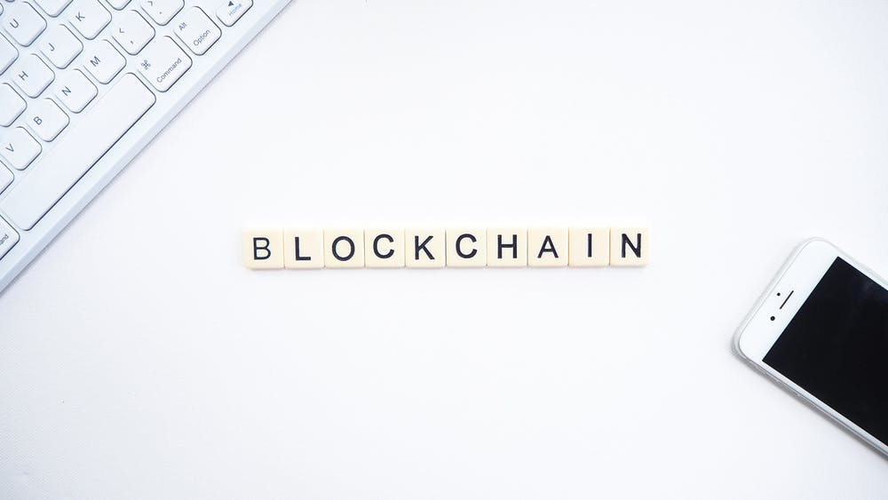
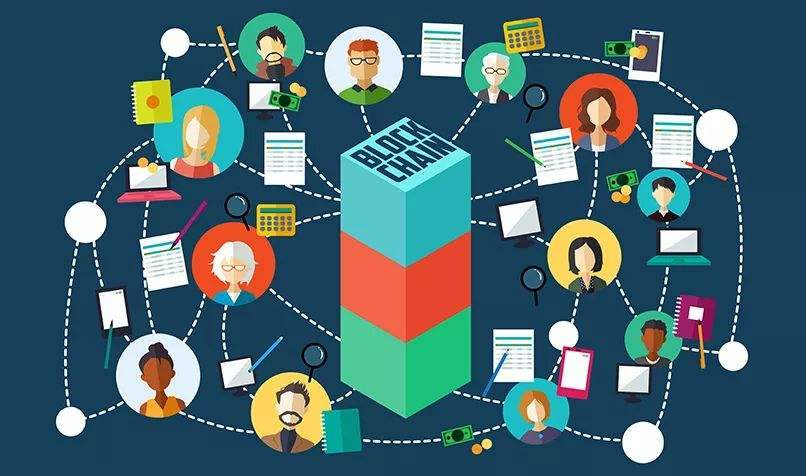
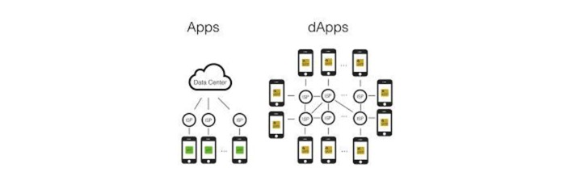

什么是Dapp，相比较于app，有什么不同？

<!-- more -->
# 一、什么是Dapp？
DAPP是Decentralized Application的缩写，即去中心化应用，也有人称为分布式应用。它被认为开启了区块链3.0时代。DAPP就是在底层区块链平台衍生的各种分布式应用，是区块链世界中的服务提供形式。DAPP之于区块链，有些类似APP之于IOS和Android。

# 二、Dapp的特点

> 1.Dapp通过网络节点去中心化操作
可以运行在用户的个人设备之上，比如：手机、个人电脑。永远属于用户，也可以自由转移给任何人。
> 2.运行在对等网络上
不依赖中心服务器，不需要专门的通信服务器传递消息，也不需要中心数据库来记数据。数据保存在用户个人空间，可能是手机，也可能是个人云盘。
> 3.数据加密后存储在区块链上
可以依托于区块链进行产权交易、销售，承载没有中介的交易方式。
> 4.参与者信息被安全存储
可以保护数字资产，保证产权不会泄露、被破坏。
> 5.Dapp必须开源、自治
可以由用户自由打包生成，签名标记所属权。它的发布不受任何机构限制。 各种创意与创新可以自由表达和实现。

# 三、Dapp与app的区别

从客户体验角度
APP相对于DAPP有四大问题，一是截留用户数据，二是垄断生态平台，三是保留用户权利，四是限制产品标准扼杀创新。但是由于Dapp得到的是去中心化，所以响应速度固然没有中心化服务器快。
从技术角度
DAPP与APP区别主要有两个方面，一是APP在安卓或苹果系统上安装并运行；DAPP在区块链公链上开发并结合智能合约；二是APP信息存储在数据服务平台，可以运营方直接修改；DAPP数据加密后存储在区块链，难以篡改。

# 四、Dapp的分类
根据去中心化的对象，DAPP可以进行分类。对于一个中心化服务器而言，包括计算、存储能力，以及所产生的数据三个方面，而由数据之前的关联度又产生了某种特定的“关系”。因此一般而言，去中心化包括以下几类：
> 1.基于计算能力的去中心化（Pow机制）
> 2.基于存储能力的去中心化（IPFS）
> 3.基于数据的去中心化（Steemit）
> 4.基于关系的去中心化（去中心化ID）
