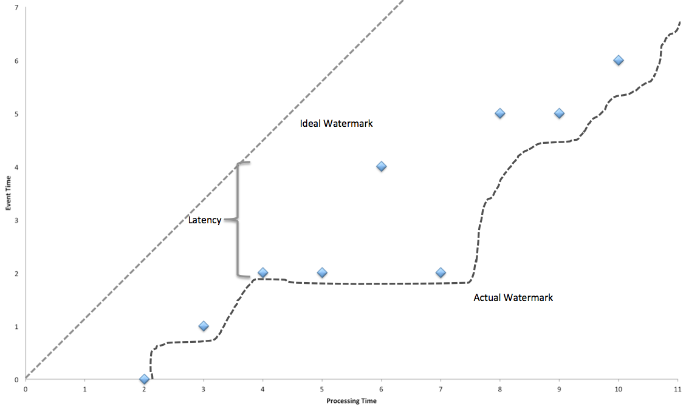

flink，号称第二代实时大数据计算引擎，被他的名头吸引过来，我也来学习学习，下面是我在学习过程中遇到的一些问题和解决方案。

<!-- more -->

# 如何保证数据处理的有序性
&nbsp;&nbsp;&nbsp;&nbsp;flink通过watermark来解决这个问题。当使用事件时间来进行对事件排序时，很有必要跟踪事件的处理时间，例如在一个窗口操作t到t+5中，只有当系统能够保证没有数据的事件时间小于t+5时，然后对这个窗口中的数据进行排序计算，才是保证数据处理的有序性，那么如何确定没有数据的事件时间小于t+5呢？flink是使用watermark来确定的，它会追踪穿过系统中的每一条数据，当它知道没有数据对应的时间戳小于t1后，它会将这个t1水印广播📢到下流operators，一旦watermark被提交，下流operators在获取watermark值时就会发现并作出相应的反应。
&nbsp;&nbsp;&nbsp;&nbsp;在窗口操作中，窗口会等待t+5的watermark，然后触发计算，并向下游广播t+5的watermark。
&nbsp;&nbsp;&nbsp;&nbsp;当所有的operater都在等待他的watermark和输入数据时，系统会被延时，从而影响时效性。
&nbsp;&nbsp;&nbsp;&nbsp;下图是实际水印、事件时间与处理时间之间的关系：

学习使我快乐。