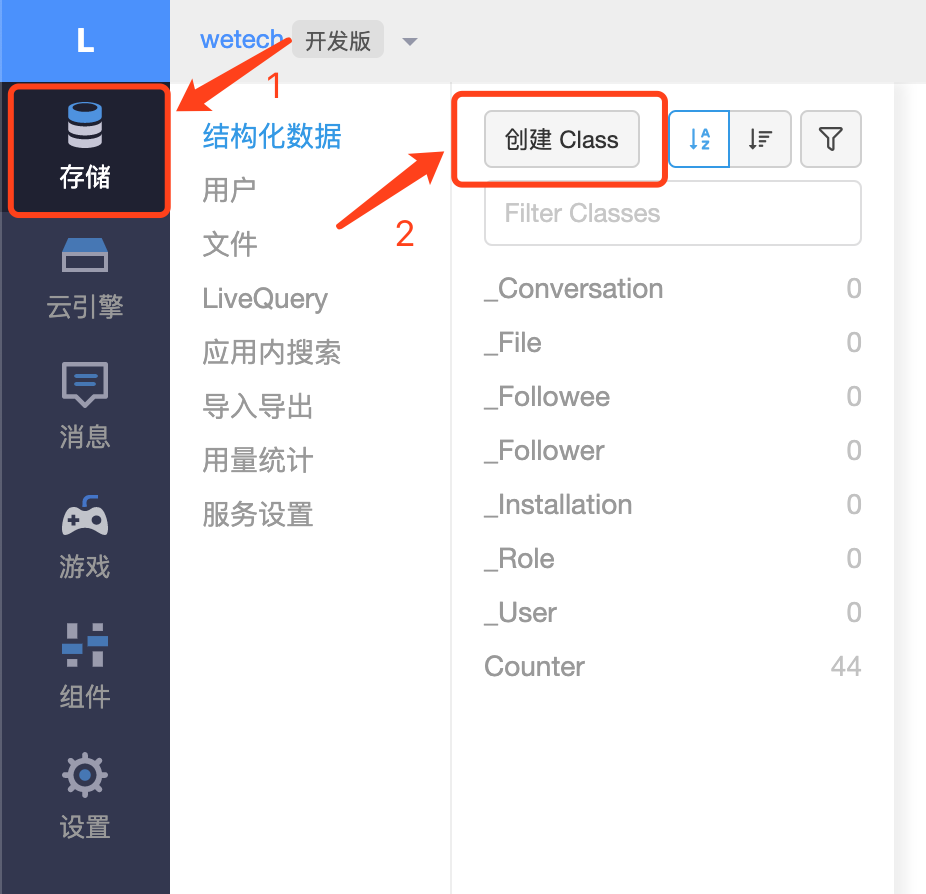

&nbsp;&nbsp;&nbsp;&nbsp;&nbsp;&nbsp;相比于国内和国外的开源技术和产品，我更青睐国外的，更何况是google的产品呢？
&nbsp;&nbsp;&nbsp;&nbsp;&nbsp;&nbsp;目前Hexo的阅读排行功能，用的最多的是Google的Firestore和国内的Leancloud。由于尝试了firestore2天，一些js和中文乱码的问题困扰着做后端的我，决定放弃firestore，使用Leancloud了，不过确实比firestore配置简单。下面来看看吧。


<!-- more -->
&nbsp;&nbsp;&nbsp;&nbsp;&nbsp;&nbsp;主要的实现原理就是将每篇文章的访问url和次数存储到数据库中，每篇文章初始化的次数为0，每访问一次+1，取出列表时，对访问次数降序排序展示到页面上，就这么简单，主要使用js实现。

# 1.新建页面

&nbsp;&nbsp;&nbsp;&nbsp;&nbsp;&nbsp;`hexo n page top`新建页面，会生成 top 目录，编辑其中自动生成的 index.md 文件，将其中的代码替换一下，这个代码主要从leancloud云数据库中取出文章url和对应的阅读数量count进行排序展示，具体如下：
```
---
title: top
date: 2019-11-24 14:34:05
---

<div id="top"></div>
<script src="https://cdn1.lncld.net/static/js/av-core-mini-0.6.4.js"></script>
<script>AV.initialize("leancloud-appid", "leancloud-appkey");</script>
<script type="text/javascript">
  var time=0
  var title=""
  var url=""
  var query = new AV.Query('Counter');
  query.notEqualTo('id',0);
  query.descending('time');
  query.limit(1000);
  query.find().then(function (todo) {
    for (var i=0;i<1000;i++){
      var result=todo[i].attributes;
      time=result.time;
      title=result.title;
      url=result.url;
      // var content="<a href='"+"http://wetech.top"+url+"'>"+title+"</a>"+"<br>"+"<font color='#fff'>"+"阅读次数："+time+"</font>"+"<br><br>";
      var content="<p>"+"<font color='#1C1C1C'>"+"【文章热度:"+time+"℃】"+"</font>"+"<a href='"+"http://wetech.top"+url+"'>"+title+"</a>"+"</p>";
      document.getElementById("top").innerHTML+=content
    }
  }, function (error) {
    console.log("error");
  });
</script>
```
&nbsp;&nbsp;&nbsp;&nbsp;&nbsp;&nbsp;并将其中的 leancloud_appid、leancloud_appkey 和页面链接替换为你的。
&nbsp;&nbsp;&nbsp;&nbsp;&nbsp;&nbsp;这2个参数可以从leancloud申请：https://console.leancloud.app/login.html
&nbsp;&nbsp;&nbsp;&nbsp;&nbsp;&nbsp;登录leancloud，进入控制台，操作步骤如下：


# 2.配置菜单显示
&nbsp;&nbsp;&nbsp;&nbsp;&nbsp;&nbsp;编辑主题配置文件 themes\next\_config.yml，添加 top：
```
menu:
  home: / || home
  top: /top/ || signal
```
&nbsp;&nbsp;&nbsp;&nbsp;&nbsp;&nbsp;新增菜单栏的显示名称 hexo/theme/next/languages/zh-Hans.yml，同样新增 top 对应的中文：
```
menu:
  home: 首页
  archives: 归档
  categories: 分类
  tags: 标签
  about: 关于
  search: 搜索
  schedule: 日程表
  sitemap: 站点地图
  commonweal: 公益404
  top: 阅读排行
```

&nbsp;&nbsp;&nbsp;&nbsp;&nbsp;&nbsp;开启leancloud-analysis统计功能，主要就是将url和访问量存储到云数据库中，参考文件theme/next/layout/_script/lean-analytics.swig文件
&nbsp;&nbsp;&nbsp;&nbsp;&nbsp;&nbsp;修改文件：theme/next/_config.yml
```
# Show number of visitors to each article.
# You can visit https://leancloud.cn get AppID and AppKey.
leancloud_visitors:
  enable: true
  app_id: YJgpFR6aBjuB1wPKjFFRp443-MdYXbMMI
  app_key: r8fnn6zRKLkDw1iaEe8g3qwb
```

&nbsp;&nbsp;&nbsp;&nbsp;&nbsp;&nbsp;最后，hexo d -g 部署后可以显示。


- - -
<b>Keep learning.</b>