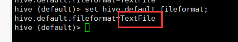
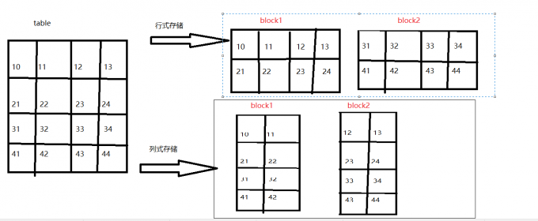
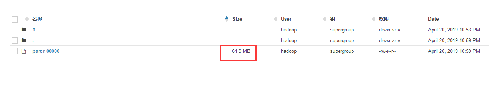
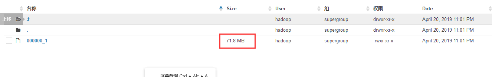
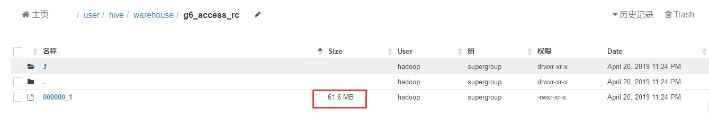
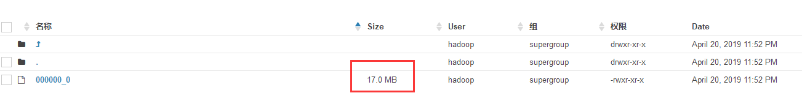
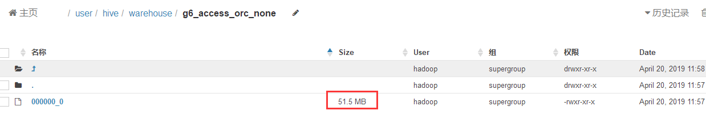
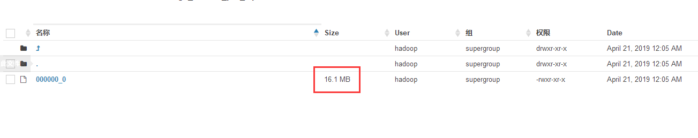

&nbsp;&nbsp;&nbsp;&nbsp;&nbsp;&nbsp;Hive表数据实际存储在HDFS文件系统中，而不同的文件格式，会有不同的特性，我们在数据仓库建设中，如何根据仓库不同层次特点设计不同的文件格式呢？下面来看下。


<!-- more -->

&nbsp;&nbsp;&nbsp;&nbsp;&nbsp;&nbsp;<font color=#0099ff>常见的hive文件存储格式包括以下几类：TEXTFILE、SEQUENCEFILE、RCFILE、ORC。其中TEXTFILE为默认格式，建表时默认为这个格式，导入数据时会直接把数据文件拷贝到hdfs上不进行处理。SequenceFile、RCFile、ORC格式的表不能直接从本地文件导入数据，数据要先导入到TextFile格式的表中，然后再从TextFile表中用insert导入到SequenceFile、RCFile表中。</font>

# 一、hive中的file_format
- SEQUENCEFILE：行存储，生产中绝对不会用，k-v格式，二进制文件，比源文本格式占用磁盘更多；
- TEXTFILE：行存储，生产中用的多，行式存储。最简单的数据格式，便于和其他工具（Pig, grep, sed, awk）共享数据，便于查看和编辑；
- RCFILE：行列混合存储，生产中用的少；
- ORC：行列式存储，生产中最常用，OCFILE的升级版，查询效率最高。
- PARQUET：列式存储，生产中最常用，更高效的压缩和编码；
- AVRO：生产中几乎不用，不用考虑
- JSONFILE：生产中几乎不用，不用考虑
- INPUTFORMAT：生产中几乎不用，不用考虑
注意hive默认的文件格式是TextFile，可通过 `set hive.default.fileformat` 进行配置



# 二、行式存储与列式存储
&nbsp;&nbsp;&nbsp;&nbsp;&nbsp;&nbsp;行式存储与列式存储数据物理底层存储区别



# 结论：由上图可知
&nbsp;&nbsp;&nbsp;&nbsp;&nbsp;&nbsp;`行式存储`一定会把同一行数据存到同一个块中，在`select`查询的时候，是对所有字段的查询，不可以单独查询某一行
&nbsp;&nbsp;&nbsp;&nbsp;&nbsp;&nbsp;`列式存储`同一列数据一定是存储到同一个块中，换句话说就是不同的列可以放到不同块中，在进行select查询的时候可以单独查询某一列。

# 三、优缺点
## 1.列式存储
&nbsp;&nbsp;&nbsp;&nbsp;&nbsp;&nbsp;<b>优点</b>：当查询某个或者某几个字段的时候，只需要查看存储这几个字段的这几个`block`就可以了，大大的减少了数据的查询范围，提高了查询效率
&nbsp;&nbsp;&nbsp;&nbsp;&nbsp;&nbsp;<b>缺点</b>：当进行全字段查询的时候，数据需要重组，比单独查一行要慢

## 2.行式存储
&nbsp;&nbsp;&nbsp;&nbsp;&nbsp;&nbsp;<b>优点</b>：全字段查询比较快
&nbsp;&nbsp;&nbsp;&nbsp;&nbsp;&nbsp;<b>缺点</b>：当查询一张表里的几个字段的时候，底层依旧是读取所有的字段，这样查询效率降低，并且会造成不必要的资源浪费，而且，生产中很少会出现需要全字段查询的场景

# 四、hive文件格式配置实现以及对比
## 1.创建原始表默认TEXTFILE
- Hive数据表的默认格式，存储方式：行存储。
- 可以使用Gzip压缩算法，但压缩后的文件不支持split
- 在反序列化过程中，必须逐个字符判断是不是分隔符和行结束符，因此反序列化开销会比SequenceFile高几十倍。
```
CREATE EXTERNAL TABLE g6_access (
    cdn string,
    region string,
    level string,
    time string,
    ip string,
    domain string,
    url string,
    traffic bigint
)
ROW FORMAT DELIMITED
FIELDS TERMINATED BY '\t'
LOCATION '/g6/hadoop/access/clear/test/';
```

导入测试数据
```
[hadoop@hadoop001 data]$ ll
-rw-r--r-- 1 hadoop hadoop 68051224 Apr 17 17:37 part-r-00000
[hadoop@hadoop001 data]$ hadoop fs -put part-r-00000 /g6/hadoop/access/clear/test/
```
通过hue查看数据的大小    64.9MB



## 2.创建以 SEQUENCEFILE格式储存的表g6_access_seq，并使用g6_access中的数据
- 压缩数据文件可以节省磁盘空间，但Hadoop中有些原生压缩文件的缺点之一就是不支持分割。支持分割的文件可以并行的有多个mapper程序处理大数据文件，大多数文件不支持可分割是因为这些文件只能从头开始读。Sequence File是可分割的文件格式，支持Hadoop的block级压缩。
- Hadoop API提供的一种二进制文件，以key-value的形式序列化到文件中。存储方式：行存储。
- sequencefile支持三种压缩选择：NONE，RECORD，BLOCK。Record压缩率低，RECORD是默认选项，通常BLOCK会带来较RECORD更好的压缩性能。
- 优势是文件和hadoop api中的MapFile是相互兼容的
```
create table g6_access_seq
stored as SEQUENCEFILE
as select * from g6_access;
```
查看数据大小   71.8MB



&nbsp;&nbsp;&nbsp;&nbsp;&nbsp;&nbsp;结论：比默认的TEXTFILE格式的文件还要大，生产上基本上是不会用的

## 3.创建RCFILE数据存储格式表，，并使用g6_access中的数据
存储方式：数据按行分块，每块按列存储。结合了行存储和列存储的优点：
- 首先，RCFile 保证同一行的数据位于同一节点，因此元组重构的开销很低
- 其次，像列存储一样，RCFile 能够利用列维度的数据压缩，并且能跳过不必要的列读取
- 数据追加：RCFile不支持任意方式的数据写操作，仅提供一种追加接口，这是因为底层的 HDFS当前仅仅支持数据追加写文件尾部。
- 行组大小：行组变大有助于提高数据压缩的效率，但是可能会损害数据的读取性能，因为这样增加了 Lazy 解压性能的消耗。而且行组变大会占用更多的内存，这会影响并发执行的其他MR作业。 考虑到存储空间和查询效率两个方面，Facebook 选择 4MB 作为默认的行组大小，当然也允许用户自行选择参数进行配置。
```
create table g6_access_rc
stored as RCFILE
as select * from g6_access;
```
查看数据大小  61.6MB



&nbsp;&nbsp;&nbsp;&nbsp;&nbsp;&nbsp;结论：存储减少了3M左右，微不足道，读写性能也没有什么优势，生产也没有用他的理由

## 4.创建ORCFILE数据存储格式表，，并使用g6_access中的数据，默认是使用zlib压缩，支持`zlib`和`snappy`
- 存储方式：数据按行分块，每块按照列存储。 
- 压缩快，快速列存取。效率比rcfile高，是rcfile的改良版本。
```
create table g6_access_orc
stored as ORC
as select * from g6_access;
```

查看数据大小    17.0MB



## 5.创建ORCFILE数据存储格式表，不使用压缩，并使用g6_access中的数据
```
create table g6_access_orc_none
stored as ORC tblproperties ("orc.compress"="NONE")
as select * from g6_access;
```
查看数据大小    51.5MB



## 6.创建PARQUET数据存储格式表，不使用压缩，并使用g6_access中的数据
- 列式存储，生产中最常用，更高效的压缩和编码；
```
create table g6_access_par
stored as PARQUET
as select * from g6_access;
```

&nbsp;&nbsp;&nbsp;&nbsp;&nbsp;&nbsp;结论：ORC文件不压缩，比源文件少了10多MB，ORC文件采用默认压缩，文件只有源文件的四分之一
查看数据大小    58.3MB

## 7.创建PARQUET数据存储格式表，设置使用gzip压缩格式，并使用g6_access中的数据
```
set parquet.compression=gzip;
create table g6_access_par_zip
stored as PARQUET
as select * from g6_access;
```



&nbsp;&nbsp;&nbsp;&nbsp;&nbsp;&nbsp;结论：parquet格式文件大小是源文件的1/4左右。生产上也是好的选择

## 8.小结
TextFile默认格式，加载速度最快，可以采用Gzip进行压缩，压缩后的文件无法split，即并行处理。
SequenceFile压缩率最低，查询速度一般，将数据存放到sequenceFile格式的hive表中，这时数据就会压缩存储。三种压缩格式NONE，RECORD，BLOCK。是可分割的文件格式。
RCfile压缩率最高，查询速度最快，数据加载最慢。
相比TEXTFILE和SEQUENCEFILE，RCFILE由于列式存储方式，数据加载时性能消耗较大，但是具有较好的压缩比和查询响应。数据仓库的特点是一次写入、多次读取，因此，整体来看，RCFILE相比其余两种格式具有较明显的优势。
在hive中使用压缩需要灵活的方式，如果是数据源的话，采用RCFile+bz或RCFile+gz的方式，这样可以很大程度上节省磁盘空间；而在计算的过程中，为了不影响执行的速度，可以浪费一点磁盘空间，建议采用RCFile+snappy的方式，这样可以整体提升hive的执行速度。至于lzo的方式，也可以在计算过程中使用，只不过综合考虑（速度和压缩比）还是考虑snappy适宜。
Parquet格式，列式存储，生产中最常用，更高效的压缩和编码；

# 五、读取数据量对比
&nbsp;&nbsp;&nbsp;&nbsp;&nbsp;&nbsp;直接执行 select 查询，观察日志 尾部HDFS Read: 190XXX ,就可知道读取数据量了。

# 六、总结
&nbsp;&nbsp;&nbsp;&nbsp;&nbsp;&nbsp;<b>行存储</b>：查询满足条件的一整行数据的时候，列存储则需要去每个聚集的字段找到对应的每个列的值，行存储只需要找到其中一个值，其余的值都在相邻地方，所以此时行存储查询的速度更快。
&nbsp;&nbsp;&nbsp;&nbsp;&nbsp;&nbsp;<b>列存储</b>：因为每个字段的数据聚集存储，在查询只需要少数几个字段的时候，能大大减少读取的数据量；每个字段的数据类型一定是相同的，列式存储可以针对性的设计更好的设计压缩算法。

&nbsp;&nbsp;&nbsp;&nbsp;&nbsp;&nbsp;数据仓库层次建设中：
1. stage层：数据是从业务库直接拉取过来的，没有做任何改动，后续的ETL操作会读取该层的全部字段数据，而且适合更新、查看，与其他组件进行交互，所以，该层设置为行存储较为合适，常见为Text格式；
2. ods层：从stage层获取数据，经过ETL清洗过程，得到格式统一（度量、维度等）的明细数据，后续事实表、中间表的建设会从这一层中获取某一部分数据，查询的是部分字段，因此，该层设置为列式存储比较合适，常见的文件格式为ORC、Parquet；
3. dwd层：有些事实表、中间表字段非常地多，我们会把他们拆分为许多分组，然后汇总在一起，此时，各个分组可以设置为行存储，而汇总后的事实表、中间表设置为列存储会比较合适；
4. report层/dws层：这一层数据量非常地小，主要作为报表层，数据集市在这里产生，分发给不同的小组或者部门查看分析用，故他们会查看所有的数据，这层设置为行存储会比较合适；

&nbsp;&nbsp;&nbsp;&nbsp;&nbsp;&nbsp;上面是总结的一些经验，如果有异议，大家可以提出来一起讨论，数据仓库建设的路很漫长，我们一起一步一个脚印👣走起来。欢迎留言：chenzuoli709@163.com.

- - -
Doing the things you want to do.