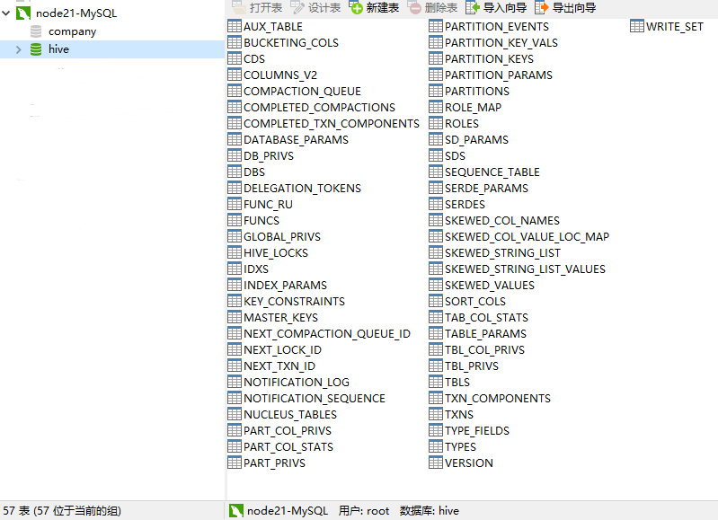
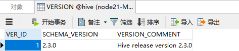
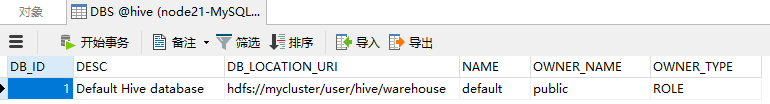
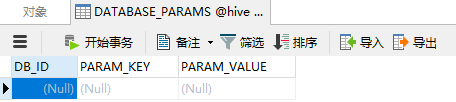

&nbsp;&nbsp;&nbsp;&nbsp;&nbsp;&nbsp;Hive的元数据信息通常存储在关系型数据库中，常用MySQL数据库作为元数据库管理。上一篇hive的安装也是将元数据信息存放在MySQL数据库中。


<!-- more -->
</br>


&nbsp;&nbsp;&nbsp;&nbsp;&nbsp;&nbsp;Hive的元数据信息在MySQL数据中有57张表

# 一、存储Hive版本的元数据表（VERSION）
```
VERSION   -- 查询版本信息
```


&nbsp;&nbsp;&nbsp;&nbsp;&nbsp;&nbsp;该表比较简单，但很重要。

VER_ID | SCHEMA_VERSION | VERSION_COMMENT
:-: | :-: | :-: 
ID主键 | Hive版本 | 版本说明
1 | 2.3.0 | Set by MetaStore

&nbsp;&nbsp;&nbsp;&nbsp;&nbsp;&nbsp;如果该表出现问题，根本进入不了Hive-Cli。
&nbsp;&nbsp;&nbsp;&nbsp;&nbsp;&nbsp;比如该表不存在，当启动Hive-Cli时候，就会报错”Table ‘hive.version’ doesn’t exist”。

# 二、Hive数据库相关的元数据表（DBS、DATABASE_PARAMS）
## 1、DBS
```
DBS　　　　 -- 存储Hive中所有数据库的基本信息
```


元数据表字段|说明|示例数据
:-:|:-:|:-:|
<b>DB_ID</b>|数据库ID|1
<b>DESC</b>|数据库描述|测试库
<b>DB_LOCATION_URI</b>|数据库HDFS路径|hdfs://mycluster/user/hive/warehouse
<b>NAME</b>|数据库名	 
<b>OWNER_NAME</b>|数据库所有者用户名	 
<b>OWNER_TYPE</b>|所有者角色|USER

## 2、DATABASE_PARAMS
```
DATABASE_PARAMS　　--该表存储数据库的相关参数，在CREATE DATABASE时候用
```

&nbsp;&nbsp;&nbsp;&nbsp;&nbsp;&nbsp;WITH DBPROPERTIES (property_name=property_value, …)指定的参数。

元数据表字段|说明|示例数据
:-:|:-:|:-:|
<b>DB_ID</b>|数据库ID	|2
<b>PARAM_KEY</b>	|参数名	|createdby
<b>PARAM_VALUE</b>	|参数值	|lxw1234
- 注意：
- - DBS和DATABASE_PARAMS这两张表通过DB_ID字段关联。

# 三、Hive表和视图相关的元数据表
&nbsp;&nbsp;&nbsp;&nbsp;&nbsp;&nbsp;主要有TBLS、TABLE_PARAMS、TBL_PRIVS，这三张表通过TBL_ID关联。

## 1、TBLS
&nbsp;&nbsp;&nbsp;&nbsp;&nbsp;&nbsp;该表中存储Hive表、视图、索引表的基本信息。

元数据表字段	|说明|	示例数据
:-:|:-:|:-:|
<b>TBL_ID</b>|	表ID|	1
<b>CREATE_TIME</b>|	创建时间|	1436317071
<b>DB_ID</b>	|数据库ID|	2，对应DBS中的DB_ID
<b>LAST_ACCESS_TIME</b>|	上次访问时间|	1436317071
<b>OWNER</b>	|所有者	|admin
<b>RETENTION</b>	|保留字段	|0
<b>SD_ID</b>	|序列化配置信息	|86，对应SDS表中的SD_ID
<b>TBL_NAME</b>|	表名|	student
<b>TBL_TYPE</b>|	表类型	|MANAGED_TABLE、EXTERNAL_TABLE、INDEX_TABLE、VIRTUAL_VIEW
<b>VIEW_EXPANDED_TEXT	</b>|视图的详细HQL语句	|select `lxw1234`.`pt`, `lxw1234`.`pcid` from `liuxiaowen`.`lxw1234`
<b>VIEW_ORIGINAL_TEXT</b>	|视图的原始HQL语句	|select * from lxw1234

## 2、TABLE_PARAMS
&nbsp;&nbsp;&nbsp;&nbsp;&nbsp;&nbsp;该表存储表/视图的属性信息。

元数据表字段|	说明|	示例数据
:-:|:-:|:-:|
<b>TBL_ID</b>	|表ID|	1
<b>PARAM_KEY</b>	|属性名	|totalSize、numRows、EXTERNAL
<b>PARAM_VALUE</b>	|属性值|	970107336、21231028、TRUE

## 3、TBL_PRIVS
&nbsp;&nbsp;&nbsp;&nbsp;&nbsp;&nbsp;该表存储表/视图的授权信息

元数据表字段|	说明|	示例数据
:-:|:-:|:-:|
<b>TBL_GRANT_ID</b>|	授权ID|	1
<b>CREATE_TIME</b>	|授权时间	|1436320455
<b>GRANT_OPTION</b>|	 	|0
<b>GRANTOR</b>	|授权执行用户	|liuxiaowen
<b>GRANTOR_TYPE</b>	|授权者类型	|USER
<b>PRINCIPAL_NAME</b>	|被授权用户	|username
<b>PRINCIPAL_TYPE</b>	|被授权用户类型	|USER
<b>TBL_PRIV</b>|	权限|	Select、Alter
<b>TBL_ID</b>	|表ID	|22，对应TBLS表中的TBL_ID

# 四、Hive文件存储信息相关的元数据表
&nbsp;&nbsp;&nbsp;&nbsp;&nbsp;&nbsp;主要涉及SDS、SD_PARAMS、SERDES、SERDE_PARAMS
&nbsp;&nbsp;&nbsp;&nbsp;&nbsp;&nbsp;由于HDFS支持的文件格式很多，而建Hive表时候也可以指定各种文件格式，Hive在将HQL解析成MapReduce时候，需要知道去哪里，使用哪种格式去读写HDFS文件，而这些信息就保存在这几张表中。

## 1、SDS
&nbsp;&nbsp;&nbsp;&nbsp;&nbsp;&nbsp;该表保存文件存储的基本信息，如INPUT_FORMAT、OUTPUT_FORMAT、是否压缩等。
&nbsp;&nbsp;&nbsp;&nbsp;&nbsp;&nbsp;TBLS表中的SD_ID与该表关联，可以获取Hive表的存储信息。

元数据表字段|	说明	|示例数据
:-:|:-:|:-:|
<b>SD_ID</b>|	存储信息ID|	1
<b>CD_ID</b>	|字段信息ID	|21，对应CDS表
<b>INPUT_FORMAT</b>|文件输入格式	|org.apache.hadoop.mapred.TextInputFormat
<b>IS_COMPRESSED</b>	|是否压缩	|0
<b>IS_STOREDASSUBDIRECTORIES</b>|	是否以子目录存储|	0
<b>LOCATION</b>	|HDFS路径	|hdfs://namenode/hivedata/warehouse/ut.db/t_lxw
<b>NUM_BUCKETS</b>	|分桶数量	|5
<b>OUTPUT_FORMAT</b>	|文件输出格式	|org.apache.hadoop.hive.ql.io.HiveIgnoreKeyTextOutputFormat
<b>SERDE_ID</b>|	序列化类ID|	3，对应SERDES表

## 2、SD_PARAMS
&nbsp;&nbsp;&nbsp;&nbsp;&nbsp;&nbsp;该表存储Hive存储的属性信息，在创建表时候使用
&nbsp;&nbsp;&nbsp;&nbsp;&nbsp;&nbsp;STORED BY ‘storage.handler.class.name’ [WITH SERDEPROPERTIES (…)指定。

元数据表字段|说明 	| 示例数据
:-:|:-:|:-:|
<b>SD_ID</b>|	存储配置ID |	1 
<b>PARAM_KEY</b>	|存储属性名	 |
<b>PARAM_VALUE</b>	|存储属性值 |	 

## 3、SERDES
&nbsp;&nbsp;&nbsp;&nbsp;&nbsp;&nbsp;该表存储序列化使用的类信息

元数据表字段|	说明|	示例数据
:-:|:-:|:-:|
<b>SERDE_ID</b>	|序列化类配置ID	|1
<b>NAME</b>	|序列化类别名	| 
<b>SLIB</b>	|序列化类	|org.apache.hadoop.hive.serde2.lazy.LazySimpleSerDe

## 4、SERDE_PARAMS
&nbsp;&nbsp;&nbsp;&nbsp;&nbsp;&nbsp;该表存储序列化的一些属性、格式信息,比如：行、列分隔符

元数据表字段|	说明|	示例数据
:-:|:-:|:-:|
<b>SERDE_ID</b>	|序列化类配置ID	|1
<b>PARAM_KEY</b>	|属性名	|field.delim
<b>PARAM_VALUE</b>	|属性值	|,

# 五、Hive表字段相关的元数据表
&nbsp;&nbsp;&nbsp;&nbsp;&nbsp;&nbsp;主要涉及COLUMNS_V2

## 1、COLUMNS_V2
&nbsp;&nbsp;&nbsp;&nbsp;&nbsp;&nbsp;该表存储表对应的字段信息。

元数据表字段|	说明	|示例数据
:-:|:-:|:-:|
<b>CD_ID</b>	|字段信息ID|	1
<b>COMMENT</b>	|字段注释|	 
<b>COLUMN_NAME</b>	|字段名	|pt
<b>TYPE_NAME</b>	|字段类型	|string
<b>INTEGER_IDX</b>|	字段顺序|	2

# 六、Hive表分区相关的元数据表
&nbsp;&nbsp;&nbsp;&nbsp;&nbsp;&nbsp;主要涉及PARTITIONS、PARTITION_KEYS、PARTITION_KEY_VALS、PARTITION_PARAMS

## 1、PARTITIONS
&nbsp;&nbsp;&nbsp;&nbsp;&nbsp;&nbsp;该表存储表分区的基本信息。

元数据表字段|	说明	|示例数据
:-:|:-:|:-:|
<b>PART_ID</b>	|分区ID|	1
<b>CREATE_TIME</b>	|分区创建时间|	 
<b>LAST_ACCESS_TIME</b>|	最后一次访问时间|	 
<b>PART_NAME</b>|	分区名|	pt=2015-06-12
<b>SD_ID</b>	|分区存储ID	|21
<b>TBL_ID</b>	|表ID	|2

## 2、PARTITION_KEYS
&nbsp;&nbsp;&nbsp;&nbsp;&nbsp;&nbsp;该表存储分区的字段信息。

元数据表字段	|说明	|示例数据
:-:|:-:|:-:|
<b>TBL_ID</b>	|表ID	|2
<b>PKEY_COMMENT</b>	|分区字段说明	| 
<b>PKEY_NAME</b>	|分区字段名	|pt
<b>PKEY_TYPE</b>	|分区字段类型	|string
<b>INTEGER_IDX</b>	|分区字段顺序	|1

## 3、PARTITION_KEY_VALS
&nbsp;&nbsp;&nbsp;&nbsp;&nbsp;&nbsp;该表存储分区字段值。

元数据表字段|	说明	|示例数据
:-:|:-:|:-:|
<b>PART_ID</b>	|分区ID|	2
<b>PART_KEY_VAL</b>|	分区字段值|	2015-06-12
<b>INTEGER_IDX</b>	|分区字段值顺序	|0

## 4、PARTITION_PARAMS
&nbsp;&nbsp;&nbsp;&nbsp;&nbsp;&nbsp;该表存储分区的属性信息。

元数据表字段|	说明	|示例数据
:-:|:-:|:-:|
<b>PART_ID</b>	|分区ID	|2
<b>PARAM_KEY</b>	|分区属性名|	numFiles、numRows
<b>PARAM_VALUE</b>	|分区属性值|	15、502195

# 七、其他不常用的元数据表
<b>DB_PRIVS</b>
&nbsp;&nbsp;&nbsp;&nbsp;&nbsp;&nbsp;数据库权限信息表。通过GRANT语句对数据库授权后，将会在这里存储。

<b>IDXS</b>
&nbsp;&nbsp;&nbsp;&nbsp;&nbsp;&nbsp;索引表，存储Hive索引相关的元数据

<b>INDEX_PARAMS</b>
&nbsp;&nbsp;&nbsp;&nbsp;&nbsp;&nbsp;索引相关的属性信息。

<b>TAB_COL_STATS</b>
&nbsp;&nbsp;&nbsp;&nbsp;&nbsp;&nbsp;表字段的统计信息。使用ANALYZE语句对表字段分析后记录在这里。

<b>TBL_COL_PRIVS</b>
&nbsp;&nbsp;&nbsp;&nbsp;&nbsp;&nbsp;表字段的授权信息

<b>PART_PRIVS</b>
&nbsp;&nbsp;&nbsp;&nbsp;&nbsp;&nbsp;分区的授权信息

<b>PART_COL_STATS</b>
&nbsp;&nbsp;&nbsp;&nbsp;&nbsp;&nbsp;分区字段的统计信息。

<b>PART_COL_PRIVS</b>
&nbsp;&nbsp;&nbsp;&nbsp;&nbsp;&nbsp;分区字段的权限信息。

<b>FUNCS</b>
&nbsp;&nbsp;&nbsp;&nbsp;&nbsp;&nbsp;用户注册的函数信息

<b>FUNC_RU</b>
&nbsp;&nbsp;&nbsp;&nbsp;&nbsp;&nbsp;用户注册函数的资源信息

# 八、从元数据表中获取表结构
&nbsp;&nbsp;&nbsp;&nbsp;&nbsp;&nbsp;来看看主要信息概览：
```
dbs
    db_id
    name
tbls
    tbl_id
    db_id
    sd_id
    tbl_name
sds
    sd_id
    cd_id
    location
columns_v2
    cd_id
    column_name
partitions
    part_name
    sd_id
    tbl_id
```
&nbsp;&nbsp;&nbsp;&nbsp;&nbsp;&nbsp;获取表字段：
```
select
    COLUMNS_V2.column_name
from dbs, tbls, sds, columns_v2
where dbs.name = ?
    and tbls.tbl_name = ?
    and dbs.db_id = tbls.db_id
    and tbls.sd_id = sds.sd_id
    and sds.cd_id = columns_v2.cd_id
```
&nbsp;&nbsp;&nbsp;&nbsp;&nbsp;&nbsp;获取表location：
```
select
    dbs.name,
    tbls.tbl_name,
    sds.location
from sds, tbls, dbs
where dbs.name = ?
    and tbls.tbl_name = ?
    and dbs.db_id = tbls.db_id
    and tbls.sd_id = sds.sd_id
```
&nbsp;&nbsp;&nbsp;&nbsp;&nbsp;&nbsp;获取表分区：
select
    dbs.name,
    tbls.tbl_name,
    part.part_name
from dbs, tbls, partitions as part
where dbs.name = ?
    and tbls.tbl_name = ?
    and dbs.db_id = tbls.db_id
    and tbls.tbl_id = part.tbl_id

- - -
<b>Where there is a will, there is a way.</b>