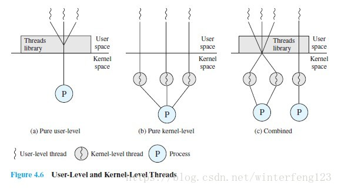

&nbsp;&nbsp;&nbsp;&nbsp;&nbsp;&nbsp;对于多核的Linux服务器，同一环境下，Java多线程和Python多线程同时进行IO密集型操作，哪个程序会更快一些呢？

<!-- more -->

&nbsp;&nbsp;&nbsp;&nbsp;&nbsp;&nbsp;无论是Java还是Python他们都是真实的线程，那么也就是调用了操作系统的api来创建线程，至于是创建的是内核级还是用户级线程，不得而知。

&nbsp;&nbsp;&nbsp;&nbsp;&nbsp;&nbsp;下面这张图来看下用户级和内核级线程配置策略：

&nbsp;&nbsp;&nbsp;&nbsp;&nbsp;&nbsp;如果是<b>用户级线程</b>，那么线程对于cpu不可见，由jvm或者python解释器来控制线程获取cpu资源的权限。所以说对于同一个进程下创建的多个线程，同一时刻只有一个线程获取了cpu资源，也就是线程只能并发不能并行（关于并发和并行的解释可以参考文章：<a>[并发与并行](http://wetech.top/2019/08/18/%E5%B9%B6%E5%8F%91%E4%B8%8E%E5%B9%B6%E8%A1%8C/)）</a>。

&nbsp;&nbsp;&nbsp;&nbsp;&nbsp;&nbsp;那么我们平时所说的Java多线程并行处理又是怎么回事？如果多线程只能并发，不能并行，那么无论是单核还是多核，java和python在io密集型的环境下应用性能是差不多的。

&nbsp;&nbsp;&nbsp;&nbsp;&nbsp;&nbsp;如果是<b>内核级线程</b>，同一进程下多个线程同一时刻可以获得多个cpu资源，这样就实现了并发，这个就可以说通了，而python解释器GIL（关于python GIL的解释，可以参考文章：<a>[Python解释器GIL详解](http://wetech.top/2019/11/03/%E4%B8%80%E8%88%AC%E6%83%85%E5%86%B5%E4%B8%8B%E4%B8%BA%E4%BB%80%E4%B9%88Python%E5%A4%9A%E7%BA%BF%E7%A8%8B%E6%AF%94%E5%8D%95%E7%BA%BF%E7%A8%8B%E8%BF%98%E6%85%A2%EF%BC%9F/)）中的线程锁将python线程控制，使得同一时刻只有一个线程获得cpu资源的权限，所以，在cpu密集型的环境或者是多核系统下，java多线程明显比python多线程性能强。

&nbsp;&nbsp;&nbsp;&nbsp;&nbsp;&nbsp;IO密集型和Cpu密集型的介绍可以参考文章：
<a>[什么是IO密集型与CPU密集型？](http://wetech.top/2019/11/03/%E4%B8%80%E8%88%AC%E6%83%85%E5%86%B5%E4%B8%8B%E4%B8%BA%E4%BB%80%E4%B9%88Python%E5%A4%9A%E7%BA%BF%E7%A8%8B%E6%AF%94%E5%8D%95%E7%BA%BF%E7%A8%8B%E8%BF%98%E6%85%A2%EF%BC%9F/)

- - -
<b>Good health is over wealth.</b>