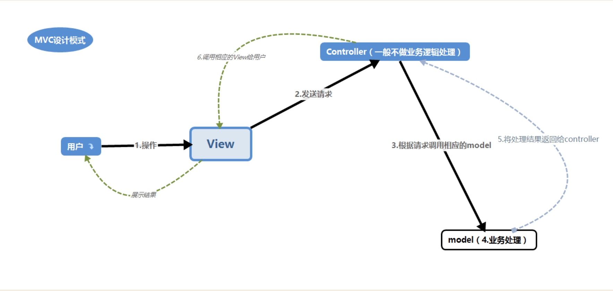

总结一下MVC(Model, View, Controller)设计模式：
&nbsp;&nbsp;&nbsp;&nbsp;&nbsp;&nbsp;MVC (Model View Controler)本来是存在于Desktop程序中的，M是指数据模型，V是指用户界面，C则是控制器。使用MVC的目的是将M和V的实现代码分离，从而使同一个程序可以使用不同的表现形式。比如一批统计数据你可以分别用柱状图、饼图来表示。C存在的目的则是确保M和V的同步，一旦M改变，V应该同步更新。 

<!-- more -->

# 1.视图 

&nbsp;&nbsp;&nbsp;&nbsp;&nbsp;&nbsp;<b>视图是用户看到并与之交互的界面（它可以包括一些可以显示数据信息的页面，或者展示形式。例如jsp，html，asp，php）</b>。对老式的Web应用程序来说，视图就是由HTML元素组成的界面，在新式的Web应用程序中，HTML依旧在视图中扮演着重要的角色，但一些新的技术已层出不穷，它们包括Macromedia Flash和象XHTML，XML/XSL，WML等一些标识语言和Web services. 

&nbsp;&nbsp;&nbsp;&nbsp;&nbsp;&nbsp;如何处理应用程序的界面变得越来越有挑战性。MVC一个大的好处是它能为你的应用程序处理很多不同的视图。在视图中其实没有真正的处理发生，不管这些数据是联机存储的还是一个雇员列表，作为视图来讲，它只是作为一种输出数据并允许用户操纵的方式。 

# 2.模型 

&nbsp;&nbsp;&nbsp;&nbsp;&nbsp;&nbsp;<b>模型表示企业数据和业务规则（可以说就是后端接口，用于业务处理）</b>。在MVC的三个部件中，模型拥有最多的处理任务。例如它可能用象EJBs和ColdFusion Components这样的构件对象来处理数据库。被模型返回的数据是中立的，就是说模型与数据格式无关，这样一个模型能为多个视图提供数据。由于应用于模型的代码只需写一次就可以被多个视图重用，所以减少了代码的重复性。 

# 3.控制器 

&nbsp;&nbsp;&nbsp;&nbsp;&nbsp;&nbsp;<b>控制器接受用户的输入并调用模型和视图去完成用户的需求（接受客户发送的请求，根据请求调用所对应的接口，然后模型业务处理后返回的数据，由控制器决定调用那个View展示）</b>。所以当单击Web页面中的超链接和发送HTML表单时，控制器本身不输出任何东西和做任何处理。它只是接收请求并决定调用哪个模型构件去处理请求，然后用确定用哪个视图来显示模型处理返回的数据。 

&nbsp;&nbsp;&nbsp;&nbsp;&nbsp;&nbsp;现在我们总结MVC的处理过程，首先控制器接收用户的请求，并决定应该调用哪个模型来进行处理，然后模型用业务逻辑来处理用户的请求并返回数据，最后控制器用相应的视图格式化模型返回的数据，并通过表示层呈现给用户。 

- - -
Making English as your working language.