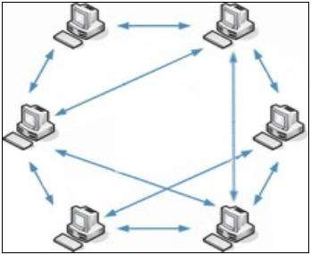

&nbsp;&nbsp;&nbsp;&nbsp;&nbsp;&nbsp;最近在研究P2P技术，奈何相关资料不多，自己琢磨了一下，分享一下学习P2P的一些原理, 以及如何打造一个P2P聊天应用。
&nbsp;&nbsp;&nbsp;&nbsp;&nbsp;&nbsp;这里指的P2P是指peer to peer， 点对点的技术， 每个客户端都是服务端，没有中心服务器，不是websocket针对某个connection推送消息。



<!-- more -->

# 一、技术要点
- udp协议
- 节点之间的建立，连接和广播
- 内网穿透，如何能让两个处在内网的节点，相互发现自己的存在，并且建立通信

# 二、原理
&nbsp;&nbsp;&nbsp;&nbsp;&nbsp;&nbsp;首先解决的是内网穿透的问题，常见的底层协议tcp，udp，他们各自有优缺点，简单说明一下。 tcp：需要处理粘包问题，双工流通道，是可靠的链接。 udp： 每次发送的都是数据包，没有粘包问题，但是连接不可靠，只能传输少量数据。更加详细的请Google

&nbsp;&nbsp;&nbsp;&nbsp;&nbsp;&nbsp;这里选择udp协议，简单一些。

&nbsp;&nbsp;&nbsp;&nbsp;&nbsp;&nbsp;再下来是内网穿透，先说结论： 两个处于不同内部网络的节点，永远无法发现他们之间的相互存在，你就算是想顺着网线过去打他都不行。

&nbsp;&nbsp;&nbsp;&nbsp;&nbsp;&nbsp;所有的内网穿透原理无外乎需要一个有公网ip的中介服务器，包括虚拟货币像比特币之类的，所以首先要有一个创世节点

&nbsp;&nbsp;&nbsp;&nbsp;&nbsp;&nbsp;在NodeJS中，创建udp服务也很简单
```
const dgram = require("dgram");
const udp = dgram.createSocket("udp4");
udp.bind(1090, callback)
```
&nbsp;&nbsp;&nbsp;&nbsp;&nbsp;&nbsp;把服务部署要公网，那么其他所有的节点都能访问，通过中转服务器，能够使得两个节点可以建立连接


&nbsp;&nbsp;&nbsp;&nbsp;&nbsp;&nbsp;我们是要建立这样的P2P网络


&nbsp;&nbsp;&nbsp;&nbsp;&nbsp;&nbsp;假如现在只有3个节点： <b>创世节点, B节点, C节点</b>， 创世节点有公网IP

&nbsp;&nbsp;&nbsp;&nbsp;&nbsp;&nbsp;我用对话的形式，阐述他们建立链接的过程:

>B节点: hey，创世节点，我要加入到P2P网络里面，告诉其他兄弟，我来了 创世节点: 兄弟们，刚刚有个叫做B的节点加入网络了，你们也去告诉其他节点 其他节点: 刚刚收到来自 "创世节点"的通知，有个fresh meet加入网络了，叫做 “B”

… 至此，所有人都知道了B节点加入了网络，里面记载着B节点的相关信息，包括IP地址，包括udp端口号

此时C节点也要加入网络，并且想要和B节点对话:

>C节点: hey，创世节点，我要加入到P2P网络里面，并且我要和B对话 创世节点: 兄弟们，刚刚有个叫做B的节点加入网络了，你们也去告诉其他节点，顺便看看有没有B这个节点 其他节点: 刚刚收到来自 "创世节点"的通知，有个fresh meet加入网络了，叫做 “C”，你们也看看有没有B这个节点 其他节点2: 收到通知，听说一个叫做C的节点在找一个B节点，我这里有它的信息，ip是xxxx.xxxx.xxx.xxxx, 端口10086 B节点: 有个C的家伙(ip: xxxx.xxxx.xxxx.xxxx, 端口1000)要找我

&nbsp;&nbsp;&nbsp;&nbsp;&nbsp;&nbsp;到这里，B获取到了C的信息，包括IP和端口，C也拿到了B的信息.

&nbsp;&nbsp;&nbsp;&nbsp;&nbsp;&nbsp;于是，他们两个就可以建立通信。消息流: B <----> C. 中间不经过任何服务器

&nbsp;&nbsp;&nbsp;&nbsp;&nbsp;&nbsp;用一张图来形容:


# 三、总结
&nbsp;&nbsp;&nbsp;&nbsp;&nbsp;&nbsp;在设计中，每个节点的功能都是一样的。如果需要加入到网络中，不一定跟创世节点链接

&nbsp;&nbsp;&nbsp;&nbsp;&nbsp;&nbsp;假设已存在的节点: 创世节点，A、B、C节点，此时有个D节点想要加入到网络。

&nbsp;&nbsp;&nbsp;&nbsp;&nbsp;&nbsp;那么D节点不一定非得链接到创世节点，可以链接到A、B、C中的任意一个节点，然后该节点再广播给其他节点说"Hey, 有个新人叫做D的加入了网络"。

&nbsp;&nbsp;&nbsp;&nbsp;&nbsp;&nbsp;这样所有人都知道，有个叫做D的节点存在，你可以和它通信，同时D节点和会同步已存在的节点。这样D节点也知道了其他节点的存在了。


- - -
找到自己感兴趣的事情，然后100%投入。