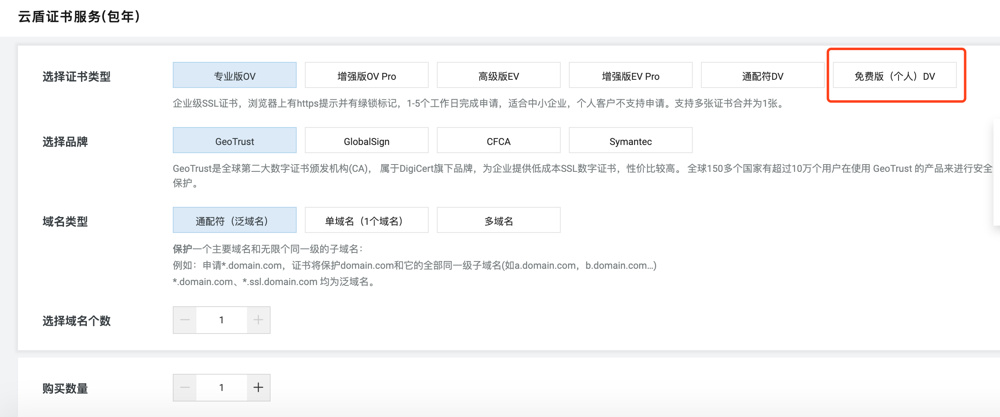
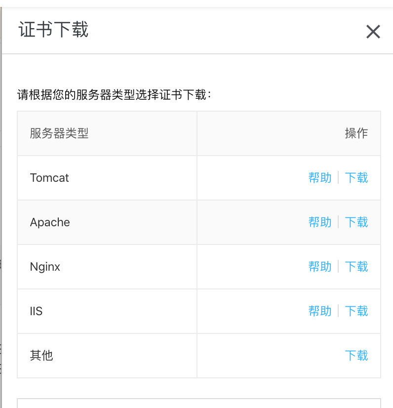

&nbsp;&nbsp;&nbsp;&nbsp;&nbsp;&nbsp;如果你的应用需要用到https，那么来看看ssl证书怎么用吧。


<!-- more -->

1. 申请ssl证书

```
https://www.aliyun.com/product/cas?spm=5176.10695662.1171680.2.5358481aEeXS2O
```


2. 下载证书

如果你是spring boot项目，下载tomcat类型


3. 查看证书信息
```
# 查看证书的信息
keytool -list -v -keystore 证书文件路径/文件名 -storepass [密码]
```

4.配置spring
按照证书信息去配置alias，类型
```
### https configuration
server.ssl.enabled=true
server.port=7443
server.ssl.key-store=/mnt/certificate/ssl_certificate.pfx
server.ssl.key-alias=alias
server.ssl.key-store-password=xxxx
server.ssl.key-store-type=JKS
```


- - -
<b>始终朝着一个目标前进。</b>
