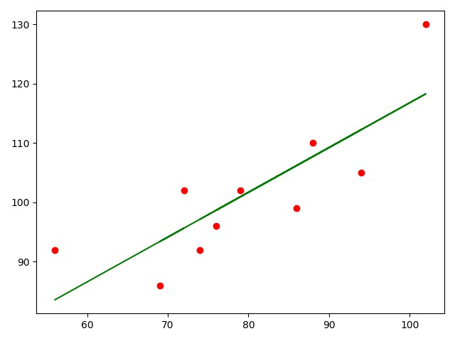

&nbsp;&nbsp;&nbsp;&nbsp;&nbsp;&nbsp;线性回归，数理统计学中的一种统计方法，描述自变量和因变量之间的关系的一种统计分析方法，获得回归模型后，在不知道因变量的情况下，通过模型可以预测新增的自变量对应的因变量。

<!-- more -->

&nbsp;&nbsp;&nbsp;&nbsp;&nbsp;&nbsp;有以下几种方法来求得回归方程：
1. 最小二乘代数法;
2. 最小二乘矩阵法;
3. sklearn;

&nbsp;&nbsp;&nbsp;&nbsp;&nbsp;&nbsp;三种方法中sklearn很简单，不需要自己推导公式，python库已帮你实现，下面来看看这种方法，直接看代码吧：

<a>[Github](https://github.com/chenzuoli/MachineLearning/blob/master/linear_regression/sklearn_learn.py)</a>

&nbsp;&nbsp;&nbsp;&nbsp;&nbsp;&nbsp;看效果图：

---
<b>学会和自己独处，拒绝无效社交</b>
