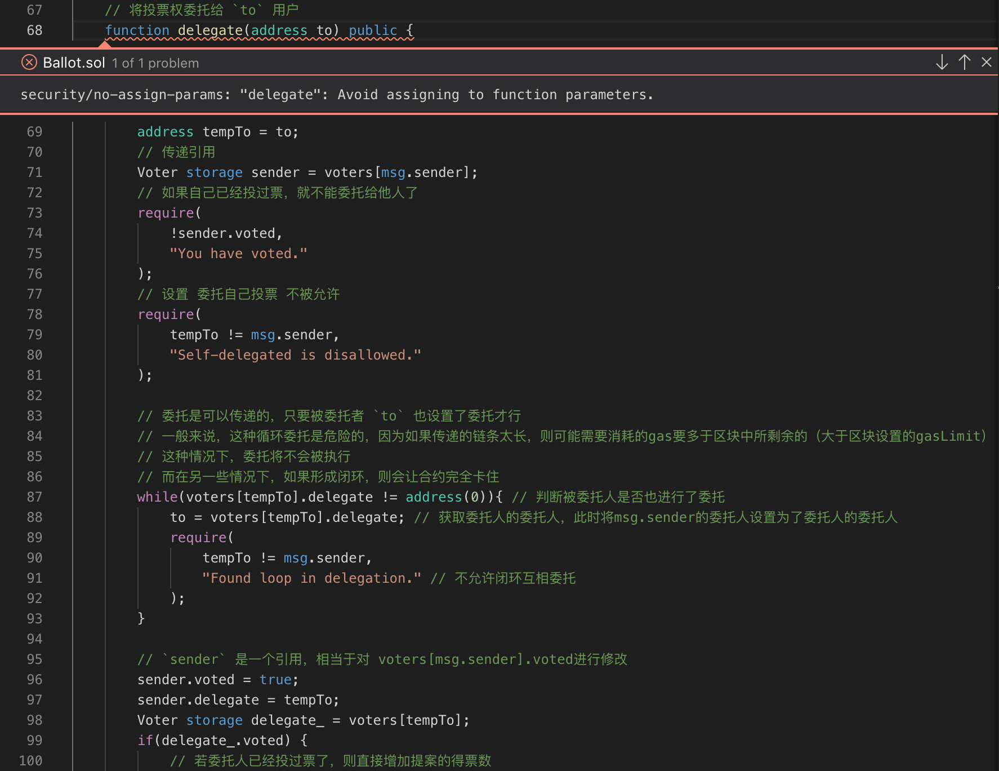

solidity 语言，作为以太坊平台智能合约语言，那就必须的学一下啊。


<!-- more -->

# 一、入门智能合约

&nbsp;&nbsp;&nbsp;&nbsp;&nbsp;&nbsp;让我们先看一下最基本的例子。现在就算你都不理解也不要紧，后面我们会有更深入的讲解。

## 1.1 存储合约（把一个数据保存到链上）

```
pragma solidity >=0.4.0 <0.7.0;

contract SimpleStorage {
    uint storedData;

    function set(uint x) public {
        storedData = x;
    }

    function get() public view returns (uint) {
        return storedData;
    }
}
```

&nbsp;&nbsp;&nbsp;&nbsp;&nbsp;&nbsp;第一行就是告诉编译器源代码所适用的 Solidity 版本为>=0.4.0 及 <0.7.0 。这是为了确保合约不会在新的编译器版本中突然行为异常。关键字 pragma 的含义是，一般来说，pragmas（编译指令）是告知编译器如何处理源代码的指令的（例如， pragma once ）。

&nbsp;&nbsp;&nbsp;&nbsp;&nbsp;&nbsp;Solidity 中合约的含义就是一组代码（它的 函数 )和数据（它的 状态 ），它们位于以太坊区块链的一个特定地址上。 代码行 uint storedData; 声明一个类型为 uint (256 位无符号整数）的状态变量，叫做 storedData 。 你可以认为它是数据库里的一个位置，可以通过调用管理数据库代码的函数进行查询和变更。对于以太坊来说，上述的合约就是拥有合约（owning contract）。在这种情况下，函数 set 和 get 可以用来变更或取出变量的值。

&nbsp;&nbsp;&nbsp;&nbsp;&nbsp;&nbsp;要访问一个状态变量，并不需要像 this. 这样的前缀，虽然这是其他语言常见的做法。

&nbsp;&nbsp;&nbsp;&nbsp;&nbsp;&nbsp;该合约能完成的事情并不多（由于以太坊构建的基础架构的原因）：它能允许任何人在合约中存储一个单独的数字，并且这个数字可以被世界上任何人访问，且没有可行的办法阻止你发布这个数字。当然，任何人都可以再次调用 set ，传入不同的值，覆盖你的数字，但是这个数字仍会被存储在区块链的历史记录中。随后，我们会看到怎样施加访问限制，以确保只有你才能改变这个数字。

> 注解
>
> > 所有的标识符（合约名称，函数名称和变量名称）都只能使用 ASCII 字符集。UTF-8 编码的数据可以用字符串变量的形式存储。

> 警告
>
> > 小心使用 Unicode 文本，因为有些字符虽然长得相像（甚至一样），但其字符码是不同的，其编码后的字符数组也会不一样。

## 1.2 子货币合约（Subcurrency）示例

&nbsp;&nbsp;&nbsp;&nbsp;&nbsp;&nbsp;下面的合约实现了一个最简单的加密货币。这里，币确实可以无中生有地产生，但是只有创建合约的人才能做到（实现一个不同的发行计划也不难）。而且，任何人都可以给其他人转币，不需要注册用户名和密码 —— 所需要的只是以太坊密钥对。

```
pragma solidity >=0.5.0 <0.7.0;

contract Coin {
// 关键字“public”让这些变量可以从外部读取
address public minter;
mapping (address => uint) public balances;

    // 轻客户端可以通过事件针对变化作出高效的反应
    event Sent(address from, address to, uint amount);

    // 这是构造函数，只有当合约创建时运行
    constructor() public {
        minter = msg.sender;
    }

    function mint(address receiver, uint amount) public {
        require(msg.sender == minter);
        equire(amount < 1e60);
        balances[receiver] += amount;
    }

    function send(address receiver, uint amount) public {
        require(amount <= balances[msg.sender], "Insufficient balance.");
        balances[msg.sender] -= amount;
        balances[receiver] += amount;
        emit Sent(msg.sender, receiver, amount);
    }

}
```

&nbsp;&nbsp;&nbsp;&nbsp;&nbsp;&nbsp;这个合约引入了一些新的概念，让我们逐一解读。

&nbsp;&nbsp;&nbsp;&nbsp;&nbsp;&nbsp;address public minter; 这一行声明了一个可以被公开访问的 address 类型的状态变量。 address 类型是一个 160 位的值，且不允许任何算数操作。这种类型适合存储合约地址或外部人员的密钥对。关键字 public 自动生成一个函数，允许你在这个合约之外访问这个状态变量的当前值。如果没有这个关键字，其他的合约没有办法访问这个变量。由编译器生成的函数的代码大致如下所示（暂时忽略 external 和 view）：

&nbsp;&nbsp;&nbsp;&nbsp;&nbsp;&nbsp;function minter() external view returns (address) { return minter; }
当然，加一个和上面完全一样的函数是行不通的，因为我们会有同名的一个函数和一个变量，这里，主要是希望你能明白——编译器已经帮你实现了。

&nbsp;&nbsp;&nbsp;&nbsp;&nbsp;&nbsp;下一行， mapping (address => uint) public balances; 也创建一个公共状态变量，但它是一个更复杂的数据类型。 该类型将 address 映射为无符号整数。 Mappings 可以看作是一个 哈希表 它会执行虚拟初始化，以使所有可能存在的键都映射到一个字节表示为全零的值。 但是，这种类比并不太恰当，因为它既不能获得映射的所有键的列表，也不能获得所有值的列表。 因此，要么记住你添加到 mapping 中的数据（使用列表或更高级的数据类型会更好），要么在不需要键列表或值列表的上下文中使用它，就如本例。 而由 public 关键字创建的 getter 函数 getter function 则是更复杂一些的情况， 它大致如下所示：

```
function balances(address _account) external view returns (uint) {
    return balances[_account];
}
```

&nbsp;&nbsp;&nbsp;&nbsp;&nbsp;&nbsp;正如你所看到的，你可以通过该函数轻松地查询到账户的余额。

&nbsp;&nbsp;&nbsp;&nbsp;&nbsp;&nbsp;event Sent(address from, address to, uint amount); 这行声明了一个所谓的“事件（event）”，它会在 send 函数的最后一行被发出。用户界面（当然也包括服务器应用程序）可以监听区块链上正在发送的事件，而不会花费太多成本。一旦它被发出，监听该事件的 listener 都将收到通知。而所有的事件都包含了 from ， to 和 amount 三个参数，可方便追踪交易。 为了监听这个事件，你可以使用如下 JavaScript 代码（假设 Coin 是已经通过 web3.js 创建好的合约对象 ）：

```
Coin.Sent().watch({}, '', function(error, result) {
    if (!error) {
        console.log("Coin transfer: " + result.args.amount +
            " coins were sent from " + result.args.from +
            " to " + result.args.to + ".");
        console.log("Balances now:\n" +
            "Sender: " + Coin.balances.call(result.args.from) +
            "Receiver: " + Coin.balances.call(result.args.to));
    }
})
```

&nbsp;&nbsp;&nbsp;&nbsp;&nbsp;&nbsp;这里请注意自动生成的 balances 函数是如何从用户界面调用的。

&nbsp;&nbsp;&nbsp;&nbsp;&nbsp;&nbsp;特殊函数 constructor 是在创建合约期间运行的构造函数，不能在事后调用。 它永久存储创建合约的人的地址: msg (以及 tx 和 block ) 是一个特殊的全局变量，其中包含一些允许访问区块链的属性。 msg.sender 始终是当前（外部）函数调用的来源地址。

&nbsp;&nbsp;&nbsp;&nbsp;&nbsp;&nbsp;最后，真正被用户或其他合约所调用的，以完成本合约功能的方法是 mint 和 send。 如果 mint 被合约创建者外的其他人调用则什么也不会发生。 另一方面， send 函数可被任何人用于向他人发送币 (当然，前提是发送者拥有这些币)。记住，如果你使用合约发送币给一个地址，当你在区块链浏览器上查看该地址时是看不到任何相关信息的。因为，实际上你发送币和更改余额的信息仅仅存储在特定合约的数据存储器中。通过使用事件，你可以非常简单地为你的新币创建一个“区块链浏览器”来追踪交易和余额。

# 二、投票合约

&nbsp;&nbsp;&nbsp;&nbsp;&nbsp;&nbsp;以下的合约有一些复杂，但展示了很多 Solidity 的语言特性。它实现了一个投票合约。 当然，电子投票的主要问题是如何将投票权分配给正确的人员以及如何防止被操纵。 我们不会在这里解决所有的问题，但至少我们会展示如何进行委托投票，同时，计票又是 自动和完全透明的 。

&nbsp;&nbsp;&nbsp;&nbsp;&nbsp;&nbsp;我们的想法是为每个（投票）表决创建一份合约，为每个选项提供简称。 然后作为合约的创造者——即主席，将给予每个独立的地址以投票权。

&nbsp;&nbsp;&nbsp;&nbsp;&nbsp;&nbsp;地址后面的人可以选择自己投票，或者委托给他们信任的人来投票。

&nbsp;&nbsp;&nbsp;&nbsp;&nbsp;&nbsp;在投票时间结束时，winningProposal() 将返回获得最多投票的提案。

&nbsp;&nbsp;&nbsp;&nbsp;&nbsp;&nbsp;以下是代码，从代码中学习 solidity 的其它一些语法：
<font color=#0099ff><b><a>[Ballot Smart Contract](https://github.com/chenzuoli/soliditydemos/blob/master/contracts/Ballot.sol)</a></b></font>

&nbsp;&nbsp;&nbsp;&nbsp;&nbsp;&nbsp;源代码在<font color=#0099ff><b><a>[这里](https://solidity.readthedocs.io/en/v0.5.10/solidity-by-example.html#voting)</a></b></font>，我在学习的时候照着模板编写发现有下面这个错误，就将 `address to` 引用到 tempTo 就 ok 了，我觉得是变量 `to` 在循环中被修改了导致的。

