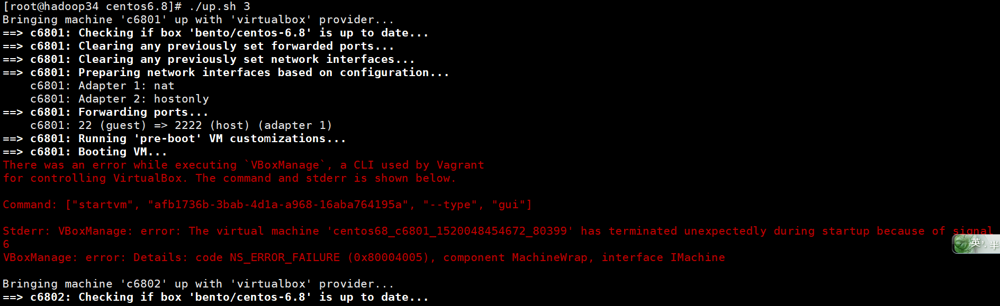

首先来介绍下ambari，它是一个apache的一个顶级项目，hadoop生态组件的监控、管理工具，相比较于cloudera公司的CDH，它的特点是完全开源，一键部署安装、管理、监控大数据各组件，省时省力，下面就来介绍ambari环境是如何安装的。
<!-- more -->
本安装教程适用于操作系统centos7，在某一台服务器上安装，原理就是虚拟化该服务器成多个virtual box，然后启动ambari服务，管理这些虚拟机。
# 安装
安装步骤可以参考官网：
<a href="https://cwiki.apache.org/confluence/display/AMBARI/Quick+Start+Guide">ambari.apache.org</a>
## 环境准备
```
yum install lrzsz openssl openssh-clients git maven -y
```
## 下载安装VirtualBox、Vagrant
<a href="https://www.virtualbox.org/wiki/Downloads">VirtualBox</a>
<a href="http://downloads.vagrantup.com"></a>
选择最新稳定版.rpm文件下载即可
上传到服务器使用yum安装
## 下载ambari-vagrant
```
git clone https://github.com/u39kun/ambari-vagrant.git
cat ambari-vagrant/append-to-etc-hosts.txt >> /etc/hosts --配置ip、域名映射
vagrant --生成密钥
```
## 启动VMs
```
cd ambari-vagrant
```
你可以看到在该文件夹下有许多centos的版本，官方说centos6.8对ambari的兼容性最好，我们就用centos6.8吧。
```
cd centos6.8
cp ~/.vagrant.d/insecure_private_key .  --将密钥复制到当前文件夹，注意不要少了组后面的一个点，代表当前文件夹
./up.sh 3 --启动3个virtual machine
```
正常的话，就启动了c6801 c6802 c6803这三台虚拟机
## 登录VMs
```
vagrant ssh c6801
su -
```
ssh没问题的话，说明安装是没问题的，下面来安装ambari-server，以root用户完成下面的操作。
## 安装ambari-server
下载ambari的源，安装并启动ambari-server
```
wget -O /etc/yum.repos.d/ambari.repo http://public-repo-1.hortonworks.com/ambari/centos6/2.x/updates/2.5.1.0/ambari.repo
yum install ambari-server -y
ambari-server setup -s
ambari-server start
```
启动成功后，我们可以访问ambari的web界面： http://c6801.ambari.apache.org:8080，初始的登录用户名和密码均为admin，以同样的方式可以访问c6802 c6803，然后我们就可以对着三台虚拟机进行安装hadoop生态的各个组件了。
# 问题
安装过程中会出现各种问题，具体问题及解决方案如下：
## 启动虚拟盒的时候报错
运行命令：
```
./up.sh 3
```
错误日志如下：

```
There was an error while excuting 'VBoxMange', a CLI used by vagrant for controlling VirtualBox, The command and stderr is shown below.
Command: ["startvm", "afb1736b-3bab-4d1a-a968-16aba764195a", "--type", "gui"]
Stderr: VBoxManage: error: The virtual machine "centos68-c6801-1520048454672_80399" has terminated upexpectedly during startup because of singal 6.
VBoxManage: error: Details: code NS_ERROR_FAILURE (0x80004005), componnent MachineWrap, interface IMachine.
```
错误原因：linux系统中的kernel module与ambari需要使用的kernel模块版本不匹配，导致vboxdrv服务启动异常，可以使用命令查看vboxdrv服务的启动情况：
```
systemctl status vboxdrv
```
解决办法：
1.安装更新kernel
```
yum install kernel -y
```
2.安装kernel-devel
```
yum install kernel -y
```
3.重启服务器
```
reboot
```
4.启动vboxdrv服务
```
systemctl start vboxdrv
systemctl status vboxdrv --查看状态
```
到这里配置就基本完成了，谢谢大家，如果有什么问题，请留言。