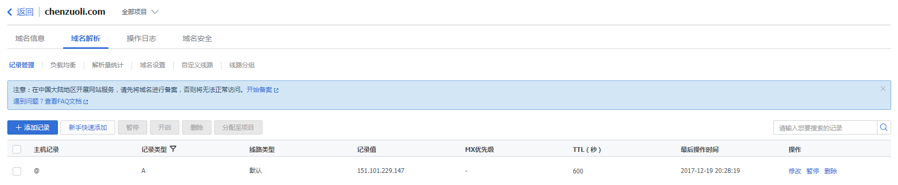
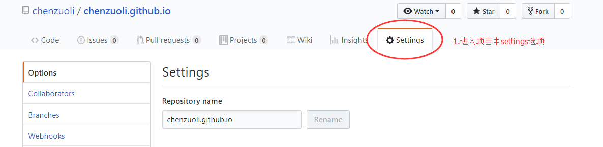
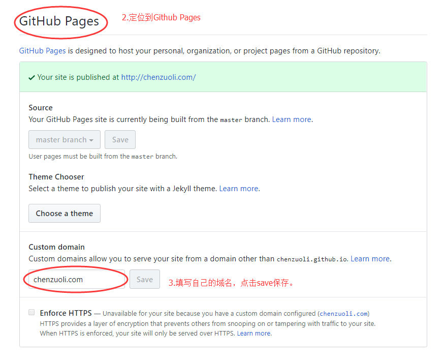

---
title: 以Hexo网页制作模板构建Github Pages个人网站
tags: [hexo,github pages,blog]
date: 2017-12-19 22:52:29
---
个人网站制作过程，以Hexo为例，为大家讲解如何制作，如果有什么错误的地方，欢迎指正，如果有什么不懂的地方，可以email我：chenzuoli709@gmail.com。具体请看详细内容 ---><!-- more -->

# 1.准备环境
<a href="https://nodejs.org/en">Node.js</a>
<a href="https://git-scm.com">Git</a>

# 2.安装Hexo
``` bash
$ npm install -g hexo-cli
```

# 3.创建github pages
<a href="https://github.com">Github官网</a>
项目名称为<username>.github.io

# 4.配置Hexo
``` bash
$ hexo init <folder>
$ cd <folder>
$ npm install
```
初始化完成后，该目录下的文件结构如下：
```
_config.yml --- 全局配置文件
package.json
scaffolds --- 模板
source --- 文件仓库
  _drafts --- 草稿
  _posts --- 发布过的文件
themes --- 主题
```
编辑_config.yml：
指定项目部署的方式为git，上传到远程仓库repo的master分支上
```
deploy:
  type: git
  repo: https://github.com/chenzuoli/chenzuoli.github.io.git
  branch: master
```

# 5.部署
``` bash
hexo generate --- 生成
hexo deploy --- 部署到github
```

# 6.域名映射
第一步：

登录你购买域名服务商提供给你的域名管理中心，我购买的是腾讯云，域名为chenzuoli.com，首先绑定主域名映射到github.com所对应的ip地址，绑定完成后，隔几分钟测试，因为DNS解析先从你的域名提供商开始，然后到其他的域名提供商，再到国外：
``` bash
ping chenzuoli.com
```
看是否能够ping通，如果ping通，说明域名映射已经ok了
第二步：


登录github到<username>.github.io项目，进入settings选项，设置自定义域名chenzuoli.com，save后，可以看到在该项目下会自动生成一个CNAME的文件，文件内容就是你设置的域名chenzuoli.com。
稍等几分钟，就可以访问chenzuoli.com了。
这里说明一下域名映射的流程：chenzuoli.com -> github.com -> chenzuoli.github.io
chenzuoli.com映射到github.com，然后github.com会解析该请求寻找CNAME为chenzuoli.com的项目，然后就找到了chenzuoli.github.io，于是就可以访问了。
大家赶紧试试吧。

