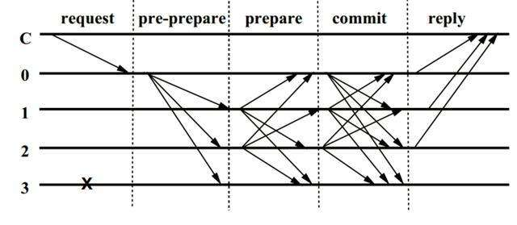

&nbsp;&nbsp;&nbsp;&nbsp;&nbsp;&nbsp;PBFT是Practical Byzantine Fault Tolerance的缩写，即：实用拜占庭容错算法。主要用于联盟链，下面来看下介绍吧。

<!-- more -->

# 摘要
&nbsp;&nbsp;&nbsp;&nbsp;&nbsp;&nbsp;PBFT是Practical Byzantine Fault Tolerance的缩写，即：实用拜占庭容错算法。该算法是Miguel Castro（卡斯特罗）和Barbara Liskov（利斯科夫）在1999年提出来的，解决了原始拜占庭容错算法效率不高的问题，算法的时间复杂度是O(n^2)，使得在实际系统应用中可以解决拜占庭容错问题。该论文发表在1999年的操作系统设计与实现国际会议上（OSDI99）。其中Barbara Liskov就是提出了著名的里氏替换原则（LSP）的人，2008年图灵奖得主。以下拜占庭容错问题简称BFT。

&nbsp;&nbsp;&nbsp;&nbsp;&nbsp;&nbsp;BFT是区块链共识算法中，需要解决的一个核心问题，以比特币和以太访为代表的POW，EOS为代表的DPOS，以及今后以太访逐渐替换的共识算法POS，这些都是公链算法，解决的是共识节点众多情况下的BFT。而PBFT是在联盟链共识节点较少的情况下BFT的一种解决方案。

&nbsp;&nbsp;&nbsp;&nbsp;&nbsp;&nbsp;网上已经有很多关于PBFT算法的描述，但是写的都不是很明白，本文以一种更为清晰易懂的方法，彻底讲明白PBFT算法原理。下一篇文章将会结合fabric-0.6.0-preview 中的代码，讲解超级账本项目是如何实现PBFT算法的。

&nbsp;&nbsp;&nbsp;&nbsp;&nbsp;&nbsp;本文假设读者已经理解什么是BFT问题。

# PBFT算法流程
&nbsp;&nbsp;&nbsp;&nbsp;&nbsp;&nbsp;PBFT算法前提，采用密码学算法保证节点之间的消息传送是不可篡改的。

&nbsp;&nbsp;&nbsp;&nbsp;&nbsp;&nbsp;PBFT容忍无效或者恶意节点数：f，为了保障整个系统可以正常运转，需要有2f+1个正常节点，系统的总节点数为：|R| = 3f + 1。也就是说，PBFT算法可以容忍小于1/3个无效或者恶意节点，该部分的原理证明请参考PBFT论文，下文有链接地址。

&nbsp;&nbsp;&nbsp;&nbsp;&nbsp;&nbsp;PBFT是一种状态机副本复制算法，所有的副本在一个视图（view）轮换的过程中操作，主节点通过视图编号以及节点数集合来确定，即：主节点 p = v mod |R|。v：视图编号，|R|节点个数，p：主节点编号。

PBFT算法主体实现流程图如下：

PBFT算法流程

以下详细说明，每个主体流程内容：

## 1. REQUEST：

&nbsp;&nbsp;&nbsp;&nbsp;&nbsp;&nbsp;客户端c向主节点p发送<REQUEST, o, t, c>请求。o: 请求的具体操作，t: 请求时客户端追加的时间戳，c：客户端标识。REQUEST: 包含消息内容m，以及消息摘要d(m)。客户端对请求进行签名。

## 2. PRE-PREPARE：

主节点收到客户端的请求，需要进行以下交验：

a. 客户端请求消息签名是否正确。

&nbsp;&nbsp;&nbsp;&nbsp;&nbsp;&nbsp;非法请求丢弃。正确请求，分配一个编号n，编号n主要用于对客户端的请求进行排序。然后广播一条<<PRE-PREPARE, v, n, d>,  m>消息给其他副本节点。v：视图编号，d客户端消息摘要，m消息内容。<PRE-PREPARE, v, n, d>进行主节点签名。n是要在某一个范围区间内的[h, H]，具体原因参见垃圾回收章节。

## 3. PREPARE：

副本节点i收到主节点的PRE-PREPARE消息，需要进行以下交验：

- a. 主节点PRE-PREPARE消息签名是否正确。
- b. 当前副本节点是否已经收到了一条在同一v下并且编号也是n，但是签名不同的PRE-PREPARE信息。
- c. d与m的摘要是否一致。
- d. n是否在区间[h, H]内。

&nbsp;&nbsp;&nbsp;&nbsp;&nbsp;&nbsp;非法请求丢弃。正确请求，副本节点i向其他节点包括主节点发送一条<PREPARE, v, n, d, i>消息, v, n, d, m与上述PRE-PREPARE消息内容相同，i是当前副本节点编号。<PREPARE, v, n, d, i>进行副本节点i的签名。记录PRE-PREPARE和PREPARE消息到log中，用于View Change过程中恢复未完成的请求操作。

## 4. COMMIT：

主节点和副本节点收到PREPARE消息，需要进行以下交验：

- a. 副本节点PREPARE消息签名是否正确。
- b. 当前副本节点是否已经收到了同一视图v下的n。
- c. n是否在区间[h, H]内。
- d. d是否和当前已收到PRE-PPREPARE中的d相同

&nbsp;&nbsp;&nbsp;&nbsp;&nbsp;&nbsp;非法请求丢弃。如果副本节点i收到了2f+1个验证通过的PREPARE消息，则向其他节点包括主节点发送一条<COMMIT, v, n, d, i>消息，v, n, d,  i与上述PREPARE消息内容相同。<COMMIT, v, n, d, i>进行副本节点i的签名。记录COMMIT消息到日志中，用于View Change过程中恢复未完成的请求操作。记录其他副本节点发送的PREPARE消息到log中。

## 5. REPLY：

主节点和副本节点收到COMMIT消息，需要进行以下交验：

- a. 副本节点COMMIT消息签名是否正确。
- b. 当前副本节点是否已经收到了同一视图v下的n。
- c. d与m的摘要是否一致。
- d. n是否在区间[h, H]内。

&nbsp;&nbsp;&nbsp;&nbsp;&nbsp;&nbsp;非法请求丢弃。如果副本节点i收到了2f+1个验证通过的COMMIT消息，说明当前网络中的大部分节点已经达成共识，运行客户端的请求操作o，并返回<REPLY, v, t, c, i, r>给客户端，r：是请求操作结果，客户端如果收到f+1个相同的REPLY消息，说明客户端发起的请求已经达成全网共识，否则客户端需要判断是否重新发送请求给主节点。记录其他副本节点发送的COMMIT消息到log中。

# 总结
&nbsp;&nbsp;&nbsp;&nbsp;&nbsp;&nbsp;PBFT算法由于每个副本节点都需要和其他节点进行P2P的共识同步，因此随着节点的增多，性能会下降的很快，但是在较少节点的情况下可以有不错的性能，并且分叉的几率很低。PBFT主要用于联盟链，但是如果能够结合类似DPOS这样的节点代表选举规则的话也可以应用于公链，并且可以在一个不可信的网络里解决拜占庭容错问题，TPS应该是远大于POW的。

# 参考
<b>拜占庭容错</b>(Byzantine Fault Tolerance) WIKI:  <a>[BFT-Wikipedia](https://en.wikipedia.org/wiki/BFT)</a>

PBFT论文地址：<a>[PBFT论文](http://pmg.csail.mit.edu/papers/osdi99.pdf)</a>

- - -
The shortest answer is doing.