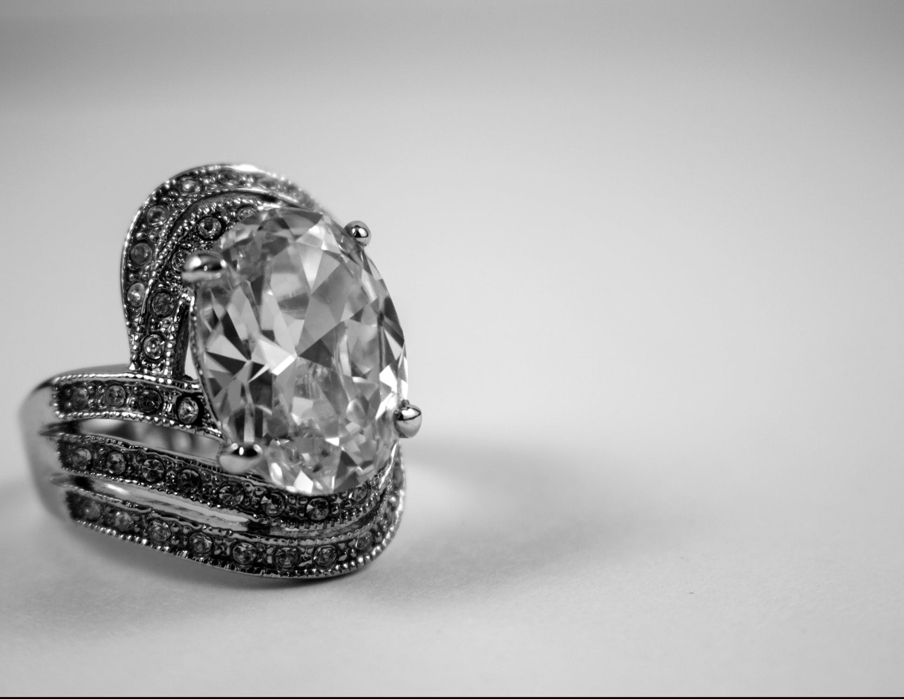

世界上最贵的钻石，在哪里呢，来看看。
<!-- more -->

1.Koh-i-Noor: 现在英国，产地印度，21.12 g，无价；
2.The Sancy: 现在印度，11.046 g，无价
3.The Cullinan: 现在英国，产地南非，1905年被发现时621.35g，后来被拆分成105颗，价值4亿美元；
4.The Hope Diamond: 现在美国，产地印度9.11g，价值3.5亿美元；
5.Millennium Star: 属于戴比尔斯集团，产地扎伊尔，40.6.8g，价值1.29亿美元；
6.Centenary Diamond: 属于戴比尔斯集团，产地南非，54.77g，价值1亿美元；
7.Pink Star: 属于戴比尔斯集团，产地南非，11.92g，价值7千万美元；
8.The Regent Diamond: 现在法国，产地印度，28.12g，价值6200万美元；
