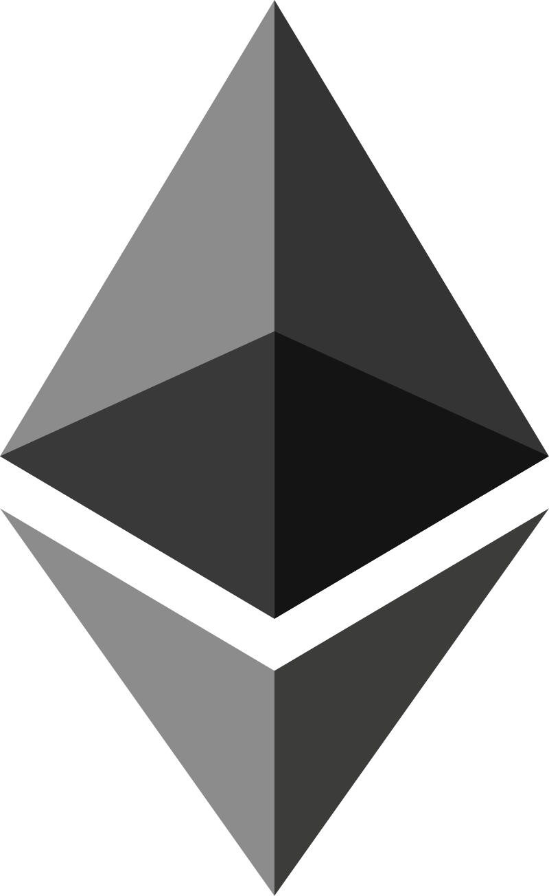
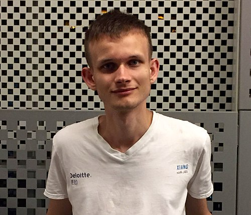

---

title: 以太坊（Ethereum）简介

date: 2019-04-23 23:42:17

tags: 以太坊

categories: 数字货币

---

以太坊是一个开源的有智能合约功能的公共区块链平台。通过其专用加密货币以太币（Ether，又称“以太币”）提供去中心化的虚拟机（称为“以太虚拟机”Ethereum Virtual Machine）来处理点对点合约。
<!-- more -->

# 以太坊（Ethereum）简介

## 概念：

是一个开源的有智能合约功能的公共区块链平台。通过其专用加密货币以太币（Ether，又称“以太币”）提供去中心化的虚拟机（称为“以太虚拟机”Ethereum Virtual Machine）来处理点对点合约。

以太坊的概念首次在2013至2014年间由程序员维塔利克·布特林受比特币启发后提出，大意为“下一代加密货币与去中心化应用平台”，在2014年透过ICO众筹得以开始发展。

截至2018年6月，以太币是市值第二高的加密货币，以太坊亦被称为“第二代的区块链平台”，仅次于比特币。

## 创始人
Vitalik Buterin（V神）

国籍：俄裔加拿大人
出生日期：1994年1月31日
事迹：以太坊创始人、以太坊白皮书作者

## 特点

### 1.智能合约（smart contract）
存储在区块链上的程序，由各节点运行，需要运行程序的人支付手续费给节点的矿工或权益人。

### 2.代币（tokens）
智能合约可以创造代币供分布式应用程序使用。分布式应用程序的代币化让用户、投资者以及管理者的利益一致。代币也可以用来进行首次代币发行。

### 3.叔块（uncle block）
将因为速度较慢而未及时被收入母链的较短区块链并入，以提升交易量。使用的是有向无环图的相关技术。

### 4.权益证明（proof-of-stake）
相较于工作量证明更有效率，可节省大量在挖矿时浪费的计算机资源，并避免特殊应用集成电路造成网络中心化。

### 5.支链（Plasma）
用较小的分支区块链运算，只将最后结果写入主链，可提升供单位时间的工作量。

### 6.状态通道（state channels）
原理类似比特币的闪雷网络，可提升交易速度、降低区块链的负担，并提高可扩展性。尚未实现，开发团队包括雷电网络（Raiden Network）和移动性网络（Liquidity Network）。

### 7.分片（sharding）
减少每个节点所需纪录的数据量，并透过平行运算提升效率。

### 8.分布式应用程序
以太坊上的分布式应用程序不会停机，也不能被关掉。

## 发展历程

### 1.激活：边境
以太坊的公共区块链在2015年7月30日引导。最初的以太坊版本称为边境（Frontier，也有“前锋”的意思），用的是[工作量证明]（proof-of-work）的算法，目前转换成[权益证明]（proof-of-stake）。

### 2.硬分叉

自最初版本以来，以太坊网络成功进行了数次硬分叉。第一次分叉调整了未来挖矿的难度，确保未来的用户会有转换至权益证明的动机。当前第五个分叉正在开发中。

### 3.第二次分叉：家园
2016年春季进行了第二次分叉，发布了第一个稳定版本，称作“家园”（Homestead）。

### 4.第三次分叉：DAO和区块链分叉
2016年六月，以太坊上的一个去中心化自治组织被骇，造成市值五千万美元的以太币被移动到只有该黑客可以控制的“分身DAO”。因为程序不允许黑客立即提取这些以太币，以太坊用户有时间讨论如何处理此事，考虑的方案包括取回以太币和关闭DAO，而DAO去中心化的本质也表示没有中央权力可以立即反应，而需要用户的共识。最后在2016年7月20日，以太坊进行硬分叉，作出一个向后不兼容的改变，让所有的以太币（包括被移动的）回归原处，而不接受此改变的区块链则成为古典以太坊。这是第一次有主流区块链为了补偿投资人，而透过分叉来更动交易记录。

在这次分叉之后，造成了在两个区块链之间进行重放攻击的可能，加上其他网络攻击，让以太坊和古典以太坊又各自进行了数次分叉来避免攻击。

### 5.第四次分叉：减重和防DDoS

2016年11月底进行了第四次的分叉。这次分叉为区块链减重（de-bloat），并加入一些避免网络攻击的设计。因为沟通疏失，这次分叉短暂造成以太坊的两个主要客户端程序 Parity 和 Geth 失去共识而产生意外的分叉，但问题在数小时内即被找出并修正。

## 发展与挑战
2018年9月，比特币核心开发者Jeremy Rubin在美国科技媒体TechCrunch上发表文章《ETH的崩溃无法避免》，称就算以太坊网络继续存续，ETH的价值也会必然归零。以太坊创始人Vitalik在回应中承认了问题的存在：“如果以太坊不改变，Jeremy Rubin的言论可能是对的”。此番言论造成ETH的价钱一度下挫。同时，许多以太坊的项目开始转移到[EOS](https://eos.io/)﹑[波场](https://tron.network/)等的其他公链上，有人担心以太坊将被取代。在ETH的价格影响下，以太坊的全网算力开始收缩，按[etherscan.io](https://etherscan.io/)的算力统计显示，9月到11月以太坊全网算力下跌了20％，从近300TH/s收缩至240TH/s。

2018年12月10日，Vitalik在推特上宣称，未来采用基于[权益证明 (PoS)]的分片技术的区块链“效率将提高数千倍”。

2019年，以太坊项目进行君士坦丁堡硬分叉，这是一个刺激以太坊网络改变其核心[共识机制算法](https://zh.wikipedia.org/wiki/%E5%85%B1%E8%AD%98%E6%A9%9F%E5%88%B6 "共识机制")的代码，这一段代码引导之后以太坊便会面临所谓的“冰河时代”，在该网络上的创建新区块的难度将会不断提升，最终减慢到完全停止。在该硬分叉升级之后，以太坊[区块链](https://zh.wikipedia.org/wiki/%E5%8C%BA%E5%9D%97%E9%93%BE "区块链")的状态将“永久性”的改变。