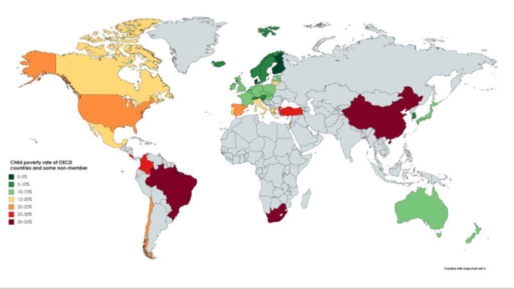

世界儿童贫困率排行，来看看。
<!-- more -->

Child poverty rate, 2016. (%)

🇨🇳CHN: 33.1%
🇧🇷BRA: 30.1%
🇹🇷TUR: 25.3%
🇮🇳IND: 23.6%
🇪🇸ESP: 22.1%
🇺🇸USA: 20.9%
🇲🇽MEX: 19.7%
🇮🇹ITA: 18.3%
🇨🇦CAN: 17.1%
🇯🇵JPN: 13.9%
🇦🇺AUS: 13.0%
🇬🇧GBR: 11.8%
🇫🇷FRA: 11.3%
🇩🇪GER: 11.2%
🇨🇭SUI: 9.5%
🇸🇪SWE: 8.9%
🇰🇷KOR: 7.1%
🇫🇮FIN: 3.3%
🇩🇰DEN: 2.9%

(OECD)
