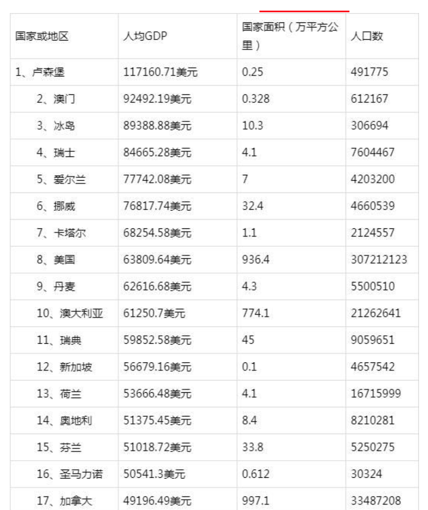

在这个世界上，人均GDP的提高，不仅需要天时地利，更重要的是人和。
来看看全球各国人均GDP排行吧，并介绍下人均GDP最高的国家：卢森堡大公国。
<!-- more -->
2018年度全球各国人均GDP排名如下：

来介绍下人均收入最高的卢森堡大公国吧：

# 基本信息
* 语言：<label style="color:blue">卢森堡语、德语、法语</label>
* 首都：卢森堡市
* 货币：欧元
* 国土面积：0.25万平方公里

# 简介
卢森堡是欧盟成员国，因境内有欧洲法院、欧洲审计院、欧洲投资银行等多个欧盟机构被称为继布鲁塞尔和斯特拉斯堡之后的欧盟“第三首都”。
卢森堡实行<label style="color:blue">君主立宪制</label>。
国家元首为卢森堡大公，也是目前欧洲唯一的一个大公国。而行政权则由内阁行使。国会共有60个席位，议员任期为5年。

# 地理位置
卢森堡位于西欧内陆，地势北高南低，东邻德国，南接法国，北部和西部同比利时接壤。北部为阿登高原，森林茂密，南部为丘陵。气候温和，属温带海洋性气候，风景优美。
首都卢森堡城有“<label style="color:blue">花都</label>”之称。铁矿丰富。这里也是中世纪的要塞。最高点为布尔格普拉兹峰，海拔约550米。

# 经济
自1999年以来，卢森堡一直是欧元区的一部分。卢森堡的经济过去以工业为主，现在卢森堡则是全球最大的金融中心之一。卢森堡是欧元区内最重要的<label style="color:blue">私人银行中心</label>及全球第二大的<label style="color:blue">投资信托中心</label>（仅次于美国）。
* 1）银行：仅次于美国的世界第二、欧洲最大的基金管理中心；
* 2）阿塞洛尔—米塔尔集团（Arcelor-Mittal）：卢第一大企业，世界第一大钢铁集团；
* 3）欧洲卫星公司（SES GLOBAL）：成立于1985年，拥有卫星数量52颗，居欧洲首位、世界第二，其卫星信号全球覆盖率达99.999%。1.22亿欧洲家庭可接收该公司卫星转播的2400套电视、电台节目；
* 4）卢森堡货运航空公司（Cargolux Airlines International）：成立于1970年，是欧洲最大全货运航空公司，拥有波音747货机26架，员工1856人，航线90多条，覆盖全球50多个国家和地区；
* 5）卢森堡广播电视公司（RTL）：该公司系卢与德 [5]  国联合组建的欧洲最大的视听媒体集团，拥有40个电视台和33个广播电台。

# 教育
教育体制中卢、德、法三语循序渐进，并行不悖。小学低年级用卢森堡语授课，高年级开始用德语讲习，中学开始再转化成法语。熟练掌握这三门语言是当地中学毕业的必要条件。

# 人种
卢森堡的外国侨民特别多，占全国人口的三成以上，最大的移民团体是葡萄牙人和意大利人。他们也同时带来了自己的语言。不过，葡萄牙语和意大利语基本只限于移民团体内部交流，在大范围内运用并不广泛。

# 宗教
多数信奉天主教，亦有部分信奉其他宗教（包含基督新教和犹太教）。
