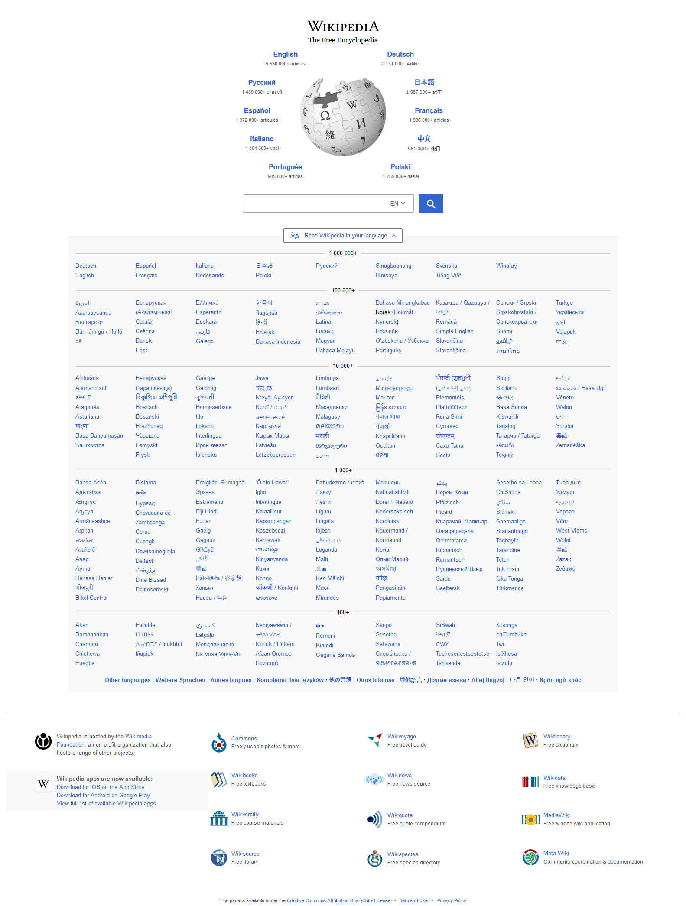
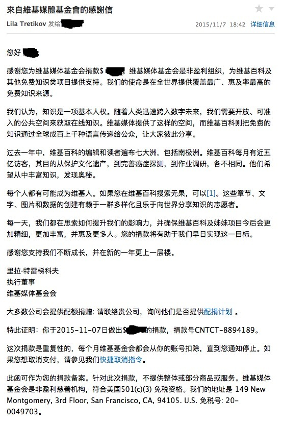

全球最受欢迎的网站排行，前三当属Google、YouTube、Facebook，没有广告、最受欢迎的网站呢，当属wikipedia莫属。没有广告的维基百科，收入从哪里来呢，谁在运营？
<!-- more -->

下面来看看该网站的基本信息：

**创建日期**：2001-01-15
**创始人**：吉米·威尔士与拉里·桑格
**持有者**：维基媒体基金会（非营利组织）
**总部**：美国
**网站类型**：自由内容、自由编辑的网络百科全书
**名称来源**：Wikipedia是混成词，分别取自于网站核心技术“Wiki”以及英文中百科全书之意的“encyclopedia”
**语言**：301种
**官方网站**：[维基百科](https://zh.wikipedia.org)

哈哈，你能访问吗？

根据知名的Alexa Internet其网络流量统计数字指出全世界总共有近3.65亿名民众使用维基百科，且维基百科也是全球浏览人数排名第五高的网站，同时也是全世界最大的无商业广告的网站。

目前网站运营资金来源于捐款，在wikipedia18岁生日的时候，Google捐款310万美元，10年接收捐款总额超过7500万美元。
