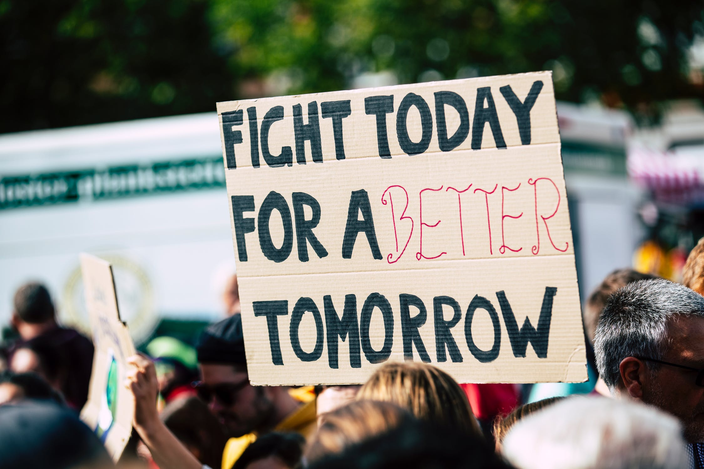

&nbsp;&nbsp;&nbsp;&nbsp;&nbsp;&nbsp;<b>第五名</b>：45%的人后悔没有善待自己的身体;

<!-- more -->

&nbsp;&nbsp;&nbsp;&nbsp;&nbsp;&nbsp;<b>第四名</b>：57%的人后悔没有好好珍惜自己的伴侣;
&nbsp;&nbsp;&nbsp;&nbsp;&nbsp;&nbsp;<b>第三名</b>：62%的人后悔对子女教育不当;
&nbsp;&nbsp;&nbsp;&nbsp;&nbsp;&nbsp;<b>第二名</b>：73%的人后悔在年轻的时候选错了职业;
&nbsp;&nbsp;&nbsp;&nbsp;&nbsp;&nbsp;<b>第一名</b>：92%的人后悔年轻时努力不够导致一事无成;

- - -
<b>What you need to do is persistence.</b>