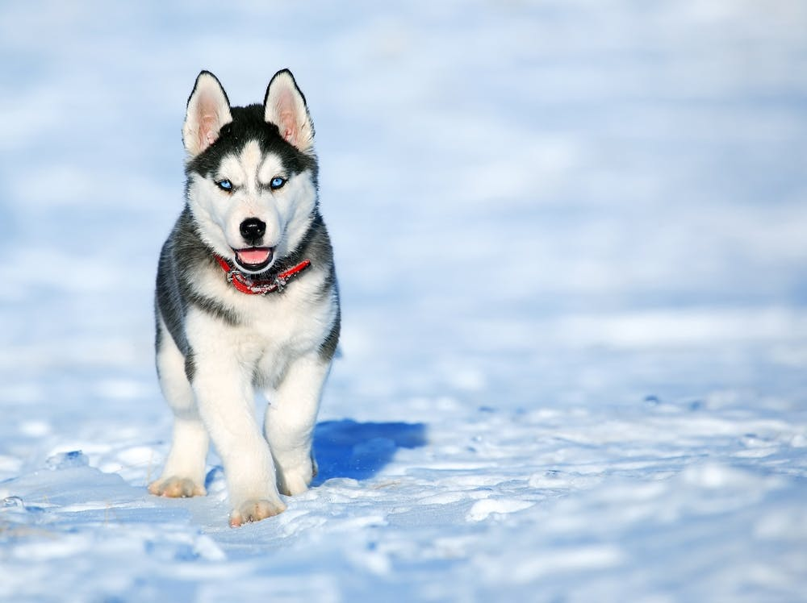

&nbsp;&nbsp;&nbsp;&nbsp;&nbsp;&nbsp;近期养了一只狗，中华田园犬，名叫mango，来看看养一只宠物狗需要花费的钱吧

<!-- more -->

1. 奶糕粮：60；
2. 肠胃药：80；
3. 狗笼子：45；
4. 狗粮：118 + 246 + 50 + 33(香肠) * 2；
5. 狗带+玩具：38；
6. 冬天衣服：60；
7. 自动投食器：289；
8. 四联疫苗：80 * 4（国外的疫苗）；
9. 狂犬疫苗：120；
10. 驱虫剂：40；
11. 磨牙棒：10；
12. 智能投食器：199；
13. 衣服：60；
14. 狗绳：24；
15. 拾便器：39；
16. 狗粮：265；
17. 狗粮：265；
18. 北京-武汉托运：100接宠+500托运+150送宠；
19. 狗粮：265

&nbsp;&nbsp;&nbsp;&nbsp;&nbsp;&nbsp;以后钱主要花在狗粮上，还有每年打一次疫苗，目前累计3400左右；

- - -
<b>If you have a idea, just do it.</b>