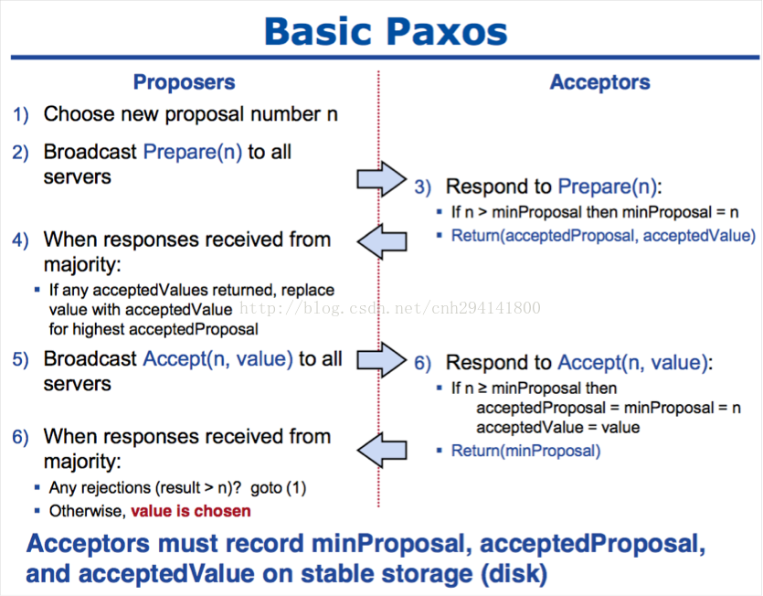
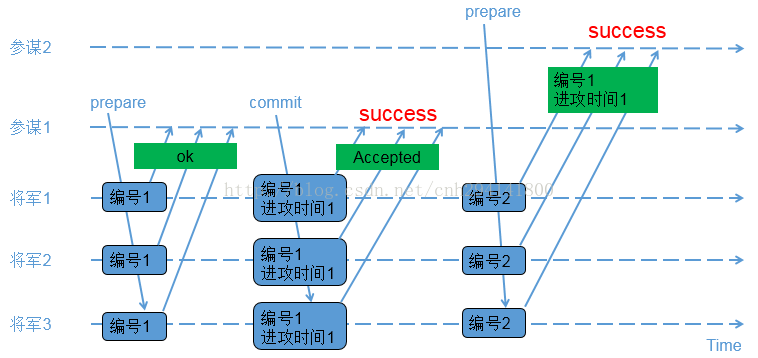
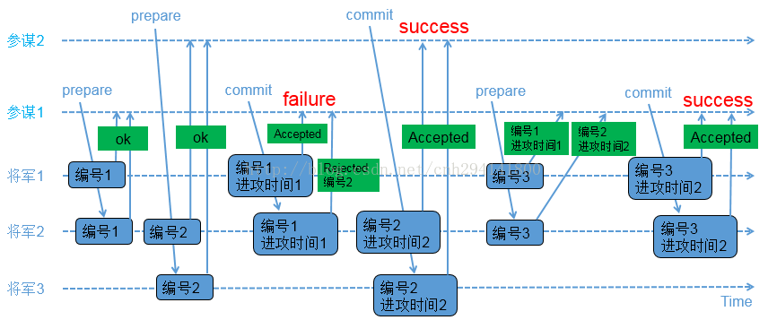

&nbsp;&nbsp;&nbsp;&nbsp;&nbsp;&nbsp;Basic-Paxos算法(可以先看后面的实际例子再看前面的具体介绍部分）
&nbsp;&nbsp;&nbsp;&nbsp;&nbsp;&nbsp;多个节点并发操纵数据，如何保证在读写过程中数据的一致性，并且解决方案要能适应分布式环境下的不可靠性，由此，Paxos共识算法应运而生。


<!-- more -->

# 一、Paxos算法的目的

&nbsp;&nbsp;&nbsp;&nbsp;&nbsp;&nbsp;Paxos算法的目的是为了解决分布式环境下一致性的问题。

&nbsp;&nbsp;&nbsp;&nbsp;&nbsp;&nbsp;多个节点并发操纵数据，如何保证在读写过程中数据的一致性，并且解决方案要能适应分布式环境下的不可靠性（系统如何就一个值达到统一）

# 二、Paxos的两个组件

<b>1.Proposer</b>

&nbsp;&nbsp;&nbsp;&nbsp;&nbsp;&nbsp;提议发起者，处理客户端请求，将客户端的请求发送到集群中，以便决定这个值是否可以被批准。

<b>2.Acceptor</b>

&nbsp;&nbsp;&nbsp;&nbsp;&nbsp;&nbsp;提议批准者，负责处理接收到的提议，他们的回复就是一次投票。会存储一些状态来决定是否接收一个值

# 三、Paxos有两个原则

1).安全原则---保证不能做错的事

>a） 针对某个实例的表决只能有一个值被批准，不能出现一个被批准的值被另一个值覆盖的情况；(假设有一个值被多数Acceptor批准了，那么这个值就只能被学习)
>b） 每个节点只能学习到已经被批准的值，不能学习没有被批准的值。

2).存活原则---只要有多数服务器存活并且彼此间可以通信，最终都要做到的下列事情：

>a）最终会批准某个被提议的值；
>b）一个值被批准了，其他服务器最终会学习到这个值。

# 四、Paxos具体流程图


 
## 1.第一阶段（prepare）

1).获取一个proposal number, n；

2).提议者向所有节点广播prepare(n)请求；

3).接收者（Acceptors比较善变，如果还没最终认可一个值，它就会不断认同提案号最大的那个方案）比较n和minProposal，如果n>minProposal,表示有更新的提议minProposal=n；如果此时该接受者并没有认可一个最终值，那么认可这个提案，返回OK。如果此时已经有一个accptedValue, 将返回(acceptedProposal,acceptedValue)；

4).提议者接收到过半数请求后，如果发现有acceptedValue返回，表示有认可的提议，保存最高acceptedProposal编号的acceptedValue到本地

 

## 2.第二阶段(Accept)

5）广播accept(n,value)到所有节点；

6).接收者比较n和minProposal，如果n>=minProposal,则acceptedProposal=minProposal=n，acceptedValue=value，本地持久化后，返回；否则，拒绝并且返回minProposal

7).提议者接收到过半数请求后，如果发现有返回值>n，表示有更新的提议，跳转1（重新发起提议）；否则value达成一致。

# 三、Paxos议案ID生成算法

&nbsp;&nbsp;&nbsp;&nbsp;&nbsp;&nbsp;在Google的Chubby论文中给出了这样一种方法：假设有n个proposer，每个编号为ir(0<=ir<n)，proposal编号的任何值s都应该大于它已知的最大值，并且满足：
```
s %n = ir    =>     s = m*n + ir
```
&nbsp;&nbsp;&nbsp;&nbsp;&nbsp;&nbsp;proposer已知的最大值来自两部分：proposer自己对编号自增后的值和接收到acceptor的拒绝后所得到的值。

&nbsp;&nbsp;&nbsp;&nbsp;&nbsp;&nbsp;例：以3个proposer P1、P2、P3为例，开始m=0,编号分别为0，1，2。

&nbsp;&nbsp;&nbsp;&nbsp;&nbsp;&nbsp;1） P1提交的时候发现了P2已经提交，P2编号为1 >P1的0，因此P1重新计算编号：new P1 = 1*3+1 = 4；

&nbsp;&nbsp;&nbsp;&nbsp;&nbsp;&nbsp;2） P3以编号2提交，发现小于P1的4，因此P3重新编号：new P3 = 1*3+2 = 5。


# 四、Paxos原理

&nbsp;&nbsp;&nbsp;&nbsp;&nbsp;&nbsp;任意两个法定集合，必定存在一个公共的成员。该性质是Paxos有效的基本保障


# 五、活锁

&nbsp;&nbsp;&nbsp;&nbsp;&nbsp;&nbsp;当某一proposer提交的proposal被拒绝时，可能是因为acceptor 承诺返回了更大编号的proposal，因此proposer提高编号继续提交。 如果2个proposer都发现自己的编号过低转而提出更高编号的proposal，会导致死循环，这种情况也称为活锁。

&nbsp;&nbsp;&nbsp;&nbsp;&nbsp;&nbsp;比如说当此时的 proposer1提案是3, proposer2提案是4, 但acceptor承诺的编号是5，那么此时proposer1,proposer2 都将提高编号假设分别为6,7，并试图与accceptor连接，假设7被接受了，那么提案5和提案6就要重新编号提交，从而不断死循环。


# 六、异常情况——持久存储

&nbsp;&nbsp;&nbsp;&nbsp;&nbsp;&nbsp;在算法执行的过程中会产生很多的异常情况：proposer宕机，acceptor在接收proposal后宕机，proposer接收消息后宕机，acceptor在accept后宕机，learn宕机，存储失败，等等。

&nbsp;&nbsp;&nbsp;&nbsp;&nbsp;&nbsp;为保证paxos算法的正确性，proposer、aceptor、learn都实现持久存储，以做到server恢复后仍能正确参与paxos处理。

&nbsp;&nbsp;&nbsp;&nbsp;&nbsp;&nbsp;propose存储已提交的最大proposal编号、决议编号（instance id）。

&nbsp;&nbsp;&nbsp;&nbsp;&nbsp;&nbsp;acceptor存储已承诺（promise）的最大编号、已接受（accept）的最大编号和value、决议编号。

&nbsp;&nbsp;&nbsp;&nbsp;&nbsp;&nbsp;learn存储已学习过的决议和编号。

# 七、具体实例：

## 1.假设的3军问题

1） 1支红军在山谷里扎营，在周围的山坡上驻扎着3支蓝军；

2） 红军比任意1支蓝军都要强大；如果1支蓝军单独作战，红军胜；如果2支或以上蓝军同时进攻，蓝军胜；

3） 三支蓝军需要同步他们的进攻时间；但他们惟一的通信媒介是派通信兵步行进入山谷，在那里他们可能被俘虏，从而将信息丢失；或者为了避免被俘虏，可能在山谷停留很长时间；

4） 每支军队有1个参谋负责提议进攻时间；每支军队也有1个将军批准参谋提出的进攻时间；很明显，1个参谋提出的进攻时间需要获得至少2个将军的批准才有意义；

5） 问题：是否存在一个协议，能够使得蓝军同步他们的进攻时间？

 

## 2.接下来以两个假设的场景来演绎BasicPaxos；参谋和将军需要遵循一些基本的规则

1） 参谋以两阶段提交（prepare/commit）的方式来发起提议，在prepare阶段需要给出一个编号；

2） 在prepare阶段产生冲突，将军以编号大小来裁决，编号大的参谋胜出；

3） 参谋在prepare阶段如果收到了将军返回的已接受进攻时间，在commit阶段必须使用这个返回的进攻时间；

### 2.1 两个参谋先后提议的场景



1） 参谋1发起提议，派通信兵带信给3个将军，内容为（编号1）；

2） 3个将军收到参谋1的提议，由于之前还没有保存任何编号，因此把（编号1）保存下来，避免遗忘；同时让通信兵带信回去，内容为（ok）；

3） 参谋1收到至少2个将军的回复，再次派通信兵带信给3个将军，内容为（编号1，进攻时间1）；

4） 3个将军收到参谋1的时间，把（编号1，进攻时间1）保存下来，避免遗忘；同时让通信兵带信回去，内容为（Accepted）；

5） 参谋1收到至少2个将军的（Accepted）内容，确认进攻时间已经被大家接收；

 

6） 参谋2发起提议，派通信兵带信给3个将军，内容为（编号2）；

7） 3个将军收到参谋2的提议，由于（编号2）比（编号1）大，因此把（编号2）保存下来，避免遗忘；又由于之前已经接受参谋1的提议，因此让通信兵带信回去，内容为（编号1，进攻时间1）；

8） 参谋2收到至少2个将军的回复，由于回复中带来了已接受的参谋1的提议内容，参谋2因此不再提出新的进攻时间，接受参谋1提出的时间；

### 2.2 两个参谋交叉提议的场景



1） 参谋1发起提议，派通信兵带信给3个将军，内容为（编号1）；

2） 3个将军的情况如下

>a) 将军1和将军2收到参谋1的提议，将军1和将军2把（编号1）记录下来，如果有其他参谋提出更小的编号，将被拒绝；同时让通信兵带信回去，内容为（ok）；
>b) 负责通知将军3的通信兵被抓，因此将军3没收到参谋1的提议；

 

3） 参谋2在同一时间也发起了提议，派通信兵带信给3个将军，内容为（编号2）；

4） 3个将军的情况如下

>a) 将军2和将军3收到参谋2的提议，将军2和将军3把（编号2）记录下来，如果有其他参谋提出更小的编号，将被拒绝；同时让通信兵带信回去，内容为（ok）；
>b) 负责通知将军1的通信兵被抓，因此将军1没收到参谋2的提议；

 

5） 参谋1收到至少2个将军的回复，再次派通信兵带信给有答复的2个将军，内容为（编号1，进攻时间1）；

6） 2个将军的情况如下

>a) 将军1收到了（编号1，进攻时间1），和自己保存的编号相同，因此把（编号1，进攻时间1）保存下来；同时让通信兵带信回去，内容为（Accepted）；
>b) 将军2收到了（编号1，进攻时间1），由于（编号1）小于已经保存的（编号2），因此让通信兵带信回去，内容为（Rejected，编号2）；


7） 参谋2收到至少2个将军的回复，再次派通信兵带信给有答复的2个将军，内容为（编号2，进攻时间2）；

8） 将军2和将军3收到了（编号2，进攻时间2），和自己保存的编号相同，因此把（编号2，进攻时间2）保存下来，同时让通信兵带信回去，内容为（Accepted）；

9） 参谋2收到至少2个将军的（Accepted）内容，确认进攻时间已经被多数派接受；

 

10） 参谋1只收到了1个将军的（Accepted）内容，同时收到一个（Rejected，编号2）；参谋1重新发起提议，派通信兵带信给3个将军，内容为（编号3）；

11） 3个将军的情况如下

>a) 将军1收到参谋1的提议，由于（编号3）大于之前保存的（编号1），因此把（编号3）保存下来；由于将军1已经接受参谋1前一次的提议，因此让通信兵带信回去，内容为（编号1，进攻时间1）；
>b) 将军2收到参谋1的提议，由于（编号3）大于之前保存的（编号2），因此把（编号3）保存下来；由于将军2已经接受参谋2的提议，因此让通信兵带信回去，内容为（编号2，进攻时间2）；
>c) 负责通知将军3的通信兵被抓，因此将军3没收到参谋1的提议；

12） 参谋1收到了至少2个将军的回复，比较两个回复的编号大小，选择大编号对应的进攻时间作为最新的提议；参谋1再次派通信兵带信给有答复的2个将军，内容为（编号3，进攻时间2）；

13） 将军1和将军2收到了（编号3，进攻时间2），和自己保存的编号相同，因此保存（编号3，进攻时间2），同时让通信兵带信回去，内容为（Accepted）；

14） 参谋1收到了至少2个将军的（accepted）内容，确认进攻时间已经被多数派接受；
