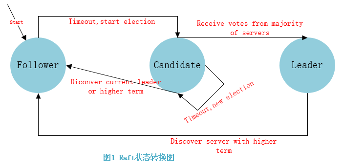
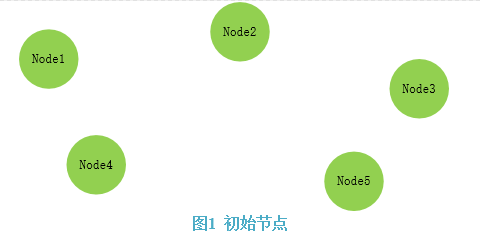
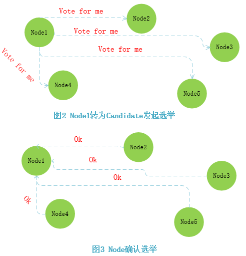
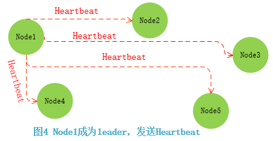

&nbsp;&nbsp;&nbsp;&nbsp;&nbsp;&nbsp;熟悉或了解分布式系统的开发者都知道一致性算法的重要性，Paxos一致性算法提出至今已经有二十几年了，而Paxos流程太过于繁杂，实现起来比较复杂，因此Raft应运而生，它是比Paxos更简单而又能实现Paxos所解决的问题的一致性算法。

<!-- more -->

 

<a>[<b>Raft动图展示详解</b>](http://thesecretlivesofdata.com/raft/?spm=a2c4e.10696291.0.0.122c19a4sBpxKb)</a>

# 一、背景
&nbsp;&nbsp;&nbsp;&nbsp;&nbsp;&nbsp;熟悉或了解分布性系统的开发者都知道一致性算法的重要性，Paxos一致性算法从90年提出到现在已经有二十几年了，而Paxos流程太过于繁杂实现起来也比较复杂，可能也是以为过于复杂 现在我听说过比较出名使用到Paxos的也就只是Chubby、libpaxos，搜了下发现Keyspace、BerkeleyDB数据库中也使用了该算法作为数据的一致性同步，虽然现在很广泛使用的Zookeeper也是基于Paxos算法来实现，但是Zookeeper使用的ZAB（Zookeeper Atomic Broadcast）协议对Paxos进行了很多的改进与优化，算法复杂我想会是制约他发展的一个重要原因；说了这么多只是为了要引出本篇文章的主角Raft一致性算法，没错Raft就是在这个背景下诞生的，文章开头也说到了Paxos最大的问题就是复杂，Raft一致性算法就是比Paxos简单又能实现Paxos所解决的问题的一致性算法。
&nbsp;&nbsp;&nbsp;&nbsp;&nbsp;&nbsp;Raft是斯坦福的Diego Ongaro、John Ousterhout两个人以易懂（Understandability）为目标设计的一致性算法，在2013年发布了论文：《In Search of an Understandable Consensus Algorithm》从2013年发布到现在不过只有两年，到现在已经有了十多种语言的Raft算法实现框架，较为出名的有etcd，Google的Kubernetes也是用了etcd作为他的服务发现框架；由此可见易懂性是多么的重要。

# 二、Raft概述
&nbsp;&nbsp;&nbsp;&nbsp;&nbsp;&nbsp;与Paxos不同Raft强调的是易懂（Understandability），Raft和Paxos一样只要保证n/2+1节点正常就能够提供服务；众所周知但问题较为复杂时可以把问题分解为几个小问题来处理，Raft也使用了分而治之的思想把算法流程分为三个子问题：选举（Leader election）、日志复制（Log replication）、安全性（Safety）三个子问题；这里先简单介绍下Raft的流程;
&nbsp;&nbsp;&nbsp;&nbsp;&nbsp;&nbsp;Raft开始时在集群中选举出Leader负责日志复制的管理，Leader接受来自客户端的事务请求（日志），并将它们复制给集群的其他节点，然后负责通知集群中其他节点提交日志，Leader负责保证其他节点与他的日志同步，当Leader宕掉后集群其他节点会发起选举选出新的Leader；

# 三、Raft详解
## 1、角色
&nbsp;&nbsp;&nbsp;&nbsp;&nbsp;&nbsp;Raft把集群中的节点分为三种状态：Leader、 Follower 、Candidate，理所当然每种状态负责的任务也是不一样的，Raft运行时提供服务的时候只存在Leader与Follower两种状态；
><b>Leader（领导者）</b>：负责日志的同步管理，处理来自客户端的请求，与Follower保持这HeartBeat的联系；
><b>Follower（追随者）</b>：刚启动时所有节点为Follower状态，响应Leader的日志同步请求，响应Candidate的请求，把请求到Follower的事务转发给Leader；
><b>Candidate（候选者）</b>：负责选举投票，Raft刚启动时由一个节点从Follower转为Candidate发起选举，选举出Leader后从Candidate转为Leader状态；

## 2、Term
&nbsp;&nbsp;&nbsp;&nbsp;&nbsp;&nbsp;在Raft中使用了一个可以理解为周期（第几届、任期）的概念，用Term作为一个周期，每个Term都是一个连续递增的编号，每一轮选举都是一个Term周期，在一个Term中只能产生一个Leader；先简单描述下Term的变化流程： Raft开始时所有Follower的Term为1，其中一个Follower逻辑时钟到期后转换为Candidate，Term加1这是Term为2（任期），然后开始选举，这时候有几种情况会使Term发生改变：
- 如果当前Term为2的任期内没有选举出Leader或出现异常，则Term递增，开始新一任期选举
- 当这轮Term为2的周期选举出Leader后，过后Leader宕掉了，然后其他Follower转为Candidate，Term递增，开始新一任期选举
- 当Leader或Candidate发现自己的Term比别的Follower小时Leader或Candidate将转为Follower，Term递增
- 当Follower的Term比别的Term小时Follower也将更新Term保持与其他Follower一致；

&nbsp;&nbsp;&nbsp;&nbsp;&nbsp;&nbsp;可以说每次Term的递增都将发生新一轮的选举，Raft保证一个Term只有一个Leader，在Raft正常运转中所有的节点的Term都是一致的，如果节点不发生故障一个Term（任期）会一直保持下去，当某节点收到的请求中Term比当前Term小时则拒绝该请求；

## 3、选举（Election）
&nbsp;&nbsp;&nbsp;&nbsp;&nbsp;&nbsp;Raft的选举由定时器来触发，每个节点的选举定时器时间都是不一样的，开始时状态都为Follower某个节点定时器触发选举后Term递增，状态由Follower转为Candidate，向其他节点发起RequestVote RPC请求，这时候有三种可能的情况发生：
- 该RequestVote请求接收到n/2+1（过半数）个节点的投票，从Candidate转为Leader，向其他节点发送heartBeat以保持Leader的正常运转
- 在此期间如果收到其他节点发送过来的AppendEntries RPC请求，如该节点的Term大则当前节点转为Follower，否则保持Candidate拒绝该请求
- Election timeout发生则Term递增，重新发起选举

&nbsp;&nbsp;&nbsp;&nbsp;&nbsp;&nbsp;在一个Term期间每个节点只能投票一次，所以当有多个Candidate存在时就会出现每个Candidate发起的选举都存在接收到的投票数都不过半的问题，这时每个Candidate都将Term递增、重启定时器并重新发起选举，由于每个节点中定时器的时间都是随机的，所以就不会多次存在有多个Candidate同时发起投票的问题。
&nbsp;&nbsp;&nbsp;&nbsp;&nbsp;&nbsp;有这么几种情况会发起选举，1：Raft初次启动，不存在Leader，发起选举；2：Leader宕机或Follower没有接收到Leader的heartBeat，发生election timeout从而发起选举;

## 4、日志复制（Log Replication）
&nbsp;&nbsp;&nbsp;&nbsp;&nbsp;&nbsp;<b>日志复制（Log Replication）</b>主要作用是用于保证节点的一致性，这阶段所做的操作也是为了保证一致性与高可用性；当Leader选举出来后便开始负责客户端的请求，所有事务（更新操作）请求都必须先经过Leader处理，这些事务请求或说成命令也就是这里说的日志，我们都知道要保证节点的一致性就要保证每个节点都按顺序执行相同的操作序列，日志复制（Log Replication）就是为了保证执行相同的操作序列所做的工作；在Raft中当接收到客户端的日志（事务请求）后先把该日志追加到本地的Log中，然后通过heartbeat把该Entry同步给其他Follower，Follower接收到日志后记录日志然后向Leader发送ACK，当Leader收到大多数（n/2+1）Follower的ACK信息后将该日志设置为已提交并追加到本地磁盘中，通知客户端并在下个heartbeat中Leader将通知所有的Follower将该日志存储在自己的本地磁盘中。

## 5、安全性（Safety）
&nbsp;&nbsp;&nbsp;&nbsp;&nbsp;&nbsp;<b>安全性</b>是用于保证每个节点都执行相同序列的安全机制，如当某个Follower在当前Leader commit Log时变得不可用了，稍后可能该Follower又会倍选举为Leader，这时新Leader可能会用新的Log覆盖先前已committed的Log，这就是导致节点执行不同序列；Safety就是用于保证选举出来的Leader一定包含先前 commited Log的机制：
- 选举安全性（Election Safety）
- 每个Term只能选举出一个Leader
- Leader完整性（Leader Completeness）

&nbsp;&nbsp;&nbsp;&nbsp;&nbsp;&nbsp;这里所说的完整性是指Leader日志的完整性，当Log在Term1被Commit后，那么以后Term2、Term3…等的Leader必须包含该Log；Raft在选举阶段就使用Term的判断用于保证完整性：当请求投票的该Candidate的Term较大或Term相同Index更大则投票，否则拒绝该请求。

- - -
keep exercising, keep learning english, keep learning blockchain.