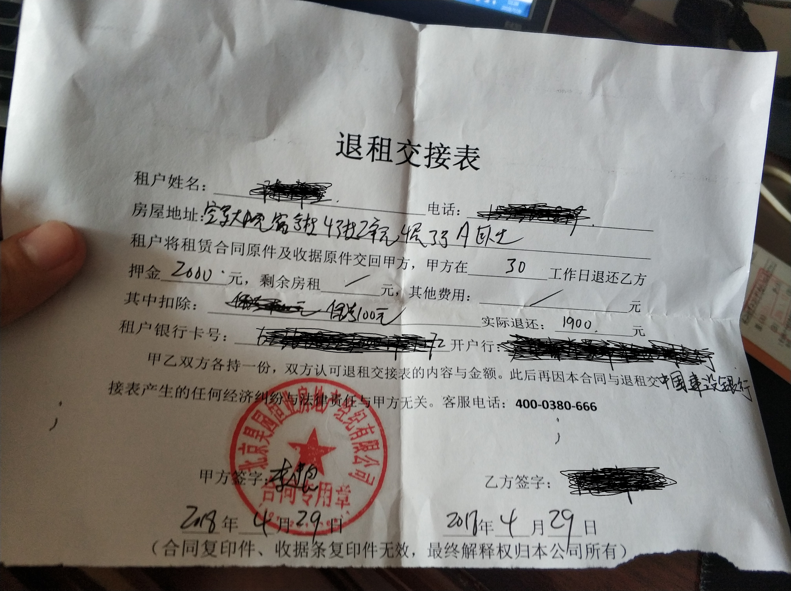

给大家说说我亲身经历的租房骗局，小中介如何骗你的钱。
我会不定期在网站发布个人生活中遇到的各种骗局，发布到【个人黑名单】分类中，请大家持续关注，避免遇到同样的坑，打击坑蒙拐骗，让那些只顾赚钱，不顾服务的商家，淘汰掉。
<!-- more -->
# 中介公司
美丽家园房地产有限公司、昊园恒业房地产有限公司
# 产品
大熊公寓
# 总部地址
北京市朝阳区财满街8号楼2单元703室
# 个人情况
首先说说我的情况，码农一枚跟朋友一起租房，3个人，租2间房，一间2人，一间1人，无奈北京房租太贵，链家、我爱我家中介费太高，只好找小中介，不受中介费。
# 租房
## 第一个坑：预付款时，一定看好是“订金”还是“定金”
找到一个小中介公司，在一个小区里面租下15平米左右的主卧2000元，收了一个月押金。当时保证押金可以退回，家具家电均可以上门维修。于是就签合同，另一个朋友，在签合同的时候，了解到，如果中途退租的话，需要找到接盘侠，才能退租，把押金退给你，他不干，于是签了一半的合同终止了，但是中介不干啊，他说合同是要收钱的，200块，你说气不气人，还有，跟他们争论的时候，还问他们索要订金200块，但是那个条子上写的是“定金”，意思就是你已经预付款一些金钱把这个房子定下来了，于是发现情况不对，就对他们客气地说话，说我们之前没弄清楚情况，麻烦谅解一下，最后扣了100块，定金退了。所以大家以后预付款的时候，一定看好是“订金”还是“定金”。
## 第二个坑：房租付款方式，自付最好，不要和第三方借贷平台签约
租金结算方式为58月付，58月付是一个借贷平台，通过借贷的方式，一次性借贷1年的房租也就是20000元，58月付一下子就把钱打给了中介公司，然后58每个月从你的银行卡中扣除2000元，这样中介公司实际就获得了20000元的借款，可以拿去投资或者业务扩张了，而实际是你借的钱。
这种借贷是上了征信的，如果你有违约，征信就会出现问题，所以我没一次敢怠慢。
## 第三个坑：房屋中的家电不能用
租下房子之前看过了房子，家电、桌椅、床等设施都齐全，灯、空调、冰箱都使用过了，确实是好的，于是签了合同，住进来才发现洗衣机没法用，缺少一根水管，于是联系他们，配一根洗衣机水管，于是他就叫我们自己弄，公司没有这项规定，也没有相应的业务人员做这个事情，于是只能自己网上买水管了啊，合同都签了。
还有一次，灯不亮了，也叫他们过来维修，同样的理由，叫我们自己网上买个灯管，我们真是服了，对于服务这么差的中介，绝对不会合作第二次。
## 第三个坑：重新签合同，导致交租金提前
美丽家园被收购，母公司重新过来签合同，之前是每月16日交租，现在12日交租，房租提前4天交，他们的业务员说会把这4天的钱退给我们，但是一直没退。
## 第四个坑：退租，乱扣租金
退租的时候，房管一副高高在上的样子，好像谁欠他钱似的，查看了房间，检查了家电，押金中扣了我们300元，我去你大爷，住了10个月，给你换了灯管、镇流器、洗衣机水管，还给我们说损坏费用。
这300块，100块写在单子上付给公司，另外200块说私下给他转过去，这是拿回扣啊，好好好给你这个死胖子。
好了，这押金搞定了，还有房租的事情，因为每次交房租都是交的下个月的，于是我们最后一个月交的是下个月的，应该退我们1个月的房租，但是~一脸横肉的房管，硬生生给我们算成了26天，我跟他算数，他不跟我算数，一直按照他的那套算法来，他妹的，你们还差我4天前没退呢，最后也懒得跟这种人打交道了，就26天了，拿了单子走人了。
最后说是押金和租金会在1-2个月内退回，你妹的，你们工作效率这么低吗，要这么长时间。我拿了押金条，快速离开了这个人。这里附上退租押金条：

## 第五个坑：不退押金，原因是财务正在处理
一个月到了确实退了我们租金，但是押金没有退给我们，于是找他们要，第一次，他说提交给财务，第二次去催催财务，第三次去催催财务，这几次，态度极其恶劣，如果不是钱在他手里，我就骂死他，于是又忍气吞声1个月半月过去了，承诺给我们的1-2个月已经超过了半个月，继续联系，我们同一个套间里面的其他朋友也都在催，于是叫我们联系客服，客服电话一直打不通，一次没打通过，于是跟他理论，自己去总部要钱，他说不知道总部位置，我晕死，你一个业务人员不知道总部的位置，还干啥啊，回家种田吧，又联系一次，说是找找总部位置，给我发了一个地址：朝阳区牌坊街8号楼2单元703，好了，我带着沉重的心情去总部要钱，没把握要到钱啊，位置离我2个小时车程。
到了，没有公司牌子，很像一个租户的屋，于是敲门，问问，果然是的。于是恼火了，我2个小时到这里，你给我一个错误的地址？打电话过去骂他，我们互相对骂，这几年没骂人了，骂的痛快，你不让我好过，我也不让你好过。无奈啊，找物业问了，也是说没有这个房地产公司。
于是找当初带我们看房子的业务员，问他总部位置，说是：朝阳区财满街8号楼2单元703，于是有话2小时去这个地方，这个地方是对的，找到他们领导，说明了情况，登记了紧急退租表，给我们说是8月10号退租。
其实这时候心还是有点怀疑他们说的话，但是不信也没什么办法啊，于是回家了，今天一天都在处理这个事情了，上午9点出发，下午4点才到家，等吧。
这里附上总部图片：

还有房管的电话：15510302000，欢迎去骚扰他，骂他更好。

好了，希望大家记住这几点，并告诉身边的朋友们，多谢了。