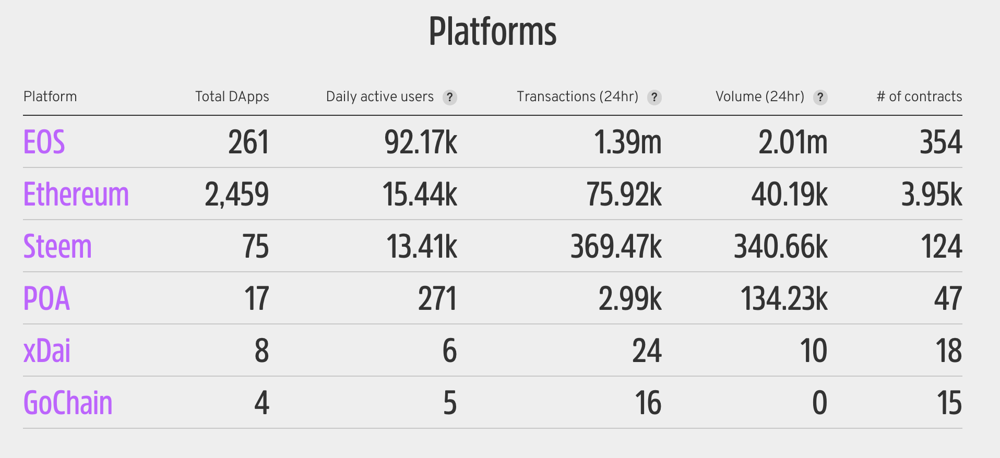
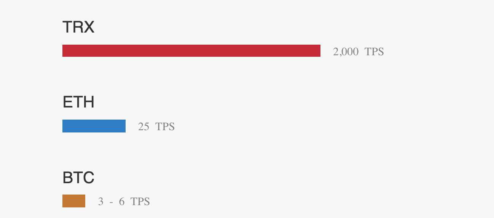

区块链三大公链Dapp平台ETH、EOS、TRON对比，根据创始人经历、平台共识机制、平台发展历程、目前发展现状等方面进行对比，寻找最有可能实现未来去中心化操作系统的平台。
<!-- more -->

# 一、创始人
## 1.ETH以太坊创始人：维塔利克·布特林（Vitalik Buterin）
* 出生日期：1994年1月31日
* 国籍：俄罗斯裔加拿大人
* 学历：加拿大滑铁卢大学肄业
* 区块链经历：
2012年17岁时从他父亲那里了解了比特币，开始研究比特币、为比特币杂志写文章转比特币稿费，当时出版社给他一篇文章5个比特币；
2013年18岁时获得奥林匹亚资讯奖铜牌，经常去访问其他国家的比特币社区开发人员，讨论比特币的发展与问题；
2014年19岁自加拿大滑铁卢大学休学；该年11月，公布《以太坊白皮书》初版，开始募集开发者；
2015年20岁获得硅谷知名的亿万富翁设立的泰尔奖学金10万美元成立非营利组织以太坊基金会，全职在以太坊工作；在迈阿密的比特币会议公开发表以太坊计画，该年7月，启动以太坊计画众售募资，募得3.1万枚比特币（当时约合1840万美元）
2016年21岁以太坊最初版本Frontier问世、以太币开始在世界各地交易所公开交易
2017年22岁被《财星》杂志评选为2016年40岁以下的40大杰出人物

## 2.EOS柚子创始人：丹尼尔·拉里默（Daniel Larimer）
* 出生日期：未查到
* 国籍：美国
* 学历：2003年毕业于佛吉尼亚大学计算机系本科学士学位
* 区块链经历：
2009年对比特币感兴趣，开始了解；
2013年创建BitShares去中心化交易所，是一个拥有钱包, 账本, 交易所, 货币系统，社群与一身的产品，与之对应的是BTS(比特股)虚拟货币的发行，目前市值排名51；
2016年离开BitShares创建Steem区块链平台和利用区块链技术实现的社交app steemit，该平台可以对用户的创作予以代币奖励；
项目完成后，2017年7月发布EOS白皮书，提供分散式应用程序托管﹑智能合约功能与分散式储存的企业方案，解决比特币和以太坊等区块链的可扩展性问题，并消除用户的交易费用。成立了Block.One公司并搭建了EOSIO平台，并发行以ERC-20方式发行1亿枚EOS代币

## 3.TRON波场创始人：孙宇晨
* 出生日期：1990年
* 国籍：中国
* 学历：北京大学、宾夕法尼亚大学硕士
* 区块链经历：
2013年以前投资比特币，获得二十倍以上收益；
由于比特币的投资经历，孙宇晨活跃于美国比特币社区，并对加密货币，去中心化清算协议产生了极其浓厚的兴趣。经过长期调查与研究，他对于诞生于加州硅谷的全球第一个分布式清算支付网络协议——Ripple协议产生了极其浓厚的兴趣。
2013年底加入RippleLabs，成为Ripple协议缔造者与研发者中的一员；
2014年，他回国创立锐波并兼任CEO，锐波也成为中国首家从事去中心化清算系统产品开发的互联网科技公司；
2017年，孙宇晨在“世界区块链峰会上”发表《From it to bit》主题演讲，讲述了互联网的发展历史，阐释了web 4.0的观点。7月，随后推出了自己所做的项目：波场TRON，发布波场白皮书，基于区块链的开源去中心化内容娱乐协议，致力于利用区块链与分布式存储技术，构建一个全球范围内的自由内容娱乐体系，这个协议可以让每个用户自由发布，存储，拥有数据，并通过去中心化的自治形式，以数字资产发行，流通，交易方式决定内容的分发、订阅、推送，赋能内容创造者，形成去中心化的内容娱乐生态。
2018年7月，完成了对于BitTorrent及其旗下所有产品的收购，并将其并入到波场生态中。

# 二、区块链共识机制
先来介绍下三种共识机制的概念
## POW：Proof Of Work
工作量证明机制：通过计算机随机不停地计算得到指定hash值后获得记账权，并将区块链接到区块链上的机制，每个获得记账权的矿工会获得一定的代币，作为记账的奖励，这个过程俗称挖矿。

## POS：Proof Of Stake
权益证明机制：人们对于POW日趋中心化的算力分布(矿池)心怀忌惮之际，产生了权益证明机制，即对于验证人/节点的奖励，不是通过算力挖矿，而是通过持币而产生利息，这里就要引入一个概念叫做---币龄，币龄=币量x持有天数。这是根据你持有货币的量和时间，给你发利息的一个制度。当你获得了利息以后，你的所有币龄将被清空，你的持币时间将从0重新算起。

## DPOS：Delegated Proof Of Stake
委托权益证明机制：可以说DPOS是POS共识机制理念的一个变种。先通过选举，产生若干超级节点；后续记账权将以相同概率分配于超级节点中。它有点像是议会制度或人民代表大会制度。如果代表不能履行他们的职责(当轮到他们时，没能生成区块)，他们会被除名，网络会选出新的超级节点来取代他们。
DPOS让每一个持有代币的人都有权利通过投票给验证人的方式行使自己的权利，利用科技的手段实现民主治理。

## 1.ETH
* 第一阶段，边境（Frontier，2015年7月）
以太坊的第一次版本发布，允许开发人员对以太坊进行挖矿，并基于以太坊进行 DApp 与工具软件的开发。

* 第二阶段，家园（Homestead，2016年3月）
发布了第一个生产环境版本，对许多协议进行了优化改进，为之后的升级奠定了基础，并且加快了交易速度。

* 第三阶段，大都会（Metropolis，2017年10月）
第三阶段分为两次升级，分别命名为拜占庭（Byzantium，2017年10月）和君士坦丁堡（Constantinople，2019年1月），将会使得以太坊更轻量、更快速、更安全。

* 第四阶段，宁静（Serenity，时间待定）
这个版本将会使用期待已久的 PoS 共识，其中将会使用 Casper 共识算法。

目前第三阶段已升级完成，所以ETH仍然使用POW共识机制。

## 2.EOS
DPOS
目前已选出21个超级节点进行选举出块。

## 3.TRON
DPOS
* 第一阶段：Exudos，出埃及记
数据自由-基于点对点的分布式的内容上传、存储和分发机制。出埃及记阶段，波场（TRON）将建立在以IPFS为代表的分布式存储技术之上，为用户提供一个可以完全自由可依赖的数据发布，存储，传播平台。

* 第二阶段：Odyssey，奥德赛（2019年1月-2020年6月，2019年5月发布2.0，9月发布3.0）
内容赋能-经济激励赋能内容生态。区块链技术，将为内容产生，分发，传播建立一整套充分竞争、回报公平的经济机制，激励个体，赋能内容，从而不断拓展系统的边界。

* 第三阶段：Great Voyage（2020年7月-2021年7月）
伟大航程，人人发行数字价值。波场（TRON）基于区块链的优势，解决了收益衡量、红利发放和支持者管理三大难题，实现了从“粉丝经济”向“粉丝金融”的重大转变，波场（TRON）基于区块链以波场币（TRX）为官方代币的自治经济体系使得个人内容生产者在体系内的每一笔收入和支出都公开、透明且不可篡改，通过智能合约，支持者们可以自动参与内容生产者的数字资产购买并按照约定自动共享红利成长，不需要任何第三方进行监督即可公正地完成全部流程。

* 第四阶段：Apollo，阿波罗（2021年8月-2023年3月）
价值自由流动-去中心化的个体专属代币交易。当每一个波场（TRON）体系内的内容生产者都可以发行自己的专属代币，则系统必须拥有一整套完整的去中心化交易所解决方案，方能实现价值的自由流动。

* 第五阶段：Star Trek，星际旅行（2023年4月-2025年9月）
流量变现-去中心化的博弈与预测市场。全球博弈市场规模2014年超过4500亿美元。波场（波场（TRON））内容平台所带来的流量，为构建去中心化的线上博弈平台提供了可能。开发者可以通过波场（TRON）自由搭建线上博弈平台，提供全自治的博弈预测市场功能。

* 第六阶段：Eternity，永恒之地（2025年10月-2027年9月）
流量转化-去中心化的游戏。2016年，全球电子游戏市场规模达996亿美元，其中手机游戏市场规模461亿美元，占比42%。波场（波场（TRON））为构建去中心化的线上游戏平台提供了可能。开发者可以通过波场（TRON）自由搭建游戏平台，实现游戏开发众筹，并为普通投资者提供参与投资游戏的可能。

目前第二阶段升级到1.0版本。

# 平台功能
## ETH
1.Smart Contract：智能合约
2.EVM：以太坊虚拟机，提供智能合约运行的分布式区块链环境
3.ICO：发币融资（如：BNB）
4.DAPPs
5.转账

## EOS
1.Smart Contract：智能合约
2.ICO：发币融资
3.DAPPs
4.转账

## TRON
1.内容上传、存储和分发
2.给予内容创作者奖励
3.ICO（未实现）
4.去中心化的博弈与预测市场（未实现）
5.去中心化游戏（未实现）
6.DAPPs
7.转账

# 三、平台目前发展现状
## 实时数据
据 DAppTotal4月29日数据显示，过去一周，综合对比 ETH、 EOS、 TRON四大公链的 DApp生态情况发现：
* 总用户量(个)
EOS(292,337)> TRON(87,261)> ETH(31,678)；
* 总交易次数(笔)
EOS(26,393,841)> TRON(9,856,747)> IOST(2,360,126)> ETH(373,918)；
* 总交易额(美元)
EOS(144,852,700)> TRON(88,426,176)> ETH(39,182,195)；
* 跨四条公链按用户量 TOP3 DApps
EOS Global(EOS)、 Endless Game(EOS)、 Lore Free(EOS)；
* 按交易次数 TOP3 DApps
Hash Baby(EOS)、 TRONbet(TRON)、 Dice(EOS)；
* 按交易额 TOP3 DApps
TRONbet(TRON)、 EOS Global(EOS)、 TronWoW(TRON)。

## 统计数据

尴尬，这个网站：[State of Dapps](https://www.stateofthedapps.com/stats#new) 没有统计TRON平台的数据。

# 转账交易速度TPS
由于平台共识机制不同，导致去中心化程度、运行速度也不同，下面是几大平台交易速度：

其中EOS，TPS可达3500.比其他几大平台都快。

这些是目前公共区块链平台的一些基本信息，希望对大家有用，如有错误的地方还请指正，联系方式：chenzuoli709@163.com，一起交流学习。