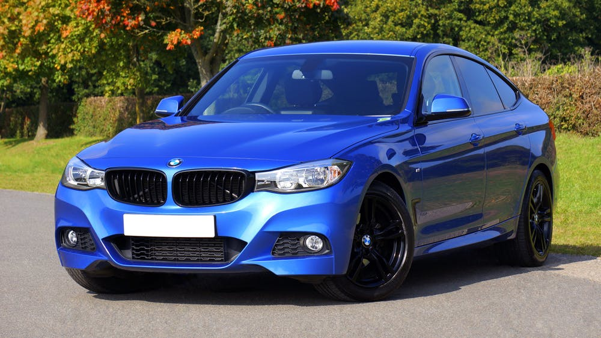
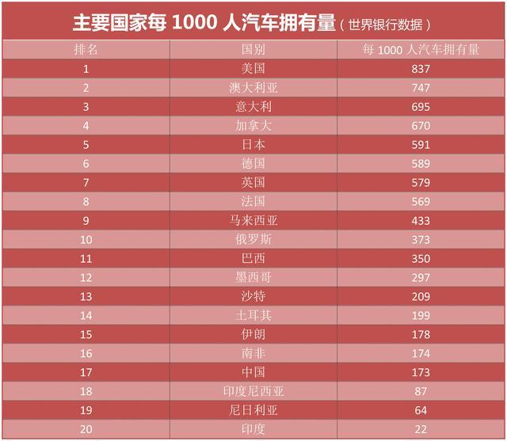

&nbsp;&nbsp;&nbsp;&nbsp;&nbsp;&nbsp;中国车市未老先衰，中低收入者没钱买车。

<!-- more -->

&nbsp;&nbsp;&nbsp;&nbsp;&nbsp;&nbsp;中国的人口结构财富是一个三角形，大面积的人口都是中低收入人口，只有少量人口才算是富裕人口。
&nbsp;&nbsp;&nbsp;&nbsp;&nbsp;&nbsp;随着房价不断上涨以及生活必需品价格的不断上涨，事实上对于整个中低收入影响是非常大的，他们购车欲望降低。
&nbsp;&nbsp;&nbsp;&nbsp;&nbsp;&nbsp;蔚来、长安等类似车企，销量急剧下滑，蔚来18年亏损甚至达200亿，股价一度跌近90%。
&nbsp;&nbsp;&nbsp;&nbsp;&nbsp;&nbsp;来看下世界各国汽车人均占比图：

&nbsp;&nbsp;&nbsp;&nbsp;&nbsp;&nbsp;看似中国汽车市场有很大增长空间，但是实际收入相比美国还是甚远，2018年中国9770美元，美国6.26万美元，相差7倍。
&nbsp;&nbsp;&nbsp;&nbsp;&nbsp;&nbsp;看到这个状况，你有什么想法吗？

- - -
If you want to succeed, you should use persistence as your good friend, experience as your perference, prudence as your brother and hope as your sentry.