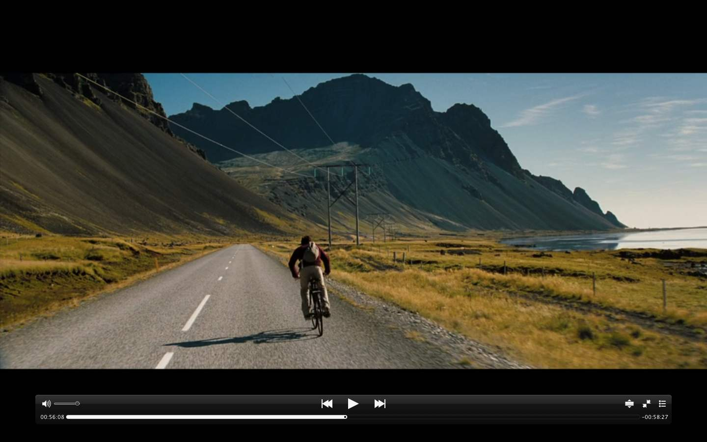

今年国庆回家了，以往都是出去浪了。

<!-- more -->

&nbsp;&nbsp;&nbsp;&nbsp;&nbsp;&nbsp;去年带着爸妈弟弟去重庆了，享受了一家人的旅行时光，很不错，今年他们不去，也恰好我被辞了。

&nbsp;&nbsp;&nbsp;&nbsp;&nbsp;&nbsp;带着一个电脑，一本技术类的书籍，一点都没碰。

&nbsp;&nbsp;&nbsp;&nbsp;&nbsp;&nbsp;第一天回家，跟堂哥堂姐表弟一起玩去了，中午表弟家团聚吃饭，晚饭我家一起吃饭，第二天中午堂哥家吃饭，时间过得很快，他们下午就回武汉了，为了赚钱。

&nbsp;&nbsp;&nbsp;&nbsp;&nbsp;&nbsp;第三天又去另一个表哥家过客了，喜得千金，很多人，很热闹，欢乐过后就在他家睡觉了，等待第二天的朋友相聚。

&nbsp;&nbsp;&nbsp;&nbsp;&nbsp;&nbsp;第四天，顺利与朋友寒暄，畅聊了3个小时，他妈弄了一大盘饺子吃，自己家手包的饺子就是非常地美味，so decilious. 但是天一直下雨☔️，变得很冷，无法回我老家，无法去我姥姥家，人算不如天算，计划被打乱，于是又回到表哥家过了一夜，期待明天天晴。

&nbsp;&nbsp;&nbsp;&nbsp;&nbsp;&nbsp;第五天果然天晴，一大早吃完早餐，与舅舅舅妈告别，急急忙忙骑着摩托车回家，天太冷，受罪了，冻得哆嗦。路上带着妈去姥姥家，天下着小雨，雾很大，幸亏有妈的指引，不然会迷路。
&nbsp;&nbsp;&nbsp;&nbsp;&nbsp;&nbsp;姥姥85岁，身体好了点，比去年强多了，Thank God，愿亲人身体健康。
&nbsp;&nbsp;&nbsp;&nbsp;&nbsp;&nbsp;急急忙忙吃完午饭，就赶忙与姥姥姥爷告别要赶高铁了，一路小雨微风，我上车了。

&nbsp;&nbsp;&nbsp;&nbsp;&nbsp;&nbsp;回家的这几天，表哥喜得千金，过得很幸福；堂哥开车回家；堂姐带了男朋友回家；表弟辞职了，准备区深圳闯一闯；我呢还是他们以为的那个样子，很不错。
&nbsp;&nbsp;&nbsp;&nbsp;&nbsp;&nbsp;但是也看到了亲人背后的无奈与压力，堂哥公司垮掉了，被迫要学习一些新的技能赚钱了。堂姐离婚后，为了赚钱，与她儿子分开，离开时候的不舍，估计只有她最懂。表弟的工作不赚钱，辞职了，为了能够与女朋友结婚，决定去深圳看看机会。表哥喜得千金，过客后又去工地跟着舅舅赚钱去了，工地很是辛苦，他们最懂。
&nbsp;&nbsp;&nbsp;&nbsp;&nbsp;&nbsp;我好像也好不到哪儿去，过完假要去找工作了。

&nbsp;&nbsp;&nbsp;&nbsp;&nbsp;&nbsp;10月7日早上到达北京，开始学习了。

- - -
All I know is that I should do my all effort to make my and my family's life best.