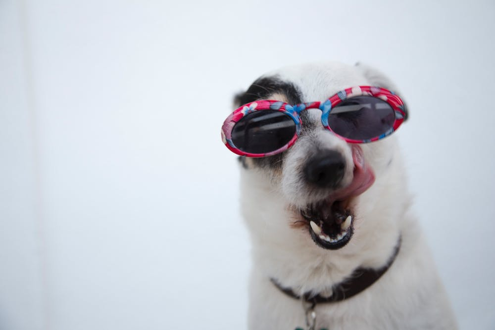

&nbsp;&nbsp;&nbsp;&nbsp;&nbsp;&nbsp;关于宠物饲养、医疗、培训、宠粮的一些知识，有些是从宠物店那边咨询得到的，有些确实很有用，来看看他们怎么说。

<!-- more -->

# 一、南梓宠物
1. 体型小（泰迪、柯基等）的宠物好养，放在家里，一天吃2餐即可，大型宠物（金毛、阿拉斯加等）需要更多的陪伴时间，不然在家里乱抓、乱咬、乱蹦；
2. 他家的泰迪9个月大，2000元；
3. 宠物店老板给我推荐 `海倍健` 狗粮，我不知道是好是坏，60块一袋；
4. 刚断奶的小狗，并且陌生的新环境，容易出现一些应激反应，例如呕吐、腹泻等，必须要吃益生菌药品，防止感染；我不知道是不是真的，买了一盒益动益生菌80块；

# 二、小小宠物
1. 狗是有感情的，你养了它以后，它就会记住你，一辈子都会记住你的，你要是遗弃它，它会非常地惨；猫不一样，过一个星期就会把你忘记；
2. 品种狗不要给它吃人吃的东西，有些吃了会过敏、消化不良、甚至中毒死亡（葡萄🍇）等；
3. 所以你要想清楚，你是否真的想，你是否有足够的精力去养一只狗；
4. 他家的泰迪4个月大，600元；
5. 品种狗一般都不会咬人，除非你在家虐待它，让它有一些暴躁的情绪；

# 三、承恩动物诊所：
1. 狗粮分类
    1. 材料：
        1. 天然粮：无动物死尸、动物副产品，不使用人工合成剂等有害物质；
        2. 商品粮：含4D（Dead、Disease、Dying、Disabled）肉等物质及其副产品；
    2. 水分含量：
        1. 全干粮：吃了要多喝水，建议吃干粮；
        2. 半干粮；
        3. 湿粮：容易长牙结石；
    3. 狗年龄分类：
        1. 奶糕粮；
        2. 幼犬粮；
        3. 成犬粮；
        4. 老年犬粮；
    4. 天然由于商品粮；
2. 狗的养法
    1. 宠物养：
        1. 没断奶小狗领养回家，吃奶糕粮；
        2. 2个月大，打防感染疫苗四联、六联、八联、驱虫，打三次，每次隔20天-30天；
        3. 狂犬疫苗；
        4. 后期一年一次狂犬疫苗；
    2. 土狗养：
        1. 吃的随便；
        2. 散养，不怎么管，适合农村；

- - -
<b>Where there is poverty, there is love.</b>