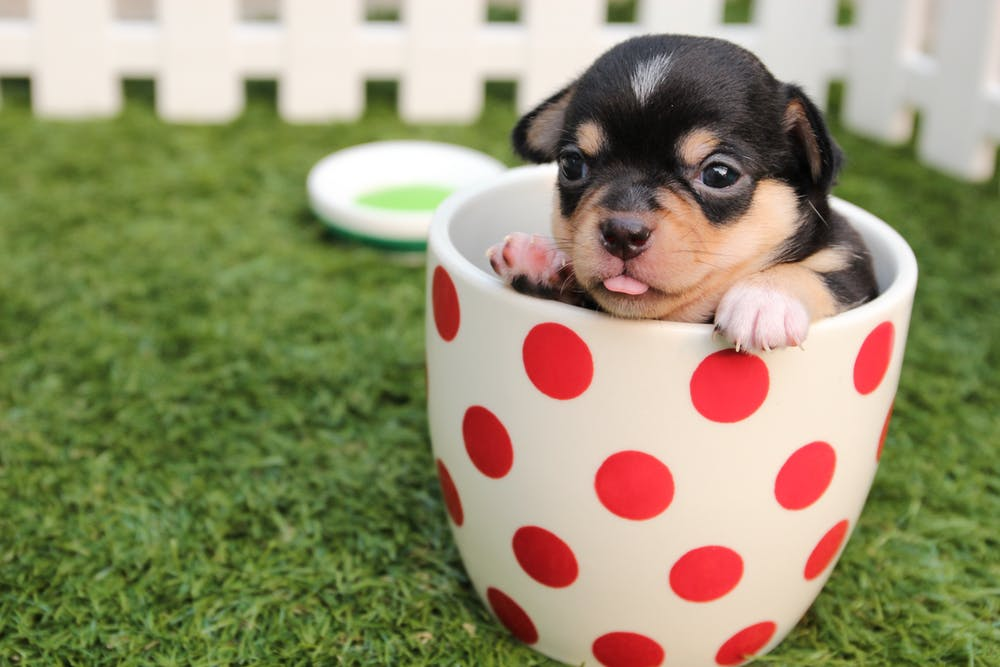
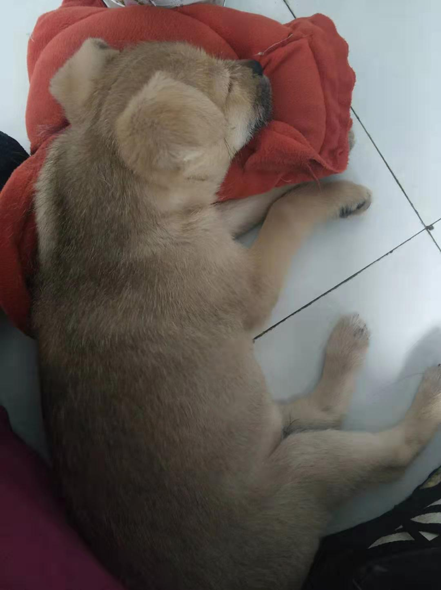

&nbsp;&nbsp;&nbsp;&nbsp;&nbsp;&nbsp;宠物知识百科，你要的入门了解都在这里，我会把我从0开始养狗的一些经历记录下来，分享给你们，避免走一些弯路，会不定期更新的哦。

<!-- more -->

# 1.品种
&nbsp;&nbsp;&nbsp;&nbsp;&nbsp;&nbsp;200种左右

# 2.食物
&nbsp;&nbsp;&nbsp;&nbsp;&nbsp;&nbsp;不要给水果吃，容易食物中毒（无分解酶导致肾功能下降）；

# 3.基本训练
## a.给小狗取个好听的名字
&nbsp;&nbsp;&nbsp;&nbsp;&nbsp;&nbsp;经常看着它并叫它的名字，让它知道你是在和它打招呼。久而久之，它一听见自己的名字就会屁颠屁颠地过来你跟前，别忘了给它一点狗粮奖励它的听话举动。

## b.顽皮是大多数小狗的天性
&nbsp;&nbsp;&nbsp;&nbsp;&nbsp;&nbsp;经常在家里撕扯衣服或小孩玩具或者乱吠乱咬。当狗出现这种情况时，主人应该及时的阻止，不要给它食物，否则它会因此认为它做的是正确的。

## c.给狗狗佩戴一个适合的锁链
&nbsp;&nbsp;&nbsp;&nbsp;&nbsp;&nbsp;经常性的带它出去散散步透透风，老是闷在家里狗狗也会烦闷，带它出去开开眼界，到人多的地方走一走，听听不同的声音。

## d.不要经常打骂它
&nbsp;&nbsp;&nbsp;&nbsp;&nbsp;&nbsp;会给狗狗留下难以磨灭的印象的。尤其是小狗狗，还会让狗狗对你产生畏惧的情感，失去顽皮的天性和对你的依赖。打就不要打头，不然会打傻的。

## e.春秋两季，狗狗进入换毛期
&nbsp;&nbsp;&nbsp;&nbsp;&nbsp;&nbsp;被毛大量脱落，影响室内卫生，如果被犬误食还会影响犬的消化。因此，要经常给犬梳理被毛，这样不仅可除去脱落的被毛污垢和灰尘，防止被毛缠结。

# 4.疫苗
## a.多联疫苗
&nbsp;&nbsp;&nbsp;&nbsp;&nbsp;&nbsp;幼犬只要达到45日龄就可以注射预防传染病的多联疫苗。首年注射需连续注射3次，每次间隔20-21天左右。以后每年定时免疫一次进行加强，具体时间决定于首年免疫时最后一次注射的时间。与此同时，狗狗在满3月龄以上，才能接种注射狂犬疫苗，可以选择在注射预防传染病疫苗的任何一针同时注射，两者不相冲突。

## b.周期
- 第一针    多联疫苗
- 第二针（间隔21天后）    多联疫苗
- 第三针（间隔21天后）    多联疫苗
- 第四针（间隔一周后）狂犬疫苗。
- 加强免疫，即首次免疫11个月后，多联疫苗和狂犬疫苗各加强一针。

# 5.体检
## a.宠物狗不用频繁的去体检
&nbsp;&nbsp;&nbsp;&nbsp;&nbsp;&nbsp;在正常情况下，每年带狗狗去体检1-2次即可。然而狗狗体检的具体收费，可能每一家宠物医院都不一样。一般来说，宠物医院也有一个相关的收费标准，狗狗体检的收费跟狗狗体检的内容密切相关。

## b.价格
&nbsp;&nbsp;&nbsp;&nbsp;&nbsp;&nbsp;当然，给宠物狗做一次全面的身体检查，也不会花费太多的钱，几十、几百也都是有可能的。然而，不管宠物狗体检需要花多少钱，每年带它去体检确实必要的。定期为狗狗注射疫苗、检查身体，详细的知道狗狗的身体情况。这不仅仅是对宠物狗负责，同时也是保证狗狗与人和谐相处的基本所在。

# 6.运输
## a.运送方式
&nbsp;&nbsp;&nbsp;&nbsp;&nbsp;&nbsp;空运、汽运、铁路、国际托运

## b.把犬从一个地方运送到另一个地方
&nbsp;&nbsp;&nbsp;&nbsp;&nbsp;&nbsp;多用于军犬、警犬、实验犬和观赏犬等。运输犬时可根据当地的交通条件及有关规定，结合任务缓急和路程远近等情况，选乘适当的交通工具。整个运输过程应以安全、方便、迅速为原则。运输犬前应做好如下准备：

### a.健壮无病
&nbsp;&nbsp;&nbsp;&nbsp;&nbsp;&nbsp;首先检查犬的健康状况，不仅要检查犬的呼吸脉搏和体温，而且须观察犬的粪便和排尿等情况，确保犬在健康情况下进行运输（伤、病犬运往治疗地点除外）。

### b.准备好运犬箱
&nbsp;&nbsp;&nbsp;&nbsp;&nbsp;&nbsp;对运犬箱的基本要求是轻便、坚固，体积适中，箱门必须能上锁。犬箱虽可用木材、角铁或硬塑料等制作，但一定要有通风和排除粪尿的空隙。如在冬季运输，犬箱中应加垫草防寒保暖。

### c.饮水，饲料准备充分
&nbsp;&nbsp;&nbsp;&nbsp;&nbsp;&nbsp;长途运输时应准备好饲料、饮水及食盆等生活必须品。犬料以精干料为主，不能带易腐败的肉及蔬菜等，而可带一些肉罐头或煮熟的鸡蛋等高蛋白食品。

### d.应急药品和器械
&nbsp;&nbsp;&nbsp;&nbsp;&nbsp;&nbsp;长途运输时还应携带一些常用药品，如治疗感冒、腹泻以及外用的消毒药等，最好还应带些抗菌素之类的药物及注射器、酒精棉等简单的治疗药品和器械，以防犬生病时急用。

### e.注意安全
&nbsp;&nbsp;&nbsp;&nbsp;&nbsp;&nbsp;短途运输或条件许可而不把犬装入箱内运输时，应给犬佩戴皮制口笼，系好牵引带，始终由护送人员将犬牵送到目的地。

### f.饲喂和排便
&nbsp;&nbsp;&nbsp;&nbsp;&nbsp;&nbsp;犬在运输的前2小时，应得到一定数量优质饲料，并给充足的饮水，之后进行适当的散放，使犬排除大小便。

### g.防止疾病和中毒
&nbsp;&nbsp;&nbsp;&nbsp;&nbsp;&nbsp;犬在上车或船前，运送人员应检查船舱或车厢内是否符合卫生要求，有无通风设备，附近有无农药或可危害犬体健康的物质，以及有传染病的动物等，必要时可进行清理、消毒或请求予以调换船舱或车厢等。

# 7.医药
## a.益生菌
&nbsp;&nbsp;&nbsp;&nbsp;&nbsp;&nbsp;其实益生菌是那个阶段的狗狗都是能吃的，如果你家狗狗是幼犬的话，那么建议你平时最好是给它吃些益生菌。因为初到家里这个陌生的新环境，容易出现一些应激反应，例如呕吐、腹泻等，所以给幼犬喂些益生菌有助减少这些问题的发生！如果你家狗狗体质比较差、经常生病的，那么也是可以给它喂些益生菌的，因为益生菌本身就属于保健品。平时给狗狗喂些宠物益生菌有效提高免疫力、抵抗力，这样狗狗就能减少生病的情况，就算你家狗狗体质不差也可以喂益生菌哦！

- - -
<b>I have a dog named Mango.</b>

