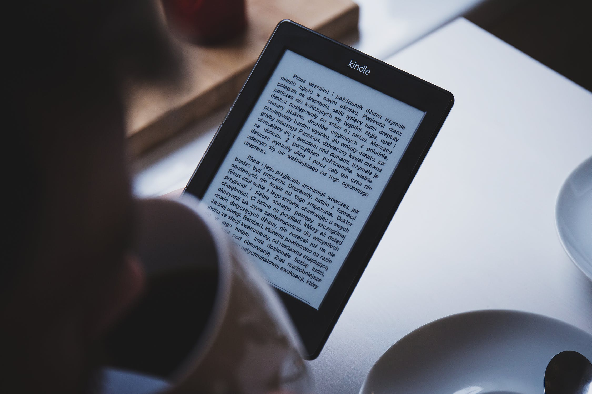

截至2019年的最富有的人。（以十亿美元计）

<!-- more -->

马云在2018年7月已跌出亚洲首富，现为印度人穆克什·安巴尼，世界排名如下：


```
🇺🇸杰夫·贝索斯：161		亚马逊			电子商务		美国
🇺🇸比尔·盖茨：102			微软			软件 		美国
🇫🇷伯纳德·阿诺特：94		LVMH集团总裁		奢侈品		法国
🇺🇸沃伦·巴菲特：90			伯克希尔哈撒韦		投资、咨询	美国
🇺🇸马克·扎克伯格：73		Facebook		社交		美国
🇺🇸拉里·埃里森：67			甲骨文Oracle		软件服务		美国
🇪🇸阿曼西奥·奥特加：66		Zara			服装零售		西班牙
🇲🇽卡洛斯·斯利姆：61		卡尔索集团		商业、电信	墨西哥
🇮🇳穆克什·安巴尼：56		信诚工业集团		商业 		印度
🇺🇸迈克尔·布隆伯格：55		彭博			媒体、慈善	美国
```