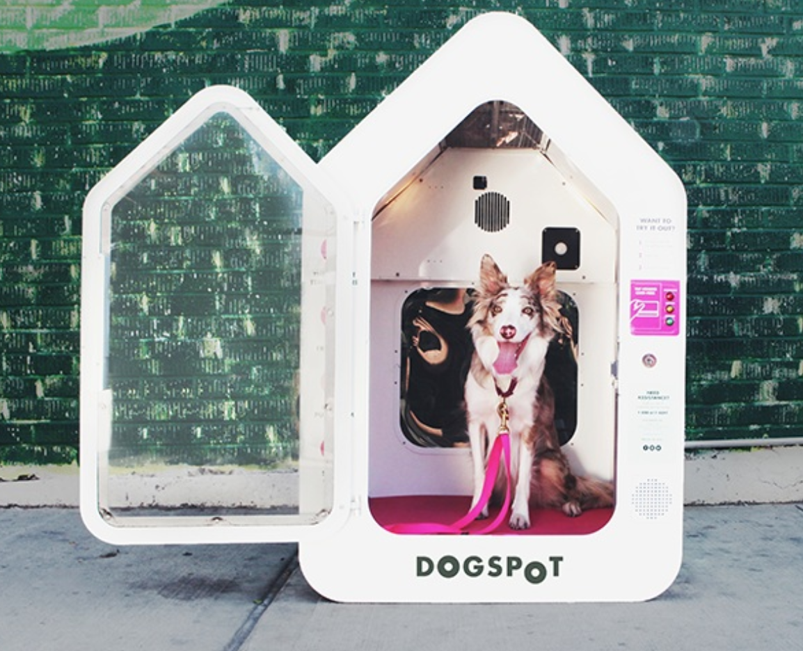
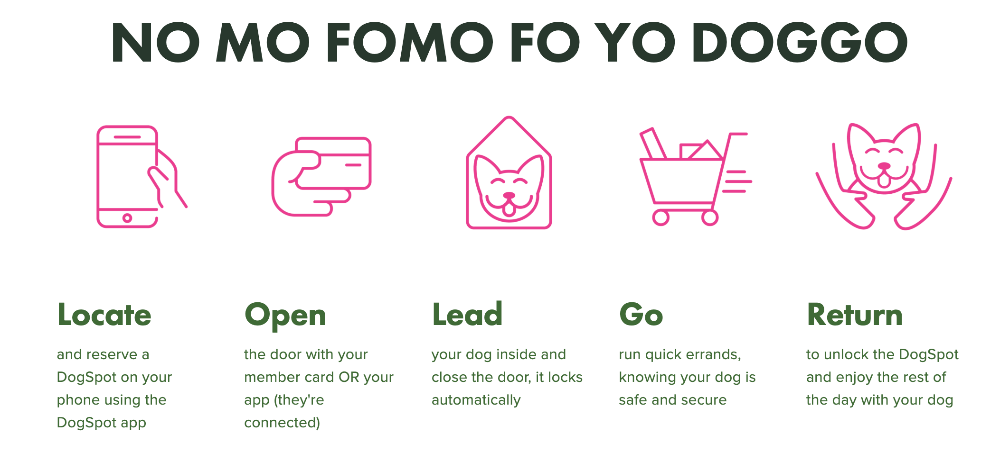
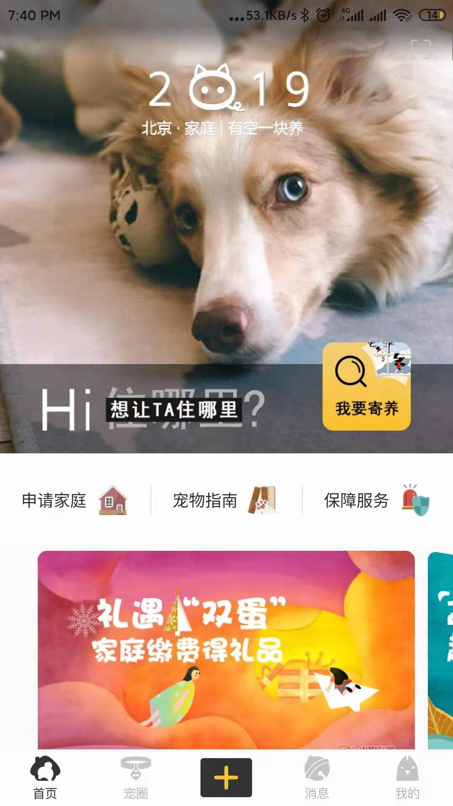
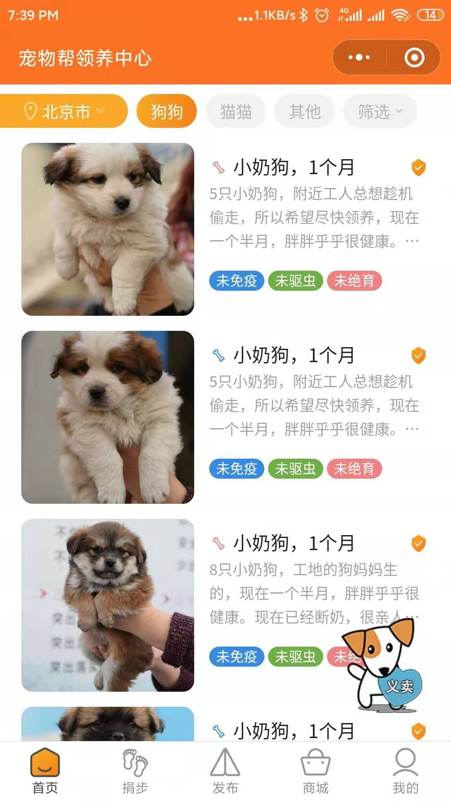

&nbsp;&nbsp;&nbsp;&nbsp;&nbsp;&nbsp;大家都是铲屎官，有时候想知道关于宠物的答案，有时候想跟别人分享自己的小狗狗的精彩瞬间，那么咱们去哪个平台呢，下面来给大家说说下面几个，都是我亲自用过的。

<!-- more -->

1. 宠优优App
    a. 记录我的优宠生活：我的动态、粉丝关注消息、发布文字视频、优选、养宠教程、养宠问答等功能，基本都有；
    b. 但是教程问答不是很全；
    c. 宠物领养无地区界限选择，我无法找到想要领养的城市；
2. 爱宠网
    a. http://www.ichong123.com/
    b. 宠物新闻、健康、养护、花卉、奇闻趣谈于一体的网站，非常地全面；
    c. 微博、公众号运营；
    d. 小程序商城；
    e. 缺点就是多杂乱，好多广告；
3. dogspot
    a. https://hellodogspot.com/  印度厂商提供的一种狗存放点服务
    b. 你出去玩的时候，没必要时刻带着狗，而是把它放在一个公共的智能存储点，提供给狗一个安全的、有趣的地方暂时存储；

    c. 其他服务

4. 顺丰旗下丰羿平台提供宠宝机票托运服务
    a. 从北京到武汉需要680元
5. 小狗在家
    a. 提供专业有爱的家庭式寄养服务；
    b. 申请为家庭，可以接单；
    c. c2c模式；

6. 【宠物帮领养中心】小程序
    a. 领养、送出的好地方
    b. 发布、领养宠物，捐赠宠粮；

- - -
<b>Where there is a will, there is a way.</b>