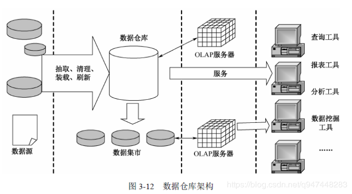
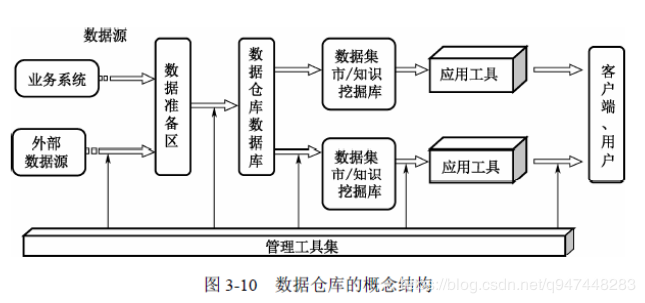
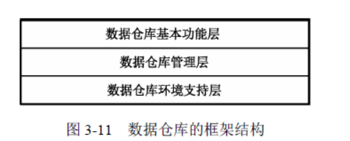

&nbsp;&nbsp;&nbsp;&nbsp;&nbsp;&nbsp;数据仓库是一个面向主题的、集成的、稳定的、反映历史变化的数据集合，用于支持决策管理，下面来看看它的组成部分。

<!-- more -->

&nbsp;&nbsp;&nbsp;&nbsp;&nbsp;&nbsp;这里有讲解数据仓库各个特点的具体详情，<a>[数据仓库特点详解](http://wetech.top/2019/09/17/%E6%95%B0%E6%8D%AE%E5%BA%93%E3%80%81%E6%95%B0%E6%8D%AE%E4%BB%93%E5%BA%93%E3%80%81%E6%95%B0%E6%8D%AE%E9%9B%86%E5%B8%82%E7%9A%84%E5%8C%BA%E5%88%AB%E4%B8%8E%E8%81%94%E7%B3%BB/)</a>

根据仓库特点我们可以大致猜到，他的结构大概是什么样子的：

1. 面向主题的、集成的
&nbsp;&nbsp;&nbsp;&nbsp;&nbsp;&nbsp;集成的数据仓库，数据是从不同的业务主题数据源处经过清洗、整合、统一规范入库，那么仓库中就会有<b>数据准备区(data staging层)</b>缓存业务数据，然后清洗，得到的一致性数据<b>ODS层</b>，另外需要提供<b>数据查询工具</b>、<b>数据可视化工具</b>、<b>数据建模工具</b>、<b>OLAP分析工具</b>进行数据展示和分析，来更好地提供决策支持。
2. 稳定的、反映历史变化的
&nbsp;&nbsp;&nbsp;&nbsp;&nbsp;&nbsp;仓库中的数据是定期按时从源数据端拉取过来，不会经常做更新操作，拉取更新操作需要用到<b>抽取工具</b>、<b>任务调度工具</b>，而且可以查询到历史数据状态，那么就需要管理数据的<b>元数据管理工具</b>，了解仓库中到底有哪些数据，这些数据目前的状况是怎样的。

# 一、概念结构

&nbsp;&nbsp;&nbsp;&nbsp;&nbsp;&nbsp;从数据仓库的概念结构看，一般来说，数据仓库系统要包含数据源、数据准备区、数据仓库数据库、数据集市/知识挖掘库及各种管理工具和应用工具，如图 3-10 所示。数据仓库建立之后，首先要从数据源中抽取相关的数据到数据准备区，在数据准备区中经过净化处理后再加载到数据仓库数据库，最后根据用户的需求将数据导入数据集市和知识挖掘库中。当用户使用数据仓库时，可以利用包括 OLAP（On-Line Analysis Processing，联机分析处理）在内的多种数据仓库应用工具向数据集市/知识挖掘库或数据仓库进行决策查询分析或知识挖掘。数据仓库的创建、应用可以利用各种数据仓库管理工具辅助完成。

# 二、层次框架

&nbsp;&nbsp;&nbsp;&nbsp;&nbsp;&nbsp;数据仓库框架由数据仓库基本功能层、数据仓库管理层和数据仓库环境支持层组成。

<b>数据仓库基本功能层</b>:

&nbsp;&nbsp;&nbsp;&nbsp;&nbsp;&nbsp;数据仓库的基本功能层部分包含数据源、数据准备区、数据仓库结构、数据集市或知识挖掘库，以及存取和使用部分。

<b>数据仓库管理层</b>:
&nbsp;&nbsp;&nbsp;&nbsp;&nbsp;&nbsp;数据仓库管理层由数据仓库的数据管理和数据仓库的元数据管理组成。
&nbsp;&nbsp;&nbsp;&nbsp;&nbsp;&nbsp;数据仓库的数据管理层包含数据抽取、新数据需求与查询管理，数据加载、存储、刷新和更新系统，安全性与用户授权管理系统及数据归档、恢复及净化系统等四部分。

<b>数据仓库的环境支持层</b>:
&nbsp;&nbsp;&nbsp;&nbsp;&nbsp;&nbsp;数据仓库的环境支持层由数据仓库数据传输层和数据仓库基础层组成。

# 三、架构图

- - -
<b>you must do what you like.</b>