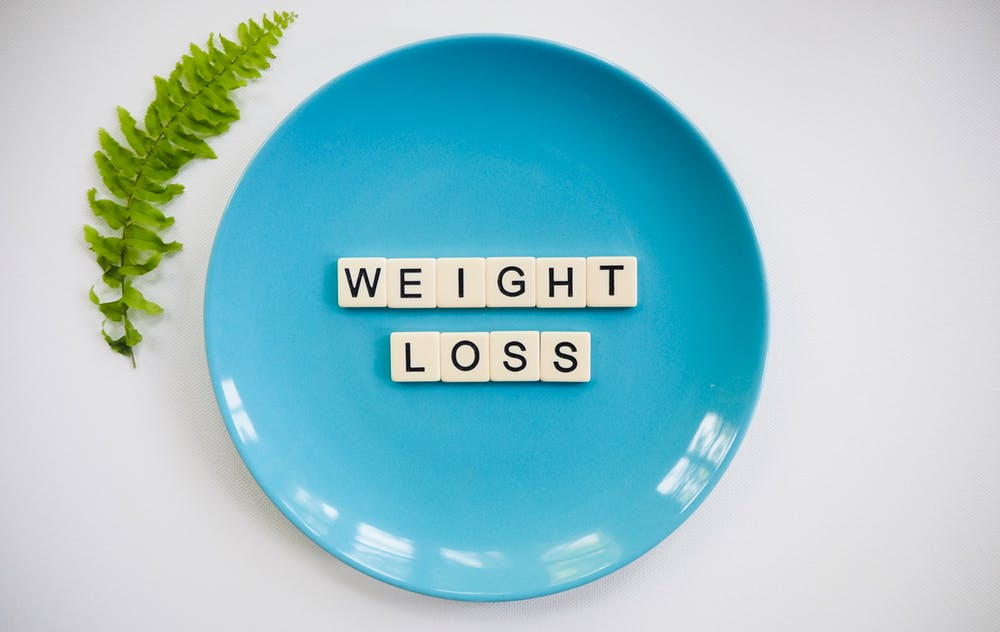

&nbsp;&nbsp;&nbsp;&nbsp;&nbsp;&nbsp;简单介绍下数据仓库数据质量管理系统，因为本人也是在不断学习建设当中，所以有什么问题请及时沟通。

<!-- more -->

&nbsp;&nbsp;&nbsp;&nbsp;&nbsp;&nbsp;下面来看下质量管理系统需要做的工作：

1. 数据表字段值范围预警；
2. 数据质量对比；
   1. 数据量；
   2. 数据值；
   3. 主键重复；
3. 任务运行时间范围预警；

- - -
<b>When the going gets tough, the tough get going.</b>