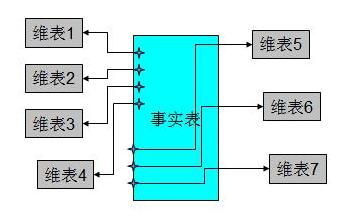
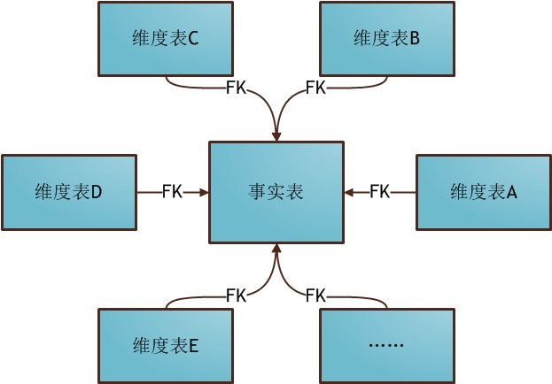
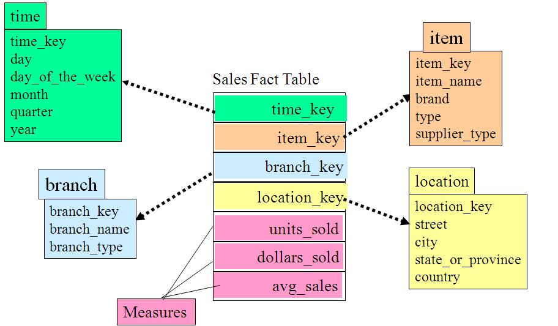
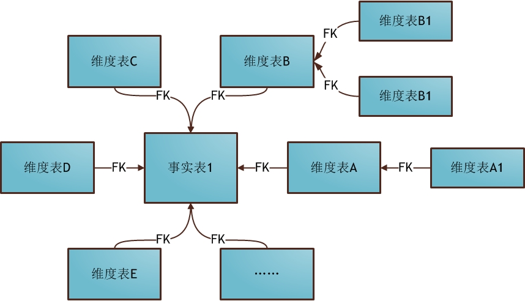
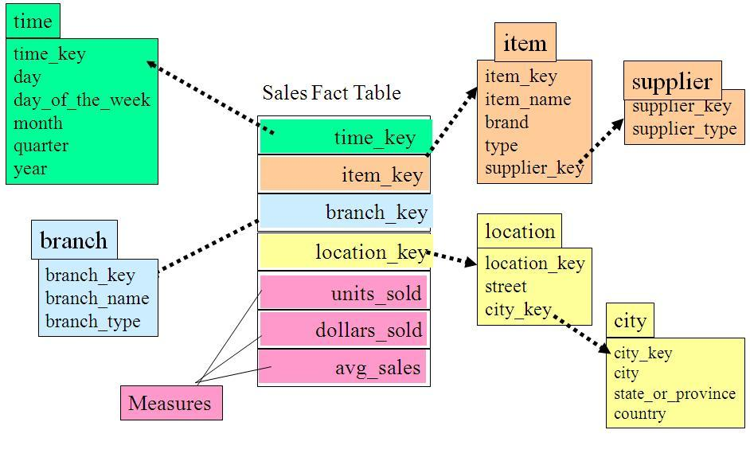
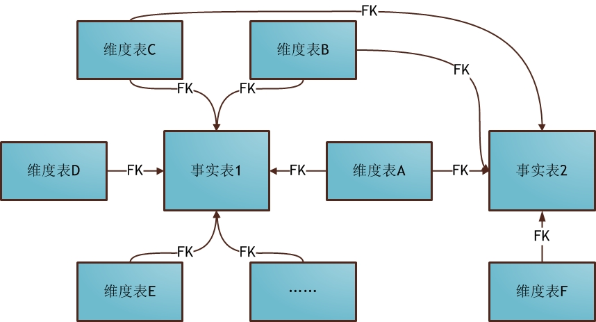
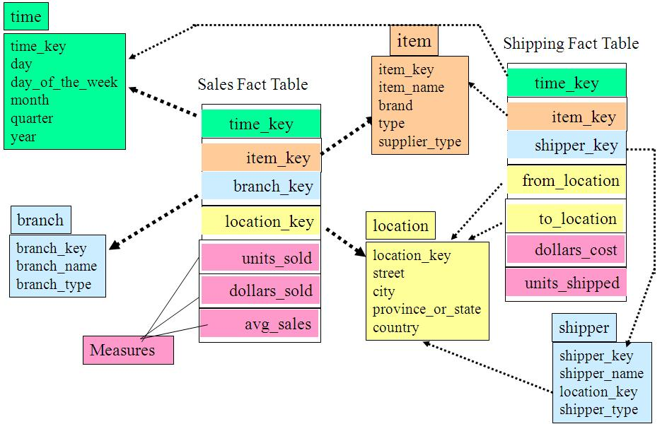

&nbsp;&nbsp;&nbsp;&nbsp;&nbsp;&nbsp;大千世界，万物都有其遵循的自有法则，数据仓库也不例外，根据业务场景，选择不同的设计模式，解决不同的业务问题。
&nbsp;&nbsp;&nbsp;&nbsp;&nbsp;&nbsp;下面来看看数据仓库的三种设计模式。

<!-- more -->

# 一、范式建模法（Third Normal Form，3NF）
&nbsp;&nbsp;&nbsp;&nbsp;&nbsp;&nbsp;范式建模法其实是我们在构建数据模型常用的一个方法，该方法的主要由 Inmon 所提倡，主要解决关系型数据库得数据存储，利用的一种技术层面上的方法。
&nbsp;&nbsp;&nbsp;&nbsp;&nbsp;&nbsp;目前，我们在关系型数据库中的建模方法，大部分采用的是三范式建模法。
&nbsp;&nbsp;&nbsp;&nbsp;&nbsp;&nbsp;范式是数据库逻辑模型设计的基本理论，一个关系模型可以从第一范式到第五范式进行无损分解，这个过程也可称为规范化。
&nbsp;&nbsp;&nbsp;&nbsp;&nbsp;&nbsp;在数据仓库的模型设计中目前一般采用第三范式，它有着严格的数学定义。从其表达的含义来看，一个符合第三范式的关系必须具有以下三个条件 :
>1.每个属性值唯一，不具有多义性 ;
>2.每个非主属性必须完全依赖于整个主键，而非主键的一部分 ;
>3.每个非主属性不能依赖于其他关系中的属性，因为这样的话，这种属性应该归到其他关系中去。

>优点：
>>从关系型数据库的角度出发，结合了业务系统的数据模型，能够比较方便的实现数据仓库的建模。

>缺点：
>>由于建模方法限定在关系型数据库之上，在某些时候反而限制了整个数据仓库模型的灵活性，性能等，特别是考虑到数据仓库的底层数据向数据集市的数据进行汇总时，需要进行一定的变通才能满足相应的需求。

# 二、维度建模法
&nbsp;&nbsp;&nbsp;&nbsp;&nbsp;&nbsp;维度建模法，Kimball 最先提出这一概念。其最简单的描述就是，按照事实表，维表来构建数据仓库，数据集市。

&nbsp;&nbsp;&nbsp;&nbsp;&nbsp;&nbsp;事实表是用来记录具体事件的，包含了每个事件的具体要素，以及具体发生的事情；维表则是对事实表中事件的要素的描述信息。

&nbsp;&nbsp;&nbsp;&nbsp;&nbsp;&nbsp;比如一个事件会包含时间、地点、人物、事件，事实表记录了整个事件的信息，但对时间、地点和人物等要素只记录了一些关键标记，比如事件的主角叫“Michael”，那么Michael到底“长什么样”，就需要到相应的维表里面去查询“Michael”的具体描述信息了。

>优点:
>>1.维度建模非常直观，紧紧围绕着业务模型，可以直观的反映出业务模型中的业务问题。
>>2.不需要经过特别的抽象处理，即可以完成维度建模。这一点也是维度建模的优势。

>缺点:
>>1.由于在构建星型模式之前需要进行大量的数据预处理，因此会导致大量的数据处理工作。
>>2.而且，当业务发生变化，需要重新进行维度的定义时，往往需要重新进行维度数据的预处理。而在这些与处理过程中，往往会导致大量的数据冗余。
>>3.如果只是依靠单纯的维度建模，不能保证数据来源的一致性和准确性，而且在数据仓库的底层，不是特别适用于维度建模的方法。

&nbsp;&nbsp;&nbsp;&nbsp;&nbsp;&nbsp;因此以笔者的观点看，维度建模的领域主要适用与数据集市层，它的最大的作用其实是为了解决数据仓库建模中的性能问题。
&nbsp;&nbsp;&nbsp;&nbsp;&nbsp;&nbsp;维度建模很难能够提供一个完整地描述真实业务实体之间的复杂关系的抽象方法。

&nbsp;&nbsp;&nbsp;&nbsp;&nbsp;&nbsp;基于事实表和维表就可以构建出多种多维模型，包括星形模型、雪花模型和星座模型。
## 1.星型模式（Star-schema）。
星型模式的核心是一个大的中心表（事实表），一组小的附属表（维表）。星型模式示例如下所示：

可以看出，星形模式的维度建模由一个事实表和一组维表成，且具有以下特点：
>a. 维表只和事实表关联，维表之间没有关联；
>b. 每个维表的主码为单列，且该主码放置在事实表中，作为两边连接的外码；
>c. 以事实表为核心，维表围绕核心呈星形分布；

## 2.雪花模型
&nbsp;&nbsp;&nbsp;&nbsp;&nbsp;&nbsp;雪花模式是星型模式的扩展，其中某些维表被规范化，进一步分解到附加表（维表）中。雪花模式示例如下图所示：

&nbsp;&nbsp;&nbsp;&nbsp;&nbsp;&nbsp;从图中我们可以看到地址表被进一步细分出了城市（city）维。supplier_type表被进一步细分出来supplier维。

&nbsp;&nbsp;&nbsp;&nbsp;&nbsp;&nbsp;星形模式中的维表相对雪花模式来说要大，而且不满足规范化设计。雪花模型相当于将星形模式的大维表拆分成小维表，满足了规范化设计。然而这种模式在实际应用中很少见，因为这样做会导致开发难度增大，而数据冗余问题在数据仓库里并不严重。

## 3.星座模型

&nbsp;&nbsp;&nbsp;&nbsp;&nbsp;&nbsp;数据仓库由多个主题构成，包含多个事实表，而维表是公共的，可以共享，这种模式可以看做星型模式的汇集，因而称作星系模式或者事实星座模式。本模式示例如下图所示：

&nbsp;&nbsp;&nbsp;&nbsp;&nbsp;&nbsp;如上图所示，事实星座模式包含两个事实表：sales和shipping，二者共享维表。

&nbsp;&nbsp;&nbsp;&nbsp;&nbsp;&nbsp;事实星座模式是数据仓库最常使用的数据模式，尤其是企业级数据仓库（EDW）。

&nbsp;&nbsp;&nbsp;&nbsp;&nbsp;&nbsp;前面介绍的两种维度建模方法都是多维表对应单事实表，但在很多时候维度空间内的事实表不止一个，而一个维表也可能被多个事实表用到。在业务发展后期，绝大部分维度建模都采用的是星座模式。

&nbsp;&nbsp;&nbsp;&nbsp;&nbsp;&nbsp;这也是数据仓库区别于数据集市的一个典型的特征，从根本上而言，数据仓库数据模型的模式更多是为了避免冗余和数据复用，套用现成的模式，是设计数据仓库最合理的选择。

## 4.三种模式对比

# 三、实体建模法
&nbsp;&nbsp;&nbsp;&nbsp;&nbsp;&nbsp;实体建模法并不是数据仓库建模中常见的一个方法，它来源于哲学的一个流派。
&nbsp;&nbsp;&nbsp;&nbsp;&nbsp;&nbsp;那么我们在数据仓库的建模过程中完全可以引入这个抽象的方法，将整个业务也可以划分成一个个的实体，而每个实体之间的关系，以及针对这些关系的说明就是我们数据建模需要做的工作。
&nbsp;&nbsp;&nbsp;&nbsp;&nbsp;&nbsp;即我们可以将任何一个业务过程划分成 3 个部分，实体，事件和说明。
&nbsp;&nbsp;&nbsp;&nbsp;&nbsp;&nbsp;例如我们描述一个简单的事实：“小明开车去学校上学”。以这个业务事实为例，我们可以把“小明”，“学校”看成是一个实体，“上学”描述的是一个业务过程，我们在这里可以抽象为一个具体“事件”，而“开车去”则可以看成是事件“上学”的一个说明。
&nbsp;&nbsp;&nbsp;&nbsp;&nbsp;&nbsp;从上面的举例我们可以了解，我们使用的抽象归纳方法其实很简单，任何业务可以看成 3 个部分：
>1.实体，主要指领域模型中特定的概念主体，指发生业务关系的对象。
>2.事件，主要指概念主体之间完成一次业务流程的过程，特指特定的业务过程。
>3.说明，主要是针对实体和事件的特殊说明。

&nbsp;&nbsp;&nbsp;&nbsp;&nbsp;&nbsp;由于实体建模法，能够很轻松的实现业务模型的划分，因此，在业务建模阶段和领域概念建模阶段，实体建模法有着广泛的应用。从笔者的经验来看，再没有现成的行业模型的情况下，我们可以采用实体建模的方法，和客户一起理清整个业务的模型，进行领域概念模型的划分，抽象出具体的业务概念，结合客户的使用特点，完全可以创建出一个符合自己需要的数据仓库模型来。
&nbsp;&nbsp;&nbsp;&nbsp;&nbsp;&nbsp;但是，实体建模法也有着自己先天的缺陷，由于实体说明法只是一种抽象客观世界的方法，因此，注定了该建模方法只能局限在业务建模和领域概念建模阶段。因此，到了逻辑建模阶段和物理建模阶段，则是范式建模和维度建模发挥长处的阶段。
&nbsp;&nbsp;&nbsp;&nbsp;&nbsp;&nbsp;因此，笔者建议读者在创建自己的数据仓库模型的时候，可以参考使用上述的三种数据仓库得建模方法，在各个不同阶段采用不同的方法，从而能够保证整个数据仓库建模的质量。

- - -
实践才是检验真理的唯一标准