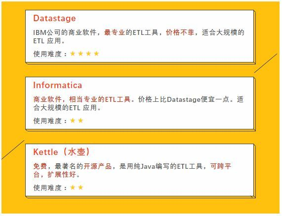

&nbsp;&nbsp;&nbsp;&nbsp;&nbsp;&nbsp;刚离职的这家公司，数据仓库可以提供基本的功能：<b>基于时间的历史数据查询，多维展示报表，决策支持、数据质量监控</b>等，但是也有许多问题，下面来看看这些问题及解决方案，不知道同行们有没有遇到过。

<!-- more -->

# 介绍
&nbsp;&nbsp;&nbsp;&nbsp;&nbsp;&nbsp;首先介绍下具体业务场景，产品是金融类app，有`贷款`、`理财`2条业务线，有<b>贷款</b>、<b>理财后台</b>、<b>前端</b>、<b>风控</b>等主体业务，数据仓库进行了分层设计：db、ods、dwd、dws、report、es，其中：
1. <b>db、ods</b>主要作为数据仓库详细数据层次，主要是一些ETL的工作，用sqoop增量拉取数据后做一些加解密、字段转换、度量单位转换等清洗工作；
2. <b>dwd</b>是数据中间层，有一些数据大宽表在这个层次；
3. <b>dws</b>和report</b>作为数据集市层，对外提供数据结果；
4. <b>es</b>对等report，直接将hive的数据导入到es的，没有做任何操作，主要是es查询快，提供给可视化工具和API使用；

&nbsp;&nbsp;&nbsp;&nbsp;&nbsp;&nbsp;没有<b>OLAP</b>系统，因为数据量没达到量级，跟企业级的数据仓库还是有一些差距的。
&nbsp;&nbsp;&nbsp;&nbsp;&nbsp;&nbsp;<b>airflow</b>作为调度系统，目前没什么大问题，遇到一个实际使用slot数超过pool设置的size限制bug，临时clear掉是可以解决问题的，但不知道怎么彻底解决。
&nbsp;&nbsp;&nbsp;&nbsp;&nbsp;&nbsp;<b>报表工具</b>使用开源的cboard，当数据量级上到10万，查询es就有些慢了，大家有什么好的工具推荐吗？

&nbsp;&nbsp;&nbsp;&nbsp;&nbsp;&nbsp;这是目前的数据仓库结构及运行模式，下面来看下一些问题及解决方案。

# 问题及解决方案
## 1.拉链表运行缓慢
<b>问题：</b>
&nbsp;&nbsp;&nbsp;&nbsp;&nbsp;&nbsp;如果对该仓库结构不清楚的人，真没法下手维护。
&nbsp;&nbsp;&nbsp;&nbsp;&nbsp;&nbsp;由于业务的原因，有些业务表有更新操作，于是我们仓库选择拉链表来对付更新表。拉链表的逻辑就是使用生效日期作为hive表的分区字段，然后每次更新数据的时候，与新增数据进行join，得到最新的数据，然后使用动态分区方式insert overwrite到目标拉链表中。
&nbsp;&nbsp;&nbsp;&nbsp;&nbsp;&nbsp;开始设计的时候，所有表（有更新的和无更新的）都做拉链表，没有想到，数据量达到千万级后，做拉链表非常地慢，千万级的表做完拉链表需要3小时，严重影响后面维度表、报表的运行。

<b>解决方案：</b>
&nbsp;&nbsp;&nbsp;&nbsp;&nbsp;&nbsp;a.对业务表进行分组，有更新的表才做拉链表，无更新的表做完清洗工作即放入目标表即可;
&nbsp;&nbsp;&nbsp;&nbsp;&nbsp;&nbsp;b.使用失效日期作为拉链表分区字段，那么就不需要每次操作所有的分区，而只是操作最后一个分区和当天分区就可以了，速度可以提高十几倍。

## 2.数据结构混乱
<b>问题：</b>
&nbsp;&nbsp;&nbsp;&nbsp;&nbsp;&nbsp;做拉链表需要用到2个中间表tmp1、tmp2，目前跟目标拉链表在同一个库下，导致有三分之二的表是中间临时表，而业务人员去使用的时候，就会问我应该使用那张表的问题。

<b>解决方案：</b>
&nbsp;&nbsp;&nbsp;&nbsp;&nbsp;&nbsp;将中间临时表放入另外一个库下，不对外开放权限。

## 3.数据查找混乱
<b>问题：</b>
&nbsp;&nbsp;&nbsp;&nbsp;&nbsp;&nbsp;无元数据管理，当需要用到某部分结果数据时，它对应哪个库哪个表，表字段属性注释等等信息，当数据表非常多时，单凭记忆是无法满足条件的，这个时候元数据的管理就至关重要了。

<b>解决方案：</b>
&nbsp;&nbsp;&nbsp;&nbsp;&nbsp;&nbsp;建立元数据管理系统，目前使用的较多的开源框架为grafana，集元数据管理、血缘关系、数据质量监控于一体，开源解决这个问题。

## 4.调度系统卡住
<b>问题：</b>
&nbsp;&nbsp;&nbsp;&nbsp;&nbsp;&nbsp;我们使用airflow的pool功能进行把控任务的调度，实现数据仓库层次的建设工作，每天按时跑。但是pool大小是有限制的，系统总的资源也是有限的（相信大部分公司资源都不是很足），分层设计之后，每层的任务会依赖上一层次的任务，上层任务运行成功后才会运行下层任务，在上层任务未运行或者运行失败的情况下，下层任务一直处于wait for状态，这些wait for任务都占用着资源，会导致那些上层任务运行成功的下层任务因为没有系统资源而无法运行。

<b>解决方案：</b>
&nbsp;&nbsp;&nbsp;&nbsp;&nbsp;&nbsp;可以重组airflow dags，合并仓库层次airflow dag脚本，保持仓库层次依然清晰，减少wait for任务的数量。

# 优化
## 1.增加元数据管理功能
&nbsp;&nbsp;&nbsp;&nbsp;&nbsp;&nbsp;开源的工具可以选择Grafana，另外Kettle还具有ETL的功能，商业软件可以IBM的Datastage，另一个就是Informatica，具体如下：

## 2.增加OLAP分析系统
&nbsp;&nbsp;&nbsp;&nbsp;&nbsp;&nbsp;如何选择OLAP工具，可以参考这篇文章：<a>[开源OLAP系统对比](http://wetech.top/2019/10/09/%E5%BC%80%E6%BA%90OLAP%E7%B3%BB%E7%BB%9F%E5%AF%B9%E6%AF%94/)</a>

## 3.仓库层次结构分组
&nbsp;&nbsp;&nbsp;&nbsp;&nbsp;&nbsp;临时表、中间表、db、ods、dwd、dws、report、es应层次分明，在不同的库存储。