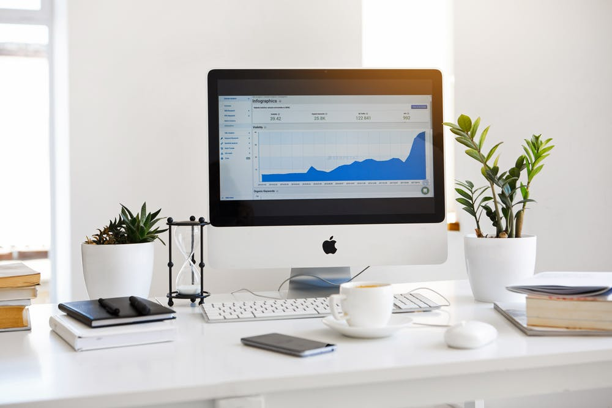

&nbsp;&nbsp;&nbsp;&nbsp;&nbsp;&nbsp;我们如何知道仓库的运行情况呢？仓库监控系统可以看到。下面来看看仓库监控系统里面需要监控的内容。

<!-- more -->

&nbsp;&nbsp;&nbsp;&nbsp;&nbsp;&nbsp;数据仓库监控系统可以监控的内容：
1. 任务概览；
   1. 任务运行详情：日志、状态、开始时间、结束时间、运行时长等
   2. 任务endTime时间（结束时间与deadline时间比较）监控；
2. 库表数概览；
   1. 数量；
3. 数据量概览；
   1. 占用磁盘大小；
4. 仓库层次概览；
   1. 仓库分层；
5. 主题域概览；
   1. 模型设计；
6. 数据集市概览；
   1. 对外业务集市；
   2. 对内业务集市；
   3. 外部导入集市；
7. 数据源概览；
   1. 仓库数据来源；
8. 报警机制：
   1. 超时任务：每个任务历史执行时长取方差，如果超出方差范围，则报警；
   2. 失败任务；
   3. 数据重复；

- - -
<b>Time is money.</b>