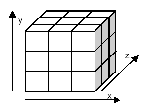
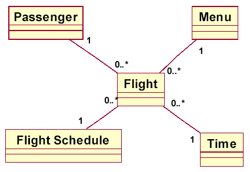
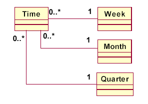
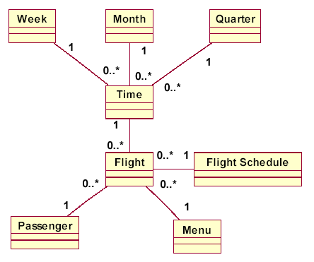

维度建模中包含2种设计方式：
1. 星型模式；
2. 雪花模式；
下面从多个角度来比较一下这2中模式的利弊吧。

<!-- more -->

&nbsp;&nbsp;&nbsp;&nbsp;&nbsp;&nbsp;从查询性能角度来看，在OLTP-DW环节，由于雪花型要做多个表联接，性能会低于星型架构；但从DW-OLAP环节，由于雪花型架构更有利于度量值的聚合，因此性能要高于星型架构。

&nbsp;&nbsp;&nbsp;&nbsp;&nbsp;&nbsp;从模型复杂度来看，星型架构更简单。

&nbsp;&nbsp;&nbsp;&nbsp;&nbsp;&nbsp;从层次概念来看，雪花型架构更加贴近OLTP系统的结构，比较符合业务逻辑，层次比较清晰。

&nbsp;&nbsp;&nbsp;&nbsp;&nbsp;&nbsp;从存储空间角度来看，雪花型架构具有关系数据模型的所有优点，不会产生冗余数据，而相比之下星型架构会产生数据冗余。

&nbsp;&nbsp;&nbsp;&nbsp;&nbsp;&nbsp;根据我们的项目经验，一般建议使用星型架构。因为我们在实际项目中，往往最关注的是查询性能问题，至于磁盘空间一般都不是问题。 当然，在维度表数据量极大，需要节省存储空间的情况下，或者是业务逻辑比较复杂、必须要体现清晰的层次概念情况下，可以使用雪花型维度。

- - -

# 一、概念：

&nbsp;&nbsp;&nbsp;&nbsp;&nbsp;&nbsp;我们先了解下星型模式和雪花模式的概念：

><b>星型模式</b>：一种使用关系数据库实现多维分析空间的模式，称为星型模式。星型模式的基本形式必须实现多维空间（常常被称为方块），以使用关系数据库的基本功能。
><b>雪花模式</b>：不管什么原因，当星型模式的维度需要进行规范化时，星型模式就演进为雪花模式。

&nbsp;&nbsp;&nbsp;&nbsp;&nbsp;&nbsp;那么我们怎么样来理解 多维分析空间 呢 ？

>几何学中的方块是指一个三维空间，其中每个维度的尺寸都相同。想象一个立方体，每个维度都有三个单元，我们即得到相同结构的33＝27个单元。
>

&nbsp;&nbsp;&nbsp;&nbsp;&nbsp;&nbsp;多维分析空间（或者数据仓库方块）与几何空间中的方块仅仅存在细节上的差异。
&nbsp;&nbsp;&nbsp;&nbsp;&nbsp;&nbsp;维度不限于 3 维。不过，处理很多维度的立方体也不是件轻松的事情，这会导致大多数的实现被限制于 6 或者 7 维。不要期盼使用图形可以很好地表示超过 4 的维度。

&nbsp;&nbsp;&nbsp;&nbsp;&nbsp;&nbsp;维度并不具有相同的规模和单元。规模从几个单元到几百万个单元，差别巨大。单元可以是一天、一位顾客、部门等。

&nbsp;&nbsp;&nbsp;&nbsp;&nbsp;&nbsp;数据立方体需要很大的内存以存储所有事实。无论是否包含事实，都必须要预留单元。这就是为什么使用关系数据库和星型模式的原因。使用它们能够优化存储并且保持数据结构的灵活性。

# 二、星型模式

&nbsp;&nbsp;&nbsp;&nbsp;&nbsp;&nbsp;星型模式的基本思想就是保持立方体的多维功能，同时也增加了小规模数据存储的灵活性。

&nbsp;&nbsp;&nbsp;&nbsp;&nbsp;&nbsp;在图中，星型模式使用事实 Flight 表示了一个 4 维方块（Passenger、Menu、Flight Schedulet 和 Time）。基本上，事实必须指定一个维度，以将其放入立方体的单元中。

&nbsp;&nbsp;&nbsp;&nbsp;&nbsp;&nbsp;每个维度根据一个对象进行描述，对象可以用类表示，这些类就是有关业务主题的名称。这一点对于成功建立数据仓库来说是很重要的，因为仓库的用户（经理、分析员、市场）对于信息技术的术语并不是很熟悉。

&nbsp;&nbsp;&nbsp;&nbsp;&nbsp;&nbsp;事实本身就是商业智能的另一个对象，仍然通过类进行表示。

&nbsp;&nbsp;&nbsp;&nbsp;&nbsp;&nbsp;事实指每个维度。事实与维度的关联常常是一对任意，这也就意味着每个事实都与单个维度的一个单元准确对应，而维度的每个单元（每个Passenger、Time等）可以与任意数量的事实发生关联（包括0个事实）。

&nbsp;&nbsp;&nbsp;&nbsp;&nbsp;&nbsp;在星型模式中切片和切块是对维度的限制（选择）。这是一个运行时问题，而不是建模问题，但是模型必须分辨其需要。

# 三、雪花模式

&nbsp;&nbsp;&nbsp;&nbsp;&nbsp;&nbsp;基本的星型模式并不能满足数据挖掘的所有需要。我们需要更复杂的维度，例如时间。分析员希望根据周、月、季度等识别模式。

&nbsp;&nbsp;&nbsp;&nbsp;&nbsp;&nbsp;维度必须进行规范化。我们不需要冗余的维度表，这只会使数据切片变得更加复杂。这种过程中我们得到的模式被称为雪花模式。

&nbsp;&nbsp;&nbsp;&nbsp;&nbsp;&nbsp;我们来看一个简单的雪花模式例子。我们将时间维度规范化为周、月和季度。

&nbsp;&nbsp;&nbsp;&nbsp;&nbsp;&nbsp;我们希望能够使用附加的规范化维度将立方体切片：周、月和季度。在本例中，我们假定季度是月的平行层次，这也就意味着我们不能将季度假定为若干月的聚合。由于这个原因，我们将使用一张范化表（是对 OLAP 查询的一项简单附加）预先选择时间维度。

&nbsp;&nbsp;&nbsp;&nbsp;&nbsp;&nbsp;最终雪花模式添加了规范化维度。

&nbsp;&nbsp;&nbsp;&nbsp;&nbsp;&nbsp;当然，所有的维度都可以像时间例子那样进行规范化，这就导致了比较复杂的数据集市模式的出现。

- - -
吾之初心，永世不忘。