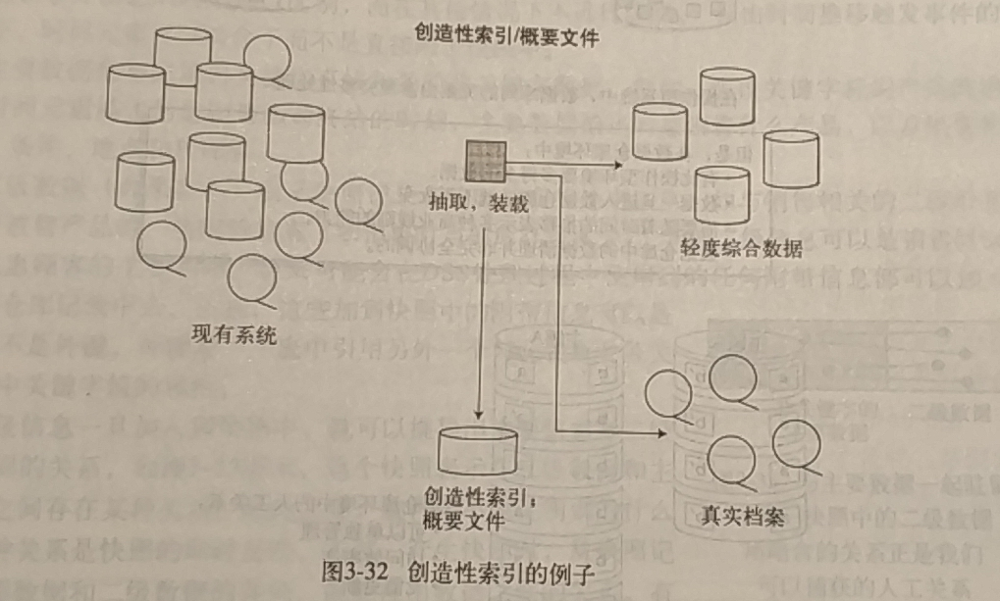
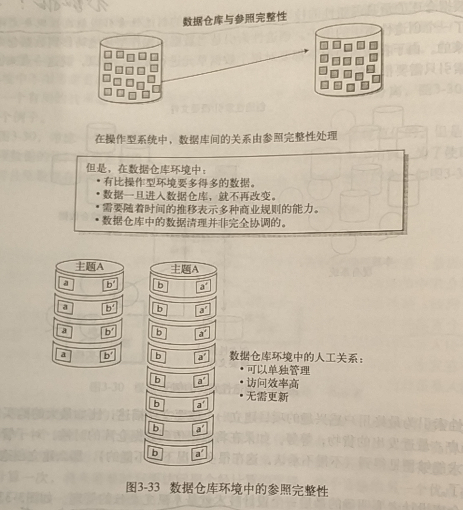

&nbsp;&nbsp;&nbsp;&nbsp;&nbsp;&nbsp;数据仓库是一个面向主题的、集成的、稳定的、反映历史变化的数据集合，这篇文章讨论数据仓库设计的一个思路，不谈设计模式、分层设计思想等。

<!--more -->

1. 创新性的技术：建立所谓的`创新性索引`或`创造性概要文件`
如下图：
&nbsp;&nbsp;&nbsp;&nbsp;&nbsp;&nbsp;创造性索引是当数据由操作型环境转移到数据仓库环境时建立起来的。由于在任何情况下都要对每个数据单元进行处理，所以就这一点来说，计算或建立索引只需要很少的开销。

&nbsp;&nbsp;&nbsp;&nbsp;&nbsp;&nbsp;创造性索引为最终用户感兴趣的项目建立一个概要文件描述，比如最大的购买额，最不活跃的账户，最近发出的货物，等等。<b>如果在将数据传到数据仓库的时候，对于管理活动有价值的需求能够预见得到（不得不承认，这在很多情况下是不能的），那么建造创造性索引就很有意义了。</b>

2. 要明确的设计技术：`参照完整性`的管理
&nbsp;&nbsp;&nbsp;&nbsp;&nbsp;&nbsp;在数据仓库环境中，参照完整性以“人工关系”的方式出现。
&nbsp;&nbsp;&nbsp;&nbsp;&nbsp;&nbsp;在操作型环境中，参照完整性表现为数据表之间的动态连接。由于在数据仓库环境中的数据量很大、数据仓库是不更新的、仓库按照时间描述数据、关系不是静态的，因此，应采取不同的方式表示参照完整性。换句话说，数据的关系在数据仓库环境中采用人工关系表示。这意味着有些数据要复制，有些数据要删除，而其他数据要仍然保留在数据仓库中。总之，试图在数据仓库环境中复制参照完整性显然是一种不正确的做法。
&nbsp;&nbsp;&nbsp;&nbsp;&nbsp;&nbsp;看下图：

- - -
<b>We're meant to lose the people we love, how else would we know how important they are to us?</b>
