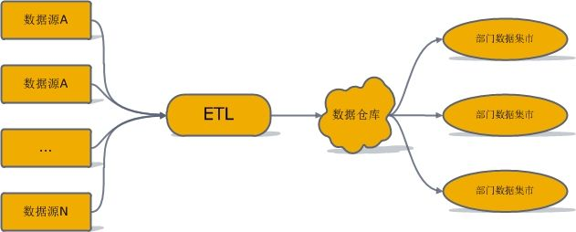
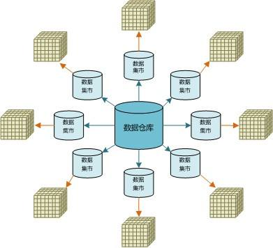

&nbsp;&nbsp;&nbsp;&nbsp;&nbsp;&nbsp;<b>数据库</b>：按照数据结构来<b>组织</b>、<b>存储</b>、<b>管理</b>数据的建立在计算机存储设备上面的仓库。数据库一般适用于操作型系统。因为符合三范式的设置，数据的一致性较好。
&nbsp;&nbsp;&nbsp;&nbsp;&nbsp;&nbsp;<b>数据仓库</b>(Data Warehouse) 是一个<b>面向主题的</b>(SubjectOri2ented) 、<b>集成的</b>(Integrate) 、<b>相对稳定的</b>(Non -Volatile) 、<b>反映历史变化</b>(TimeVariant) 的数据集合用于支持管理决策。
&nbsp;&nbsp;&nbsp;&nbsp;&nbsp;&nbsp;<b>数据集市</b>：数据集市不同于数据仓库，一般是服务于某几个部门。<b>数据仓库向各个数据集市提供数据</b>，且一般来讲，数据仓库的表设计符合规范化设计，而数据集市一般使用维度建模。

<!-- more -->

# 一.数据库
&nbsp;&nbsp;&nbsp;&nbsp;&nbsp;&nbsp;按照数据结构来组织、存储、管理数据的建立在计算机存储设备上面的仓库。数据库一般适用于操作型系统。因为符合三范式的设置，数据的一致性较好。

# 二.数据仓库
&nbsp;&nbsp;&nbsp;&nbsp;&nbsp;&nbsp;数据仓库(Data Warehouse) 是一个面向主题的(SubjectOri2ented) 、集成的( Integrate ) 、相对稳定的(Non -Volatile ) 、反映历史变化( TimeVariant) 的数据集合用于支持管理决策。
&nbsp;&nbsp;&nbsp;&nbsp;&nbsp;&nbsp;这个定义比较系统地阐述了数据仓库的特点，下面我们一一解读。
## 1. 面向主题的
&nbsp;&nbsp;&nbsp;&nbsp;&nbsp;&nbsp;数据仓库是为了提供决策服务的，会建立不同的主题，而主题是进行决策是需要重点关注的部分。
## 2. 集成的
&nbsp;&nbsp;&nbsp;&nbsp;&nbsp;&nbsp;数据仓库可以整合来自不同数据源的数据，将这个数据入库、清洗整合成统一的标准化数据。同时上文中提到的一个主题往往与多个系统相关，集成的数据很好的满足了主题构建的数据需求。数据仓库对原有的分散的数据库进行数据抽取、清理的基础上经过系统加工、汇总整理得到，清除原数据中的不一致性（面向事务的数据库往往单独存放单个系统的数据，且不同数据库相互独立，且是异构的）
## 3. 相对稳定的
&nbsp;&nbsp;&nbsp;&nbsp;&nbsp;&nbsp;数据仓库的数据面向决策，这就表明了仓库中的数据数据进入之后就会长期保留，主要面对的是查询， 修改与删除操作比较少，一般是定期的加载、更新
## 4. 反映历史变化的
&nbsp;&nbsp;&nbsp;&nbsp;&nbsp;&nbsp;数据仓库中会保存各个日期节点的数据，以满足不断变化的业务的需求。

# 三.数据集市
&nbsp;&nbsp;&nbsp;&nbsp;&nbsp;&nbsp;数据集市不同于数据仓库，一般是服务于某几个部门。数据仓库向各个数据集市提供数据，且一般来讲，数据仓库的表设计符合规范化设计，而数据集市一般使用维度建模。
&nbsp;&nbsp;&nbsp;&nbsp;&nbsp;&nbsp;请看下图：

# 四.总结
&nbsp;&nbsp;&nbsp;&nbsp;&nbsp;&nbsp;对于操作型系统，我们希望数据便于修改、满足一致性，因此产生了三范式数据库；在面对企业级决策需求的数据支撑时，我们希望系统可以集成不同的数据源的数据、数据稳定、结构统一、保存历史数据，可以满足不同部门的不断变化的数据系统，因此产生了数据仓库；对于不同的部门来讲，进行决策时如果直接访问数据仓库，得到信息需要多张表进行关联，访问压力大，且主题繁多不易于管理。因此需要建立数据集市，从数据仓库中直接取数，对数据进行汇总整理以满足特定部门的需求。

