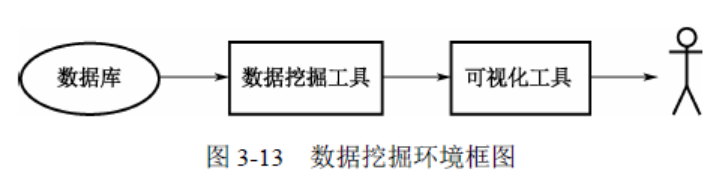

&nbsp;&nbsp;&nbsp;&nbsp;&nbsp;&nbsp;数据挖掘其实是一种深层次的数据分析方法。数据挖掘可以描述为：按企业既定业务目标，对大量的企业数据进行探索和分析，揭示隐藏的、未知的或验证已知的规律性，并进一步将其模型化的先进有效的方法。下面来看下挖掘有价值的数据的基本流程。

<!-- more -->

# 概述
&nbsp;&nbsp;&nbsp;&nbsp;&nbsp;&nbsp;应用的技术包括：数据库技术、人工智能技术、数理统计、可视化技术、并行计算等方面。数据挖掘与传统的数据分析（如查询、报表、联机应用分析）的本质区别是数据挖掘是在没有明确假设的前提下去挖掘信息、发现知识。数据挖掘所得到的信息应具有<b>先知</b>、<b>有效</b>和<b>可实用</b>三个特征。

&nbsp;&nbsp;&nbsp;&nbsp;&nbsp;&nbsp;数据挖掘的目标是从数据库中发现隐含的、有意义的知识，主要有以下五类功能。
1. 自动预测趋势和行为数据挖掘自动在大型数据库中寻找预测性信息，以往需要进行大量手工分析的问题如今可以迅速直接由数据本身得出结论。
2. 关联分析数据关联是数据库中存在的一类重要的可被发现的知识。若两个或多个变量的取值之间存在某种规律性，就称为关联。
3. 聚类数据库中的记录可被划分为一系列有意义的子集，即聚类。
4. 概念描述就是对某类对象的内涵进行描述，并概括这类对象的有关特征。概念描述分为特征性描述和区别性描述，前者描述某类对象的共同特征，后者描述不同类对象之间的区别。
5. 偏差检测数据库中的数据常有一些异常记录，从数据库中检测这些偏差很有意义。
  
# 数据挖掘技术
&nbsp;&nbsp;&nbsp;&nbsp;&nbsp;&nbsp;包括关联分析、序列分析、分类、预测、聚类分析及时间序列分析等。

## 1.关联分析
&nbsp;&nbsp;&nbsp;&nbsp;&nbsp;&nbsp;主要用于发现不同事件之间的关联性，即一个事件发生的同时，另一个事件也经常发生。关联分析的重点在于快速发现那些有实用价值的关联发生的事件。其主要依据是事件发生的概率和条件概率应该符合一定的统计意义。

## 2．序列分析
&nbsp;&nbsp;&nbsp;&nbsp;&nbsp;&nbsp;序列分析技术主要用于发现一定时间间隔内接连发生的事件。这些事件构成一个序列，发现的序列应该具有普遍意义。

## 3．分类分析
&nbsp;&nbsp;&nbsp;&nbsp;&nbsp;&nbsp;分类分析通过分析具有类别的样本的特点，得到决定样本属于各种类别的规则或方法。主要方法有基于统计学的贝叶斯方法、神经网络方法、决策树方法及支持向量机。

## 4．聚类分析
&nbsp;&nbsp;&nbsp;&nbsp;&nbsp;&nbsp;聚类分析是根据物以类聚的原理，将本身没有类别的样本聚集成不同的组，并且对每一个这样的组进行描述的过程。其主要依据是聚到同一个组中的样本应该彼此相似，而属于不同组的样本应该足够不相似。

## 5．预测
&nbsp;&nbsp;&nbsp;&nbsp;&nbsp;&nbsp;预测与分类类似，但预测是根据样本的已知特征估算某个连续类型的变量的取值的过程，而分类则只是用于判别样本所属的离散类别而已。预测常用的技术是回归分析。

## 6．时间序列
&nbsp;&nbsp;&nbsp;&nbsp;&nbsp;&nbsp;分析时间序列分析的是随时间而变化的事件序列，目的是预测未来发展趋势，或者寻找相似发展模式或者是发现周期性发展规律。

# 数据挖掘的流程

## 1．明确需求
&nbsp;&nbsp;&nbsp;&nbsp;&nbsp;&nbsp;问题定义在开始数据挖掘之前，最先的也是最重要的要求就是熟悉背景知识，弄清用户的需求。缺少了背景知识，就不能明确定义要解决的问题，就不能为挖掘准备优质的数据，也很难正确地解释得到的结果。要想充分发挥数据挖掘的价值，必须对目标有一个清晰明确的定义，即决定到底想干什么。

## 2．建立数据挖掘库
&nbsp;&nbsp;&nbsp;&nbsp;&nbsp;&nbsp;要进行数据挖掘必须收集要挖掘的数据资源。一般建议把要挖掘的数据都收集到一个数据库中，而不是采用原有的数据库或数据仓库。这是因为大部分情况下需要修改要挖掘的数据，而且还会遇到采用外部数据的情况；另外，数据挖掘还要对数据进行各种纷繁复杂的统计分析，而数据仓库可能不支持这些数据结构。

## 3．分析数据
&nbsp;&nbsp;&nbsp;&nbsp;&nbsp;&nbsp;分析数据就是通常所进行的对数据深入调查的过程。从数据集中找出规律和趋势，用聚类分析区分类别，最终要达到的目的就是搞清楚多因素相互影响的、十分复杂的关系，发现因素之间的相关性。

## 4．调整数据
&nbsp;&nbsp;&nbsp;&nbsp;&nbsp;&nbsp;通过上述步骤的操作，对数据的状态和趋势有了进一步的了解，这时要尽可能对问题解决的要求能进一步明确化、进一步量化。针对问题的需求对数据进行增删，按照对整个数据挖掘过程的新认识组合或生成一个新的变量，以体现对状态的有效描述。

## 5．模型化
&nbsp;&nbsp;&nbsp;&nbsp;&nbsp;&nbsp;在问题进一步明确，数据结构和内容进一步调整的基础上，就可以建立形成知识的模型。这一步是数据挖掘的核心环节，一般运用神经网络、决策树、数理统计、时间序列分析等方法来建立模型。

## 6．评价和解释
&nbsp;&nbsp;&nbsp;&nbsp;&nbsp;&nbsp;上面得到的模式模型，有可能是没有实际意义或没有实用价值的，也有可能是其不能准确反映数据的真实意义，甚至在某些情况下是与事实相反的，因此需要评估，确定哪些是有效的、有用的模式。评估的一种办法是直接使用原先建立的挖掘数据库中的数据来进行检验，另一种办法是另找一批数据并对其进行检验，再一种办法是在实际运行的环境中取出新鲜数据进行检验。

- - -
<b>The best way to escape from your problem is to solve it.</b>