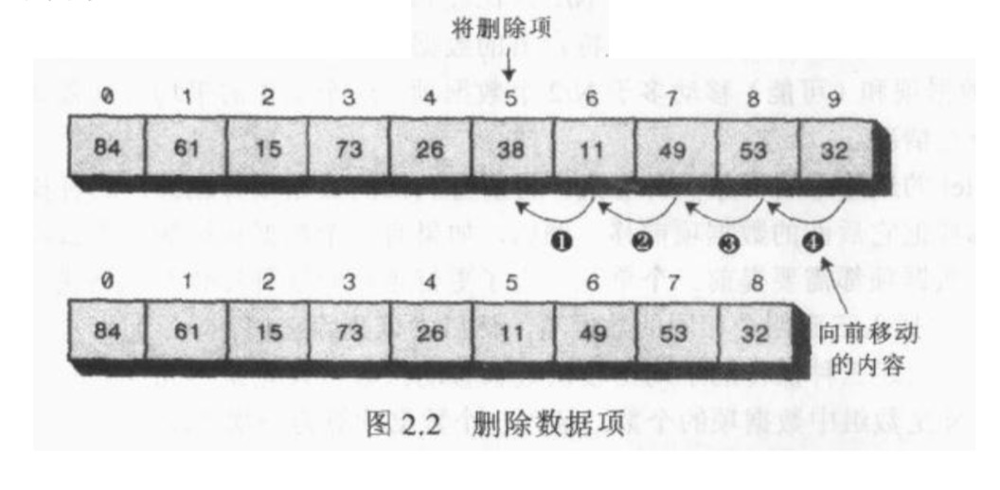

数据结构，是指数据在计算机存储空间中（磁盘中）的安排方式，算法，是指软件程序用来操作这些数据结构中的数据的过程。

<!-- more -->

# 数组Array
## 查找
&nbsp;&nbsp;&nbsp;&nbsp;&nbsp;&nbsp;从数据的第一位开始查找，直到找到为止，需要n/2步操作；
&nbsp;&nbsp;&nbsp;&nbsp;&nbsp;&nbsp;如果数组中数据项允许重复，则需要全部遍历一遍，需要n步操作。

## 插入
&nbsp;&nbsp;&nbsp;&nbsp;&nbsp;&nbsp;插入过程是很快的，一步完成，新的数据项只需插入到数组中的第一个空位上；
&nbsp;&nbsp;&nbsp;&nbsp;&nbsp;&nbsp;如果数组不允许重复项出现，则需要进行n步查询对比操作。

## 删除
&nbsp;&nbsp;&nbsp;&nbsp;&nbsp;&nbsp;删除操作有3个过程：查找、删除、移动。删除算法中暗含着一个假设，即数组中不允许有洞，洞指的是一个或几个空的数据单元，他们后面还有非空数据单元（在更高的下标下还有数据项），如果删除算法中允许有洞，那么所有其他算法都将变得复杂，因为在查看某一单元数据项时，都需要判断一下是否为空。同样算法需要找到非空数据项而变得效率低下；
&nbsp;&nbsp;&nbsp;&nbsp;&nbsp;&nbsp;因此，删除操作后，需要将后面非空数据项前移，来填补这个洞。

&nbsp;&nbsp;&nbsp;&nbsp;&nbsp;&nbsp;删除需要（假设不允许重复）查找平均n/2个数据项，并平均移动剩下的n/2个数据项来填洞，总共是n步。
<a>[查看删除的代码](https://github.com/chenzuoli/ETL/blob/master/src/main/java/top/wetech/tools/data_structure/delete/Delete.java)</a>

