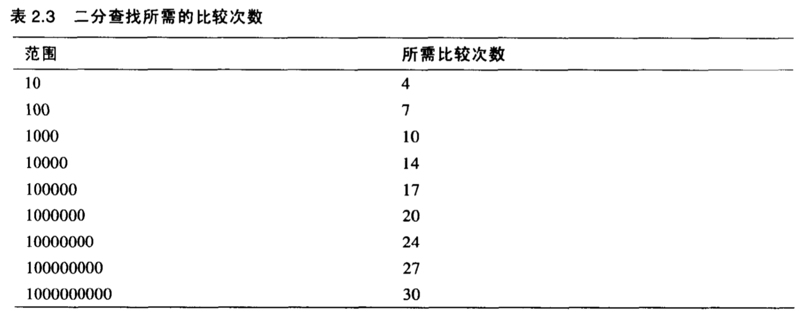

数据结构，是指数据在计算机存储空间中（磁盘中）的安排方式，算法，是指软件程序用来操作这些数据结构中的数据的过程。

<!-- more -->

# 1.数组Array
## 1.1查找
&nbsp;&nbsp;&nbsp;&nbsp;&nbsp;&nbsp;从数据的第一位开始查找，直到找到为止，需要n/2步操作；
&nbsp;&nbsp;&nbsp;&nbsp;&nbsp;&nbsp;如果数组中数据项允许重复，则需要全部遍历一遍，需要n步操作。

## 1.2插入
&nbsp;&nbsp;&nbsp;&nbsp;&nbsp;&nbsp;插入过程是很快的，一步完成，新的数据项只需插入到数组中的第一个空位上；
&nbsp;&nbsp;&nbsp;&nbsp;&nbsp;&nbsp;如果数组不允许重复项出现，则需要进行n步查询对比操作。

## 1.3删除
&nbsp;&nbsp;&nbsp;&nbsp;&nbsp;&nbsp;删除操作有3个过程：查找、删除、移动。删除算法中暗含着一个假设，即数组中不允许有洞，洞指的是一个或几个空的数据单元，他们后面还有非空数据单元（在更高的下标下还有数据项），如果删除算法中允许有洞，那么所有其他算法都将变得复杂，因为在查看某一单元数据项时，都需要判断一下是否为空。同样算法需要找到非空数据项而变得效率低下；
&nbsp;&nbsp;&nbsp;&nbsp;&nbsp;&nbsp;因此，删除操作后，需要将后面非空数据项前移，来填补这个洞。

&nbsp;&nbsp;&nbsp;&nbsp;&nbsp;&nbsp;删除需要（假设不允许重复）查找平均n/2个数据项，并平均移动剩下的n/2个数据项来填洞，总共是n步。
<a>[查看删除的代码](https://github.com/chenzuoli/ETL/blob/master/src/main/java/top/wetech/tools/data_structure/delete/Delete.java)</a>

2019-09-13更新
————————————————————————
## 1.4有序数组
&nbsp;&nbsp;&nbsp;&nbsp;&nbsp;&nbsp;有序数组的有点
&nbsp;&nbsp;&nbsp;&nbsp;&nbsp;&nbsp;使用有序数组会给我们带来什么好处？最主要的好处就是查找速度比无序数组快多了。不好的地方就是在插入数据时，由于所有靠后的数据都需要向后移动一位以腾开空间，导致速度比无序数组慢一些。
&nbsp;&nbsp;&nbsp;&nbsp;&nbsp;&nbsp;有序数组和无序数组的删除操作都比较慢，因为数据项必须向前移动来填补删除数据带来的洞。
&nbsp;&nbsp;&nbsp;&nbsp;&nbsp;&nbsp;有序数组在查找频繁的情况下非常有用，但若是插入和删除比较多的情况下，则不太适用，无法高效工作。例如，有序数组适用于公司雇员的数据库；另一方面，零售商店的货物清单不适用有序数组来实现，这是由于频繁的进货出货导致的插入删除操作都会执行地很慢。

>记住一个结论:
>二分查找法的查询次数最大为log2n，即2对n的对数，n为数组的长度；而线性查找法的平均查询次数为n/2。
>当n很大时，就可以发现二分查找法的优势了，具体看下图示例：

<a>[查看二分查找法的代码](https://github.com/chenzuoli/ETL/blob/master/src/main/java/top/wetech/tools/data_structure/search/HalfSplitSearch.java)</a>

## 1.5对象存储
使用对数组的增删改查功能，自定义对象封装数组，具体代码如下
<a>[查看二分查找法的代码](https://github.com/chenzuoli/ETL/blob/master/src/main/java/top/wetech/tools/data_structure/ClassDataApp.java)</a>

- - -
Pretty looks are in a rut, while interesting souls are cream of crop,
In love, looks and talents,
Which do you think is pretty important?