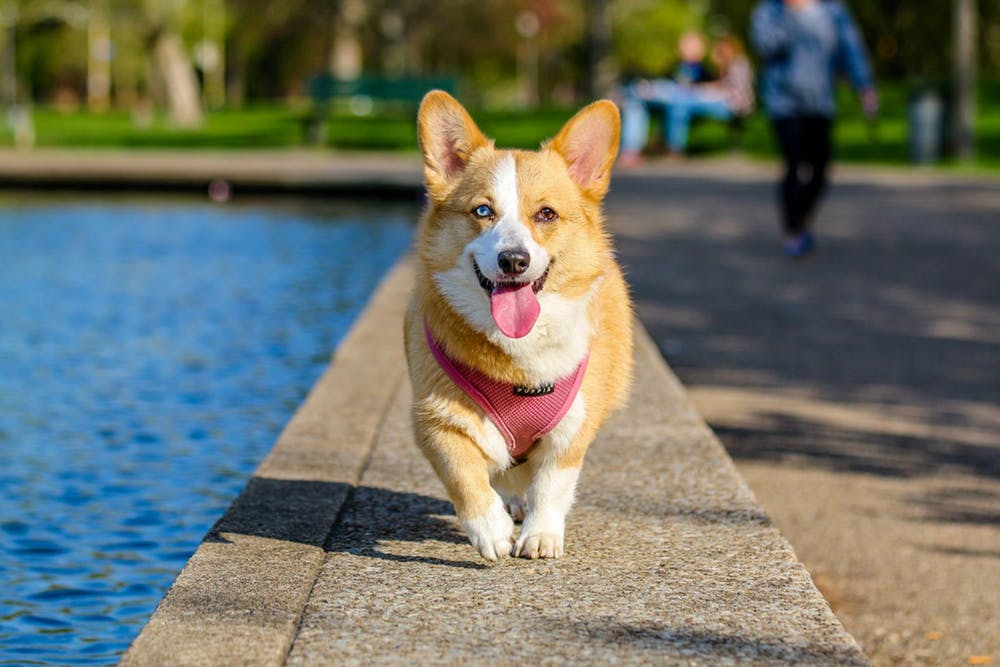

&nbsp;&nbsp;&nbsp;&nbsp;&nbsp;&nbsp;宠物，人类的帮手、伴侣，带给人们帮助的时候，有时候也有一些问题，文明、规范养宠，人人受益，下面看看一些基本的规范。

<!-- more -->

# 1.遛犬要受到时间和地点的限制

&nbsp;&nbsp;&nbsp;&nbsp;&nbsp;&nbsp;在户外陪伴爱犬，不是所有地方都能去的哦!重点管理区养犬还应当遵守下列规定:不得在禁止遛犬的区域和时间内遛犬。携犬出户的，犬只应当挂犬牌、束犬链，犬链长度不得超过1.5米，由具有完全民事行为能力的人牵领，遵守交通法规并主动避让行人和车辆。

# 2.遛犬要注意交通安全

&nbsp;&nbsp;&nbsp;&nbsp;&nbsp;&nbsp;管好狗狗，避免发生交通事故~
&nbsp;&nbsp;&nbsp;&nbsp;&nbsp;&nbsp;携犬出户不遵守交通法规致使犬只伤亡的，由养犬人承担犬只伤亡责任。

# 3.犬只伤人要依法承担民事责任

&nbsp;&nbsp;&nbsp;&nbsp;&nbsp;&nbsp;多花点时间陪伴和训练您的爱犬，让它成为“绅士”~
&nbsp;&nbsp;&nbsp;&nbsp;&nbsp;&nbsp;养犬不得危害公共利益，不得干扰他人正常生活，不得放任、驱使犬只恐吓、伤害他人。犬吠影响他人时，养犬人或携犬人应当采取措施予以制止。犬只伤人的，养犬人或携犬人应当立即将伤者送至医疗机构诊治，先行支付医疗费用，并依法承担民事责任。

# 4.犬只不能在户外随地排泄粪便

&nbsp;&nbsp;&nbsp;&nbsp;&nbsp;&nbsp;一个负责任的养犬人，应该自带清便工具，随时清理犬只粪便，不要让别人踩上“地雷”~
&nbsp;&nbsp;&nbsp;&nbsp;&nbsp;&nbsp;重点管理区养犬还应当遵守下列规定:犬只在户外排泄粪便的，携犬人应当立即清除。违反本规定，养犬污染环境或者携犬不立即清除犬只粪便的，由城市管理行政执法部门依照城市市容和环境卫生管理法律法规的有关规定处罚。

# 5.犬只不能随意进入公共场所

&nbsp;&nbsp;&nbsp;&nbsp;&nbsp;&nbsp;把爱犬带进公共场所，您考虑过别人的感受了吗？
&nbsp;&nbsp;&nbsp;&nbsp;&nbsp;&nbsp;不得携犬进入机关、医院、学校、幼儿园、疗养院、少年儿童活动场所、体育场馆、博物馆、图书馆、影剧院、宾馆、饭店、商场、室内农贸市场、金融经营场所，以及设有犬只禁入标识的公园、风景名胜区等公共场所。

# 6.携犬乘车有规矩

&nbsp;&nbsp;&nbsp;&nbsp;&nbsp;&nbsp;请不要携犬乘坐公共交通工具哦~
&nbsp;&nbsp;&nbsp;&nbsp;&nbsp;&nbsp;不得携犬乘坐除小型出租汽车以外的公共交通工具。携犬乘小型出租汽车时，应当征得驾驶员同意。

# 7.携犬乘坐电梯要遵守规定

&nbsp;&nbsp;&nbsp;&nbsp;&nbsp;&nbsp;不要让狗狗随意出入电梯哦~
&nbsp;&nbsp;&nbsp;&nbsp;&nbsp;&nbsp;携犬乘坐电梯或者上下楼梯的，应当将犬只装入犬袋、犬笼、怀抱，或者戴嘴套，并避开高峰时间。

- - -
<b>It's never too late to be a good person.</b>