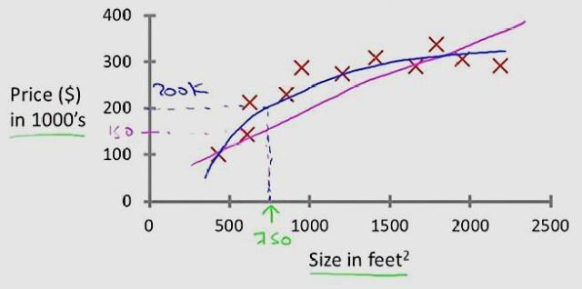
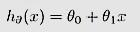
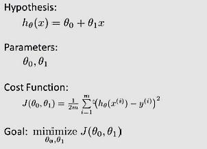
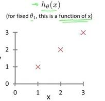
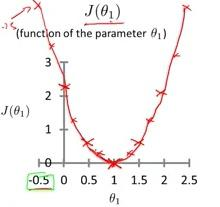

&nbsp;&nbsp;&nbsp;&nbsp;&nbsp;&nbsp;线性回归模型，处理连续数据，得到一个一维或者多维线性函数，新来一个自变量值，可对因变量的值进行预测。下面来看看介绍吧。

<!-- more -->

1.线性回归模型介绍
&nbsp;&nbsp;&nbsp;&nbsp;&nbsp;&nbsp;线性回归，就是能够用一个直线较为精确地描述数据之间的关系。这样当出现新的数据时，就能够预测出一个简单的结果值。线性回归中最常见的就是房价的问题。一直存在很多房屋面积和房价的数据，如下图所示：

&nbsp;&nbsp;&nbsp;&nbsp;&nbsp;&nbsp;在这种情况下，就可以利用线性回归构造出一条直线来近似地描述房价与房屋面积之间的关系，从而就可以根据房屋面积推测出房价。

2.线性回归的函数模型
&nbsp;&nbsp;&nbsp;&nbsp;&nbsp;&nbsp;通过线性回归构造出来的函数一般称之为线性回归模型，线性回归函数一般写作为：

3.线性回归模型的代价函数
&nbsp;&nbsp;&nbsp;&nbsp;&nbsp;&nbsp;通过线性回归算法，我们可能会得到很多的线性回归模型，但是不同的模型对于数据的拟合或者是描述能力是不一样的。我们的目的最终是需要找到一个能够精确地描述数据之间关系的线性回归模型。这时就需要用到代价函数。
&nbsp;&nbsp;&nbsp;&nbsp;&nbsp;&nbsp;<b>代价函数</b>就是用来描述线性回归模型与正式数据之间的差异。如果完全没有差异，则说明此线性回归模型完全描述数据之间的关系。如果需要找到最佳拟合的线性回归模型，就需要使得对应的代价函数最小，相关的公示描述如下：

&nbsp;&nbsp;&nbsp;&nbsp;&nbsp;&nbsp;其中：
- Hypothesis表示线性回归模型
- Cost Function表示代价函数
- Goal表示要求对应的代价函数最小

4.线性回归模型求解
&nbsp;&nbsp;&nbsp;&nbsp;&nbsp;&nbsp;假设在线性回归模型中仅仅只存在一个函数，就是斜率参数。即theta-0=0。如果存在如下的数据：

&nbsp;&nbsp;&nbsp;&nbsp;&nbsp;&nbsp;图中对应的3个点分别为（1，1），（2，2），（3，3），那么很明显，最佳线性回归模型就是h(x) = x。
&nbsp;&nbsp;&nbsp;&nbsp;&nbsp;&nbsp;如何通过实验证明呢？我们画出在theta-1处于不同值的代价函数。

5.线性回归模型的特点：
- 建模速度快，不需要很复杂的计算，在数据量大的情况下依然运行速度很快；
- 可以根据系数给出每个变量的理解和解释；
- 对异常值很敏感；

- - -
<b>Family is the most one you should protect.</b>