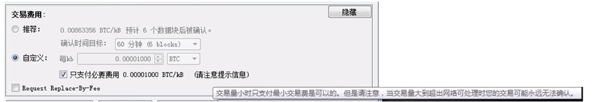

大家好，今天来说说18年很火的比特币，由于现代社会的全球化进程加快，各个国家之间的信息交换，信息共享出现了许许多多的问题，比如你出国旅游，还得更换货币，还得办个护照来证明你是个人，还有就是各个银行或金融机构对货币的监督和管理，一旦这些机构出现问题，那么我们的钱就这样没了，这是不是很亏呢，今天将的区块链技术，就可以解决这个问题，下面来详细讲解它的运行原理和应用场景。
<!-- more -->
# 一、去中心化
## 1.如何确认付款方是否有足够的比特币进行支付？
去中心化网络，舍去银行等金融机构（他们通过用户账户余额来解决这个问题）的依赖，比特币的解决方案是每笔交易都必须把以前的交易记录作为基础。
## 2.转账记录的存储和维护
### 2.1如何进行同步，互联网上的计算机交易记录同步；
### 2.2如何防止黑客篡改记录；
### 2.3如何防止同一笔比特币收入被重复使用
这个时候就需要用到区块链技术，区块链仅仅维护一个交易链，每个人将自己的转账记录发布到网络上，矿工收集这些转账记录，生成一个区块，世界上有许多矿工，那么到底哪一个矿工生成的区块才能链接到区块链的末尾呢？这时，就出现了一个机制，每个矿工在生成了这个区块后，需要对前一个区块链上前一个区块的sha256函数值+这个新区块的基本信息+这个新区块所包含的所有交易记录+随机数进行sha256函数计算，得到一个hash值前72位均为0，那么找到符合要求的随机数需要进行2的72次方sha256函数运算，计算机大概平均需要10分钟左右算出来，然后发布到区块链网络上，在这10分钟之内，一般只有一个矿工能够计算出符合要求的随机数，所以就避免了多个矿工同时生成区块而无法判断到底将哪一个区块链接到区块链的尾端的问题了。矿工得到符合要求的随机数后，发布到网络上，网络上的其他计算机会进行校验：随机数校验，交易记录校验。一切都没有问题后，就讲该区块添加到自己电脑上区块链的末尾，完成交易记录的同步
# 二、不可篡改：
针对转账交易来进行说明，利用非对称加密算法，达到不可篡改的目的，具体如下,如，小红转账给小白50元，这条记录
## 1.原始记录进行SHA256加密得到hash值1；
## 2.小红利用她的私钥对hash值1进行加密得到hash值2；
## 3.其他人利用小红的公钥（公钥是公开的），对hash值2进行解密得到hash值3；
如果hash值3等于hash值1，那么说明这个签名是针对这条记录的，并且这条记录是小红发出的，接受到的记录与原始记录相同，未被篡改。
# 三、记录可回溯
比特币的每条交易记录都记录在区块链上，当小红转账给小白时，会先计算所有转账给小红的比特币数量，来确认小红有足够的比特币进行交易，所以记录可回溯。
# 四、比特币问答
## 1.比特币是如何发行的？
新比特币作为对矿工的奖励，进入比特币网络进行流通，每生成21万个区块，奖励减半，从第0个区块到第21万个区块，每生成一个区块，奖励给矿工50个比特币，从第21万个区块开始的21万个区块，每生成一个区块，奖励给矿工25个比特币，从第42万个区块开始的21万个区块，每生成一个区块，奖励给矿工12.5个区块，以此类推。
从第693个区块开始，对矿工的奖励为0，也就是不再有新的比特币流入比特币网络，到时，累计有2100万个比特币流入到比特币网络，矿工的收入将完全来自于每笔比特币转账交易的交易费，交易费只是比特币在账户之间转移，不是新产生的比特币。
也就是说，比特币网络上的比特币总量永远不会超过2100万个。
## 2.比特币存在什么地方？
比特币一般存在比特币客户端软件的数据文件里
如果把数据文件弄丢了，比如计算机硬盘坏了，就永远地失去了里面的比特币，而且比特币网络里流通的比特币总量也会减少。
## 3.比特币转账和支付宝转账有啥区别？
比特币不是任何银行和金融机构发行的，使用比特币不需要绑定银行卡，不需要任何身份证明，不需要手机短信认证，只要能上网，只要安装了比特币客户端软件，就可以转账或收款，所有的账户不受任何机构监督和管理，转错了人，没有后悔药，完全没有挽回的余地。
在中国大陆，支付宝转账转的一般是人民币，人民币是中国人民银行发行的，人民币的发行量由中国人民银行根据社会发展需要决定。使用支付宝，需要绑定银行卡，转账或收款受支付宝和银行管理。转错了人，可以找支付宝和银行协调，有可能挽回损失。
## 4.比特币转账的手续费怎么算？
比特币软件会给一个推荐值和最低值，但具体多少由付款方自己定。既然手续费自己定，那么付款方将手续费设为最低值会怎么样呢？
请看下面这张图片：

比特币网络中，支付最少交易费是可以的。但是请注意，当交易量大到超出网络可处理时，矿工会选择手续费更高的交易记录到账本，而您的交易可能永远被搁置，无法确认。
## 5.比特币所使用的主要技术和特点：
### 5.1利用sha256和非对称加密算法制作签名；
### 5.2利用区块链中的区块存储比特币交易记录；
### 5.3设置额外的工作，从而控制单位时间内生成区块的个数，同时保护比特币网络；
### 5.4将一定数额的比特币和区块内的所有交易费奖励给成功生成该区块的矿工激励更多矿工加入比特币网络，促进比特币网络的茁壮成长；
### 5.5比特币转账不依赖任何银行或其他金融机构；

好了，到这里基本上就讲完了，这是我最近从youtube网站上看过很多次讲解的各种比特币、区块链的视频才了解的，国内的资源还很少，天朝也不看好比特币，但是区块链技术是在积极推动的，希望大家看完了总结之后，对比特币的原理有一定的了解，如果有什么不对的地方，请留言指正，或者发送到邮箱chenzuoli709@gmail.com.
附上资源：
<a href="https://www.youtube.com/watch?v=obRzfcvMshM&t=0s&list=LL6p-2jKOMljSPte26mVy3Vw"><b>比特币原理</b>https://www.youtube.com/watch?v=obRzfcvMshM&t=0s&list=LL6p-2jKOMljSPte26mVy3Vw</a>讲解比特币的实现原理
<a href="https://www.youtube.com/watch?v=8YY8yuKqziw&t=0s&list=LL6p-2jKOMljSPte26mVy3Vw"><b>区块链开放前景及学习平台</b>https://www.youtube.com/watch?v=8YY8yuKqziw&t=0s&list=LL6p-2jKOMljSPte26mVy3Vw</a>讲解比特币底层区块链技术的开发
<a href="https://www.youtube.com/watch?v=pV2DxjxpKu4&t=0s&list=LL6p-2jKOMljSPte26mVy3Vw"><b>许知远对话搜狗CEO王小川将区块链</b>https://www.youtube.com/watch?v=pV2DxjxpKu4&t=0s&list=LL6p-2jKOMljSPte26mVy3Vw</a>通俗讲解区块链在货币、商业、政治上的应用现状及前景

# 五、数字货币投资
鄙人还是非常非常看好比特币、区块链技术的，也在火币平台上购买了一些比特币，期待它在以后的日子里带我实现财务自由，想参与的伙伴们，点击链接注册<a href="https://www.huobi.br.com/zh-cn/topic/invited/?invite_code=2i9d3">https://www.huobi.br.com/zh-cn/topic/invited/?invite_code=2i9d3</a>
确认邀请码：2i9d3
