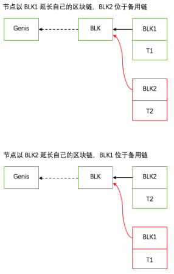
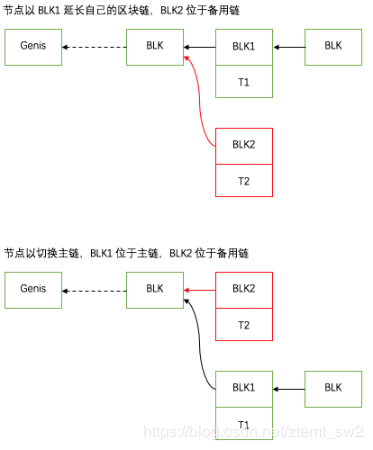
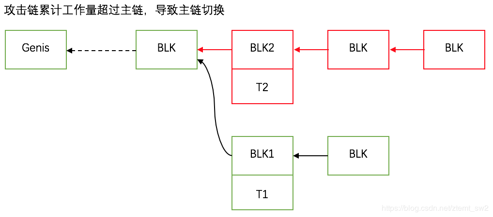

&nbsp;&nbsp;&nbsp;&nbsp;&nbsp;&nbsp;&nbsp;在学习区块链的过程中，大家一定对会听到“双花”这个词，意思就是双重支付，或者更直白点就是一笔资金被花费了两次。这篇文章我们来简单的分析一下为什么会有双花，比特币是如何避免双花的。

<!-- more -->

&nbsp;&nbsp;&nbsp;&nbsp;&nbsp;&nbsp;&nbsp;在传统的交易中，因为有银行这样的中心化机构，所以是不会存在双花问题的：每一笔支付都将从你的银行账户中扣除相应的资金，所有的明细在银行都有记录。但是在比特币中，因为没有账户的概念，而是引入了UTXO即未花费交易输出。因为没有银行这样的中心化机构的保证，当发生一笔交易时就可能存在着双花的危险：比方说A有一个比特币，然后他同时构造两笔交易T1和T2来花费这1个比特币，其中一个给了B，从B那里买件衣服，一个给了C，从C那里买双鞋。如果不引入某种机制来避免这种情况，那作为数字货币的比特币将没有任何存在的意义。接下来就来分析一下比特币是如何做到防止这种“双花”攻击的。

# (1) 正常情况

&nbsp;&nbsp;&nbsp;&nbsp;&nbsp;&nbsp;&nbsp;首先我们来看看正常情况，说白了就是绝大多数时候，区块链的共识机制就能将双花消灭在萌芽状态。我们还是以上面提到的例子来做说明：

&nbsp;&nbsp;&nbsp;&nbsp;&nbsp;&nbsp;&nbsp;假设A构造了两笔交易T1和T2，将自己价值1btc的UTXO分别转给了B和C，妄图同时从B和C那里获得好处。然后A几乎在同一时间将构造好的这两笔交易广播至网络。

&nbsp;&nbsp;&nbsp;&nbsp;&nbsp;&nbsp;&nbsp;假设网络中的矿工节点先收到了交易T1，<b>发现这笔交易的资金来源确实没有被花费过</b>，于是将T1加入到自己的内存交易池中等待打包进区块。

&nbsp;&nbsp;&nbsp;&nbsp;&nbsp;&nbsp;&nbsp;大部分情况下，这个矿工节点会在不久后又收到交易T2，此时矿工会先检查A的UTXO是否足够，因为T2所指向的交易输入与已经加入交易池的T1相同，于是发现UTXO不足，矿工节点会拒绝处理该交易。网络中其他的矿工节点都类似，因此A试图双花的尝试胎死腹中。

# (2) 分叉情况

&nbsp;&nbsp;&nbsp;&nbsp;&nbsp;&nbsp;&nbsp;上面说的是正常的情况，但是也有非正常的情况要考虑：假设矿工节点M1和M2几乎在同一时间挖出了区块，并且很不幸M1挖到区块时只收到了交易T1，而M2挖到的区块时只收到了交易T2，这样交易T1和T2被分别打包进两个区块。因为这两个区块是差不多同一时间被挖出，于是造成了区块链的分叉：

&nbsp;&nbsp;&nbsp;&nbsp;&nbsp;&nbsp;&nbsp;网络中某些节点（可能是离M1近的）先收到了M1打包的区块BLK1，于是用该区块延长自己的区块链，而另外一些节点（邻近M2的）则先收到M2打包的区块BLK2，用该区块延长自己的区块链，于是整个区块链网络中呈现出了不一致的问题：

&nbsp;&nbsp;&nbsp;&nbsp;&nbsp;&nbsp;&nbsp;像这种不一致问题，一般只需要一个确认就能得到解决：假设随后又收到新区块，而新区块是以BLK1作为父区块，那么之前用BLK1延长自己区块链的节点，只需要将新区块链接到自己的区块链上，而之前以BLK2延长自己区块链的节点，则需要切换到新的最长链上，如下图：

&nbsp;&nbsp;&nbsp;&nbsp;&nbsp;&nbsp;&nbsp;因此在出现分叉的情况下，通常也只需要等一个区块的确认时间网络节点中的区块链就可以重新一致，在这个例子中，经过一个区块的确认期以后，B最终确认自己收到A的1btc，而因为包含有转账给C的交易T2的区块BLK2位于备用链上，因此无法通过支付验证。A的双花尝试也以失败告终。

# (3) 为什么说比特币需要6个确认才安全

&nbsp;&nbsp;&nbsp;&nbsp;&nbsp;&nbsp;&nbsp;上面提到一般情况下，只要经过1个区块的确认时间基本上就能确保“相对的安全”。而在比特币中，对于很小额的支付，为了提高交易速度，一般也就是等1个区块的确认即可。但是注意这里说的是“相对安全”，对于数额特别大交易，1个区块的确认远远不够。我们考虑上面提到的分叉情况：假设经过1个区块的确认后，B知道了A给他的1btc确实已经位于链上，于是发货给A。此时A及其同伙掌握着很大的一部分算力，A通知其同伙开始使劲挖矿延长备用链（攻击链），当A最终成功的使攻击链的长度（累计工作量）超过当前主链时，会再一次导致网络中的节点切换主链的情况，如下面的示意图：

&nbsp;&nbsp;&nbsp;&nbsp;&nbsp;&nbsp;&nbsp;于是包含了A转给C的交易T2的区块BLK2位于了主链之上，此时A通知C钱已到账，C做支付验证也没问题，于是C给A发货，A的双花攻击成功。

&nbsp;&nbsp;&nbsp;&nbsp;&nbsp;&nbsp;&nbsp;因此对于额度稍大的交易，必须要等待6个区块的确认才能保证安全，因为攻击者要想构造攻击链追上已经经过6个区块确认的主链需要花费的算力成本是非常大的，很有可能得不偿失。

# 总结

>(1) 大部分情况下比特币的UTXO机制和区块链的共识机制都能有效应对双花攻击；

>(2) 对于小额支付，等待一个确认通常就可以认为安全了，但是对于大额支付，需要等6个确认才能大概率的认为安全，否则如果攻击者掌握很强算力，有可能构造累计工作量超过当前主链的攻击链导致双花成功。

Never give up on something if you think you can fight for it. It's difficult to wait but it's more difficult when you regret. 