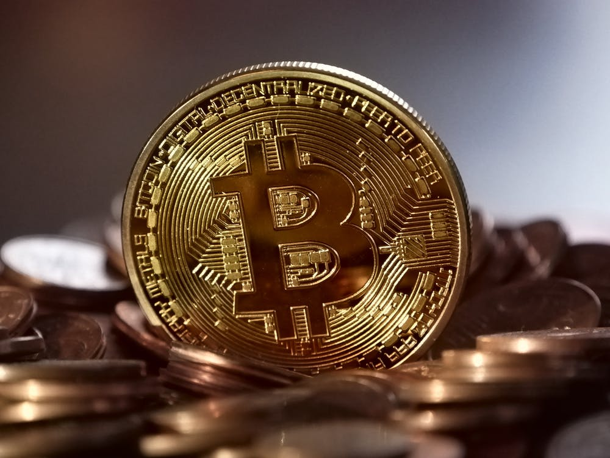

UTXO的全称为Unspent Transaction Output，翻译过来就是未被花费的交易输出。其实并没有什么比特币，我们在交易所里或者钱包里显示的比特币余额其实是UTXO。那到底什么是UTXO呢?

<!-- more -->

好像觉得还是不太理解。。。。？

# 示例
&nbsp;&nbsp;&nbsp;&nbsp;&nbsp;&nbsp;&nbsp;在比特币区块链账本上记录了一笔一笔的交易，每一笔交易都有若干个交易输入（转账者），也就是资金来源，同时也有若干个交易输出（收款者），也就是资金去向。每一笔交易都要花费一笔输入，产生一笔输出，而产生的这笔输出，就是UTXO。

举个简单的例子：
&nbsp;&nbsp;&nbsp;&nbsp;&nbsp;&nbsp;&nbsp;A地址下有1个btc，A要把1个btc转给B，则账本上交易的输入就是A，输出为B的地址，这时脚本会校验A地址是否有1个btc（余额都不够怎么会给你转），即在某一笔输出（UTXO）中查询到了A确实有1个btc。所以A可以作为输入转给B一个btc，这时就有一笔价值1个btc的输出指向B地址，直到B进行下一次转账前这笔交易都是B未被花费的输出（UTXO）。后续B要转给C时又重复A转B的操作。

# 总结
&nbsp;&nbsp;&nbsp;&nbsp;&nbsp;&nbsp;&nbsp;<b>比特币并不是基于账户的方案</b>，而是基于UTXO方案。这个和传统银行账户的思维完全不一样。张三拥有10个btc，其实就是当前区块链账本中，有若干笔交易的输出（UTXO）收款人都是张三的地址，而这些UXTO的总额为10。这个地址一共收了多少UTXO，则是要通过比特币钱包代为跟踪计算，所以钱包里显示的余额其实是有多少价值btc的输出指向你的地址。

This is your life, and you've got to fight for it. Fight for what's right. Fight for what's important to you. Fight for the people you love. 