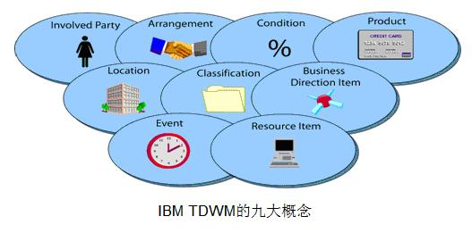
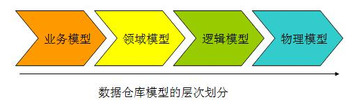
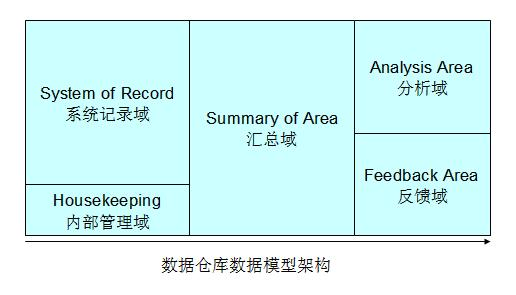
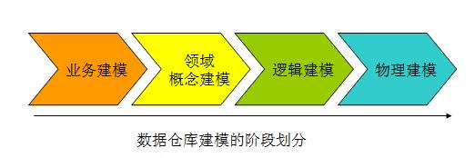
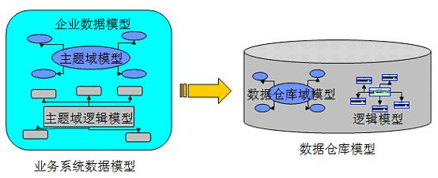
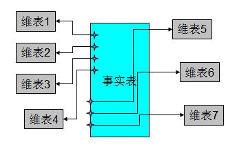
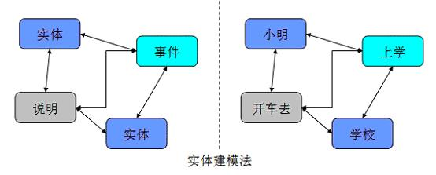
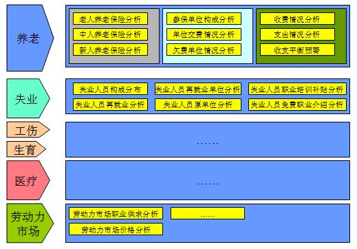
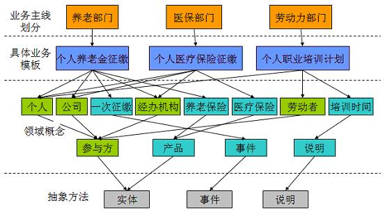

&nbsp;&nbsp;&nbsp;&nbsp;&nbsp;&nbsp;所谓水无定势，兵无常法。不同的行业，有不同行业的特点，因此，从业务角度看，其相应的数据模型是千差万别的。目前业界较为主流的是数据仓库厂商主要是 IBM 和 NCR，这两家公司除了能够提供较为强大的数据仓库平台之外，也有各自的针对某个行业的数据模型。

<!-- more -->

&nbsp;&nbsp;&nbsp;&nbsp;&nbsp;&nbsp;例如，在银行业，IBM 有自己的 BDWM(Banking data warehouse model)，而 NCR 有自己的 FS-LDM 模型。在电信业，IBM 有 TDWM（Telecom Data warehouse model），而 NCR 有自己的 TS-LDM 模型。因此，我们看到，不同的公司有自己针对某个行业的理解，因此会有不同的公司针对某个行业的模型。而对于不同的行业，同一个公司也会有不同的模型，这主要取决于不同行业的不同业务特点。

&nbsp;&nbsp;&nbsp;&nbsp;&nbsp;&nbsp;举例来说，IBM 的 TDWM 的模型总共包含了以下 9 个概念，如下图：

图 1. IBM 的 TDWM 概念模型

 
&nbsp;&nbsp;&nbsp;&nbsp;&nbsp;&nbsp;可能很多人要问，为什么你们的模型是 9 个概念而不是 10 个，11 个呢？你们的数据仓库模型的依据又是什么？其实这是我们在给客户介绍我们的数据模型时，经常被问到的一个问题，我希望读者在读完本文时，能够找到自己的答案。

&nbsp;&nbsp;&nbsp;&nbsp;&nbsp;&nbsp;虽然每个行业有自己的模型，但是，我们发现，不同行业的数据模型，在数据建模的方法上，却都有着共通的基本特点。

&nbsp;&nbsp;&nbsp;&nbsp;&nbsp;&nbsp;本文的主要目的之一，就是希望读者能够通过对本文的阅读，同时，结合自己对数据仓库建设的经验，在建设数据仓库的时候能够总结出一套适合自己的建模方法，能够更好的帮助客户去发挥数据仓库的作用。

&nbsp;&nbsp;&nbsp;&nbsp;&nbsp;&nbsp;本文主要的主线就是回答下面三个问题：
1. 什么是数据模型?
2. 为什么需要数据模型?
3. 如何建设数据模型?

&nbsp;&nbsp;&nbsp;&nbsp;&nbsp;&nbsp;最后，我们在本文的结尾给大家介绍了一个具体的数据仓库建模的样例，帮助大家来了解整个数据建模的过程。

# 一、什么是数据模型？
&nbsp;&nbsp;&nbsp;&nbsp;&nbsp;&nbsp;数据模型是抽象描述现实世界的一种工具和方法，是通过抽象的实体及实体之间联系的形式，来表示现实世界中事务的相互关系的一种映射。在这里，数据模型表现的抽象的是实体和实体之间的关系，通过对实体和实体之间关系的定义和描述，来表达实际的业务中具体的业务关系。

&nbsp;&nbsp;&nbsp;&nbsp;&nbsp;&nbsp;数据仓库模型是数据模型中针对特定的数据仓库应用系统的一种特定的数据模型，一般的来说，我们数据仓库模型分为几下几个层次，如图 1 所示。

图 2. 数据仓库模型

 
&nbsp;&nbsp;&nbsp;&nbsp;&nbsp;&nbsp;通过上面的图形，我们能够很容易的看出在整个数据仓库的建模过程中，我们需要经历一般四个过程：

- <b>业务建模</b>，生成业务模型，主要解决业务层面的分解和程序化。
- <b>领域建模</b>，生成领域模型，主要是对业务模型进行抽象处理，生成领域概念模型。
- <b>逻辑建模</b>，生成逻辑模型，主要是将领域模型的概念实体以及实体之间的关系进行数据库层次的逻辑化。
- <b>物理建模</b>，生成物理模型，主要解决，逻辑模型针对不同关系型数据库的物理化以及性能等一些具体的技术问题。

&nbsp;&nbsp;&nbsp;&nbsp;&nbsp;&nbsp;因此，在整个数据仓库的模型的设计和架构中，既涉及到业务知识，也涉及到了具体的技术，我们既需要了解丰富的行业经验，同时，也需要一定的信息技术来帮助我们实现我们的数据模型，最重要的是，我们还需要一个非常适用的方法论，来指导我们自己针对我们的业务进行抽象，处理，生成各个阶段的模型。

# 二、为什么需要数据模型？
&nbsp;&nbsp;&nbsp;&nbsp;&nbsp;&nbsp;在数据仓库的建设中，我们一再强调需要数据模型，那么数据模型究竟为什么这么重要呢？首先我们需要了解整个数据仓库的建设的发展史。

数据仓库的发展大致经历了这样的三个过程：

&nbsp;&nbsp;&nbsp;&nbsp;&nbsp;&nbsp;<b>简单报表阶段</b>：这个阶段，系统的主要目标是解决一些日常的工作中业务人员需要的报表，以及生成一些简单的能够帮助领导进行决策所需要的汇总数据。这个阶段的大部分表现形式为数据库和前端报表工具。
&nbsp;&nbsp;&nbsp;&nbsp;&nbsp;&nbsp;<b>数据集市阶段</b>：这个阶段，主要是根据某个业务部门的需要，进行一定的数据的采集，整理，按照业务人员的需要，进行多维报表的展现，能够提供对特定业务指导的数据，并且能够提供特定的领导决策数据。
&nbsp;&nbsp;&nbsp;&nbsp;&nbsp;&nbsp;<b>数据仓库阶段</b>：这个阶段，主要是按照一定的数据模型，对整个企业的数据进行采集，整理，并且能够按照各个业务部门的需要，提供跨部门的，完全一致的业务报表数据，能够通过数据仓库生成对业务具有指导性的数据，同时，为领导决策提供全面的数据支持。

&nbsp;&nbsp;&nbsp;&nbsp;&nbsp;&nbsp;通过数据仓库建设的发展阶段，我们能够看出，数据仓库的建设和数据集市的建设的重要区别就在于数据模型的支持。因此，数据模型的建设，对于我们数据仓库的建设，有着决定性的意义。

&nbsp;&nbsp;&nbsp;&nbsp;&nbsp;&nbsp;一般来说，数据模型的建设主要能够帮助我们解决以下的一些问题：

&nbsp;&nbsp;&nbsp;&nbsp;&nbsp;&nbsp;<b>进行全面的业务梳理，改进业务流程。</b>在业务模型建设的阶段，能够帮助我们的企业或者是管理机关对本单位的业务进行全面的梳理。通过业务模型的建设，我们应该能够全面了解该单位的业务架构图和整个业务的运行情况，能够将业务按照特定的规律进行分门别类和程序化，同时，帮助我们进一步的改进业务的流程，提高业务效率，指导我们的业务部门的生产。
&nbsp;&nbsp;&nbsp;&nbsp;&nbsp;&nbsp;<b>建立全方位的数据视角，消灭信息孤岛和数据差异。</b>通过数据仓库的模型建设，能够为企业提供一个整体的数据视角，不再是各个部门只是关注自己的数据，而且通过模型的建设，勾勒出了部门之间内在的联系，帮助消灭各个部门之间的信息孤岛的问题，更为重要的是，通过数据模型的建设，能够保证整个企业的数据的一致性，各个部门之间数据的差异将会得到有效解决。
&nbsp;&nbsp;&nbsp;&nbsp;&nbsp;&nbsp;<b>解决业务的变动和数据仓库的灵活性。</b>通过数据模型的建设，能够很好的分离出底层技术的实现和上层业务的展现。当上层业务发生变化时，通过数据模型，底层的技术实现可以非常轻松的完成业务的变动，从而达到整个数据仓库系统的灵活性。
&nbsp;&nbsp;&nbsp;&nbsp;&nbsp;&nbsp;<b>帮助数据仓库系统本身的建设。</b>通过数据仓库的模型建设，开发人员和业务人员能够很容易的达成系统建设范围的界定，以及长期目标的规划，从而能够使整个项目组明确当前的任务，加快整个系统建设的速度。

# 三、如何建设数据模型？
&nbsp;&nbsp;&nbsp;&nbsp;&nbsp;&nbsp;建设数据模型既然是整个数据仓库建设中一个非常重要的关键部分，那么，怎么建设我们的数据仓库模型就是我们需要解决的一个问题。这里我们将要详细介绍如何创建适合自己的数据模型。

## 数据仓库数据模型架构
&nbsp;&nbsp;&nbsp;&nbsp;&nbsp;&nbsp;数据仓库的数据模型的架构和数据仓库的整体架构是紧密关联在一起的，我们首先来了解一下整个数据仓库的数据模型应该包含的几个部分。从下图我们可以很清楚地看到，整个数据模型的架构分成 5 大部分，每个部分其实都有其独特的功能。

图 3. 数据仓库数据模型架构

 
&nbsp;&nbsp;&nbsp;&nbsp;&nbsp;&nbsp;从上图我们可以看出，整个数据仓库的数据模型可以分为大概 5 大部分：

- <b>系统记录域（System of Record）</b>：这部分是主要的数据仓库业务数据存储区，数据模型在这里保证了数据的一致性。
- <b>内部管理域（Housekeeping）</b>：这部分主要存储数据仓库用于内部管理的元数据，数据模型在这里能够帮助进行统一的元数据的管理。
- <b>汇总域（Summary of Area）</b>：这部分数据来自于系统记录域的汇总，数据模型在这里保证了分析域的主题分析的性能，满足了部分的报表查询。
- <b>分析域（Analysis Area）</b>：这部分数据模型主要用于各个业务部分的具体的主题业务分析。这部分数据模型可以单独存储在相应的数据集市中。
- <b>反馈域（Feedback Area）</b>：可选项，这部分数据模型主要用于相应前端的反馈数据，数据仓库可以视业务的需要设置这一区域。

&nbsp;&nbsp;&nbsp;&nbsp;&nbsp;&nbsp;通过对整个数据仓库模型的数据区域的划分，我们可以了解到，一个好的数据模型，不仅仅是对业务进行抽象划分，而且对实现技术也进行具体的指导，它应该涵盖了从业务到实现技术的各个部分。

## 数据仓库建模阶段划分
&nbsp;&nbsp;&nbsp;&nbsp;&nbsp;&nbsp;我们前面介绍了数据仓库模型的几个层次，下面我们讲一下，针对这几个层次的不同阶段的数据建模的工作的主要内容：

图 4. 数据仓库建模阶段划分

 
&nbsp;&nbsp;&nbsp;&nbsp;&nbsp;&nbsp;从上图我们可以清楚地看出，数据仓库的数据建模大致分为四个阶段：

<b>业务建模</b>，这部分建模工作，主要包含以下几个部分：

- 划分整个单位的业务，一般按照业务部门的划分，进行各个部分之间业务工作的界定，理清各业务部门之间的关系。
- 深入了解各个业务部门的内具体业务流程并将其程序化。
- 提出修改和改进业务部门工作流程的方法并程序化。
- 数据建模的范围界定，整个数据仓库项目的目标和阶段划分。

<b>领域概念建模</b>，这部分的建模工作，主要包含以下几个部分：

- 抽取关键业务概念，并将之抽象化。
- 将业务概念分组，按照业务主线聚合类似的分组概念。
- 细化分组概念，理清分组概念内的业务流程并抽象化。
- 理清分组概念之间的关联，形成完整的领域概念模型。

<b>逻辑建模</b>，这部分的建模工作，主要包含以下几个部分：

- 业务概念实体化，并考虑其具体的属性
- 事件实体化，并考虑其属性内容
- 说明实体化，并考虑其属性内容

<b>物理建模</b>，这部分的建模工作，主要包含以下几个部分：

- 针对特定物理化平台，做出相应的技术调整
- 针对模型的性能考虑，对特定平台作出相应的调整
- 针对管理的需要，结合特定的平台，做出相应的调整
- 生成最后的执行脚本，并完善之。

&nbsp;&nbsp;&nbsp;&nbsp;&nbsp;&nbsp;从我们上面对数据仓库的数据建模阶段的各个阶段的划分，我们能够了解到整个数据仓库建模的主要工作和工作量，希望能够对我们在实际的项目建设能够有所帮助。

## 数据仓库建模方法
&nbsp;&nbsp;&nbsp;&nbsp;&nbsp;&nbsp;大千世界，表面看五彩缤纷，实质上，万物都遵循其自有的法则。数据仓库的建模方法同样也有很多种，每一种建模方法其实代表了哲学上的一个观点，代表了一种归纳，概括世界的一种方法。目前业界较为流行的数据仓库的建模方法非常多，这里主要介绍范式建模法、维度建模法、实体建模法等几种方法，每种方法其实从本质上讲就是从不同的角度看我们业务中的问题，不管从技术层面还是业务层面，其实代表的是哲学上的一种世界观。我们下面给大家详细介绍一下这些建模方法。

1. 范式建模法（Third Normal Form，3NF）

&nbsp;&nbsp;&nbsp;&nbsp;&nbsp;&nbsp;范式建模法其实是我们在构建数据模型常用的一个方法，该方法的主要由 Inmon 所提倡，主要解决关系型数据库的数据存储，利用的一种技术层面上的方法。目前，我们在关系型数据库中的建模方法，大部分采用的是三范式建模法。

&nbsp;&nbsp;&nbsp;&nbsp;&nbsp;&nbsp;范式是数据库逻辑模型设计的基本理论，一个关系模型可以从第一范式到第五范式进行无损分解，这个过程也可称为规范化。在数据仓库的模型设计中目前一般采用第三范式，它有着严格的数学定义。从其表达的含义来看，一个符合第三范式的关系必须具有以下三个条件 :

- 每个属性值唯一，不具有多义性 ;
- 每个非主属性必须完全依赖于整个主键，而非主键的一部分 ;
- 每个非主属性不能依赖于其他关系中的属性，因为这样的话，这种属性应该归到其他关系中去。

&nbsp;&nbsp;&nbsp;&nbsp;&nbsp;&nbsp;由于范式是基于整个关系型数据库的理论基础之上发展而来的，因此，本人在这里不多做介绍，有兴趣的读者可以通过阅读相应的材料来获得这方面的知识。

&nbsp;&nbsp;&nbsp;&nbsp;&nbsp;&nbsp;根据 Inmon 的观点，数据仓库模型的建设方法和业务系统的企业数据模型类似。在业务系统中，企业数据模型决定了数据的来源，而企业数据模型也分为两个层次，即主题域模型和逻辑模型。同样，主题域模型可以看成是业务模型的概念模型，而逻辑模型则是域模型在关系型数据库上的实例化。

图 5. 范式建模法

 
&nbsp;&nbsp;&nbsp;&nbsp;&nbsp;&nbsp;从业务数据模型转向数据仓库模型时，同样也需要有数据仓库的域模型，即概念模型，同时也存在域模型的逻辑模型。这里，业务模型中的数据模型和数据仓库的模型稍微有一些不同。主要区别在于：

&nbsp;&nbsp;&nbsp;&nbsp;&nbsp;&nbsp;数据仓库的域模型应该包含企业数据模型和域模型之间的关系，以及各主题域定义。数据仓库的域模型的概念应该比业务系统的主题域模型范围更加广。
&nbsp;&nbsp;&nbsp;&nbsp;&nbsp;&nbsp;在数据仓库的逻辑模型需要从业务系统的数据模型中的逻辑模型中抽象实体，实体的属性，实体的子类，以及实体的关系等。
&nbsp;&nbsp;&nbsp;&nbsp;&nbsp;&nbsp;以笔者的观点来看，Inmon 的范式建模法的最大优点就是从关系型数据库的角度出发，结合了业务系统的数据模型，能够比较方便的实现数据仓库的建模。但其缺点也是明显的，由于建模方法限定在关系型数据库之上，在某些时候反而限制了整个数据仓库模型的灵活性，性能等，特别是考虑到数据仓库的底层数据向数据集市的数据进行汇总时，需要进行一定的变通才能满足相应的需求。因此，笔者建议读者们在实际的使用中，参考使用这一建模方式。

2. 维度建模法

&nbsp;&nbsp;&nbsp;&nbsp;&nbsp;&nbsp;维度建模法，Kimball 最先提出这一概念。其最简单的描述就是，按照事实表，维表来构建数据仓库，数据集市。这种方法的最被人广泛知晓的名字就是星型模式（Star-schema）。

图 6. 维度建模法

 
&nbsp;&nbsp;&nbsp;&nbsp;&nbsp;&nbsp;上图的这个架构中是典型的星型架构。星型模式之所以广泛被使用，在于针对各个维作了大量的预处理，如按照维进行预先的统计、分类、排序等。通过这些预处理，能够极大的提升数据仓库的处理能力。特别是针对 3NF 的建模方法，星型模式在性能上占据明显的优势。

&nbsp;&nbsp;&nbsp;&nbsp;&nbsp;&nbsp;同时，维度建模法的另外一个优点是，维度建模非常直观，紧紧围绕着业务模型，可以直观的反映出业务模型中的业务问题。不需要经过特别的抽象处理，即可以完成维度建模。这一点也是维度建模的优势。

&nbsp;&nbsp;&nbsp;&nbsp;&nbsp;&nbsp;但是，维度建模法的缺点也是非常明显的，由于在构建星型模式之前需要进行大量的数据预处理，因此会导致大量的数据处理工作。而且，当业务发生变化，需要重新进行维度的定义时，往往需要重新进行维度数据的预处理。而在这些与处理过程中，往往会导致大量的数据冗余。

&nbsp;&nbsp;&nbsp;&nbsp;&nbsp;&nbsp;另外一个维度建模法的缺点就是，如果只是依靠单纯的维度建模，不能保证数据来源的一致性和准确性，而且在数据仓库的底层，不是特别适用于维度建模的方法。

&nbsp;&nbsp;&nbsp;&nbsp;&nbsp;&nbsp;因此以笔者的观点看，维度建模的领域主要适用与数据集市层，它的最大的作用其实是为了解决数据仓库建模中的性能问题。维度建模很难能够提供一个完整地描述真实业务实体之间的复杂关系的抽象方法。

3. 实体建模法

&nbsp;&nbsp;&nbsp;&nbsp;&nbsp;&nbsp;实体建模法并不是数据仓库建模中常见的一个方法，它来源于哲学的一个流派。从哲学的意义上说，客观世界应该是可以细分的，客观世界应该可以分成由一个个实体，以及实体与实体之间的关系组成。那么我们在数据仓库的建模过程中完全可以引入这个抽象的方法，将整个业务也可以划分成一个个的实体，而每个实体之间的关系，以及针对这些关系的说明就是我们数据建模需要做的工作。

&nbsp;&nbsp;&nbsp;&nbsp;&nbsp;&nbsp;虽然实体法粗看起来好像有一些抽象，其实理解起来很容易。即我们可以将任何一个业务过程划分成 3 个部分，实体，事件和说明，如下图所示：

图 7. 实体建模法

 
&nbsp;&nbsp;&nbsp;&nbsp;&nbsp;&nbsp;上图表述的是一个抽象的含义，如果我们描述一个简单的事实：“小明开车去学校上学”。以这个业务事实为例，我们可以把“小明”，“学校”看成是一个实体，“上学”描述的是一个业务过程，我们在这里可以抽象为一个具体“事件”，而“开车去”则可以看成是事件“上学”的一个说明。

&nbsp;&nbsp;&nbsp;&nbsp;&nbsp;&nbsp;从上面的举例我们可以了解，我们使用的抽象归纳方法其实很简单，任何业务可以看成 3 个部分：

- 实体，主要指领域模型中特定的概念主体，指发生业务关系的对象。
- 事件，主要指概念主体之间完成一次业务流程的过程，特指特定的业务过程。
- 说明，主要是针对实体和事件的特殊说明。

&nbsp;&nbsp;&nbsp;&nbsp;&nbsp;&nbsp;由于实体建模法，能够很轻松的实现业务模型的划分，因此，在业务建模阶段和领域概念建模阶段，实体建模法有着广泛的应用。从笔者的经验来看，在没有现成的行业模型的情况下，我们可以采用实体建模的方法，和客户一起理清整个业务的模型，进行领域概念模型的划分，抽象出具体的业务概念，结合客户的使用特点，完全可以创建出一个符合自己需要的数据仓库模型来。

&nbsp;&nbsp;&nbsp;&nbsp;&nbsp;&nbsp;但是，实体建模法也有着自己先天的缺陷，由于实体说明法只是一种抽象客观世界的方法，因此，注定了该建模方法只能局限在业务建模和领域概念建模阶段。因此，到了逻辑建模阶段和物理建模阶段，则是范式建模和维度建模发挥长处的阶段。

&nbsp;&nbsp;&nbsp;&nbsp;&nbsp;&nbsp;<b>因此，笔者建议读者在创建自己的数据仓库模型的时候，可以参考使用上述的三种数据仓库的建模方法，在各个不同阶段采用不同的方法，从而能够保证整个数据仓库建模的质量。</b>

# 四、数据仓库建模样例
&nbsp;&nbsp;&nbsp;&nbsp;&nbsp;&nbsp;上面介绍的是一些抽象的建模方法和理论，可能理解起来相对有些难度，因此，笔者在这里举一个例子，读者可以跟着我们的这个样例，来初步了解整个数据仓库建模的大概过程。

## 背景介绍
&nbsp;&nbsp;&nbsp;&nbsp;&nbsp;&nbsp;熟悉社保行业的读者可以知道，目前我们国家的社保主要分为养老，失业，工伤，生育，医疗保险和劳动力市场这 6 大块主要业务领域。在这 6 大业务领域中，目前的状况养老和事业的系统已经基本完善，已经有一部分数据开始联网检测。而对于工伤，生育，医疗和劳动力市场这一块业务，有些地方发展的比较成熟，而有些地方还不够成熟。

1. 业务建模阶段
&nbsp;&nbsp;&nbsp;&nbsp;&nbsp;&nbsp;基于以上的背景介绍，我们在业务建模阶段，就很容易来划分相应的业务。因此，在业务建模阶段，我们基本上确定我们本次数据仓库建设的目标，建设的方法，以及长远规划等。如下图：

图 8. 业务建模阶段

 
&nbsp;&nbsp;&nbsp;&nbsp;&nbsp;&nbsp;在这里，我们将整个业务很清楚地划分成了几个大的业务主线，例如：养老，失业，工伤，生育，医疗，劳动力等着几个大的部分，然后我们可以根据这些大的模块，在每个业务主线内，考虑具体的业务主线内需要分析的业务主题。

&nbsp;&nbsp;&nbsp;&nbsp;&nbsp;&nbsp;因此，业务建模阶段其实是一次和业务人员梳理业务的过程，在这个过程中，不仅能帮助我们技术人员更好的理解业务，另一方面，也能够发现业务流程中的一些不合理的环节，加以改善和改进。

&nbsp;&nbsp;&nbsp;&nbsp;&nbsp;&nbsp;同时，业务建模阶段的另一个重要工作就是确定我们数据建模的范围，例如：在某些数据准备不够充分的业务模块内，我们可以考虑先不建设相应的数据模型。等到条件充分成熟的情况下，我们可以再来考虑数据建模的问题。

2. 领域概念建模阶段
&nbsp;&nbsp;&nbsp;&nbsp;&nbsp;&nbsp;领域概念建模阶段是数据仓库数据建模的一个重要阶段，由于我们在业务建模阶段已经完全理清相应的业务范围和流程，因此，我们在这个领域概念建模阶段的最主要的工作就是进行概念的抽象，整个领域概念建模的工作层次如下图所示：

图 9. 领域概念建模阶段

 
&nbsp;&nbsp;&nbsp;&nbsp;&nbsp;&nbsp;从上图我们可以清楚地看到，领域概念建模就是运用了实体建模法，从纷繁的业务表象背后通过实体建模法，抽象出实体，事件，说明等抽象的实体，从而找出业务表象后抽象实体间的相互的关联性，保证了我们数据仓库数据按照数据模型所能达到的一致性和关联性。

&nbsp;&nbsp;&nbsp;&nbsp;&nbsp;&nbsp;从图上看，我们可以把整个抽象过程分为四个层次，分别为：

- 抽象方法层，整个数据模型的核心方法，领域概念建模的实体的划分通过这种抽象方法来实现。
- 领域概念层，这是我们整个数据模型的核心部分，因为不同程度的抽象方法，决定了我们领域概念的不同。例如：在这里，我们可以使用“参与方”这个概念，同时，你也可以把他分成三个概念：“个人”，“公司”，和“经办机构”这三个概念。而我们在构建自己的模型的时候，可以参考业务的状况以及我们自己模型的需要，选择抽象程度高的概念或者是抽象程度低的概念。相对来说，抽象程度高的概念，理解起来较为复杂，需要专业的建模专家才能理解，而抽象程度低的概念，较适合于一般业务人员的理解，使用起来比较方便。笔者在这里建议读者可以选用抽象概念较低的实体，以方便业务人员和技术人员之间的交流和沟通。
- 具体业务层，主要是解决具体的业务问题，从这张图我们可以看出，具体的业务层，其实只是领域概念模型中实体之间的一些不同组合而已。因此，完整的数据仓库的数据模型应该能够相应灵活多变的前端业务的需求，而其本身的模型架构具有很强的灵活性。这也是数据仓库模型所具备的功能之一。
- 业务主线层，这个层次主要划分大的业务领域，一般在业务建模阶段即已经完成这方面的划分。我们一般通过这种大的业务主线来划分整个业务模型大的框架。

&nbsp;&nbsp;&nbsp;&nbsp;&nbsp;&nbsp;通过领域概念建模，数据仓库的模型已经被抽象成一个个的实体，模型的框架已经搭建完毕，下面的工作就是给这些框架注入有效的肌体。

3. 逻辑建模阶段
&nbsp;&nbsp;&nbsp;&nbsp;&nbsp;&nbsp;通过领域概念建模之后，虽然模型的框架已经完成，但是还有很多细致的工作需要完成。一般在这个阶段，我们还需要做非常多的工作，主要包括：
&nbsp;&nbsp;&nbsp;&nbsp;&nbsp;&nbsp;实例化每一个抽象的实体，例如：在上面的概念模型之后，我们需要对“人”和“公司”等这些抽象实体进行实例化。主要是，我们需要考虑“人”的属性包括那些，在业务模块中，用到的所有跟“人”相关的属性是哪些，我们都需要将这些属性附着在我们数据模型的“人”这个实体上，例如“人”的年龄，性别，受教育程度等等。同理，我们对其他属性同样需要做这个工作。
&nbsp;&nbsp;&nbsp;&nbsp;&nbsp;&nbsp;找出抽象实体间的联系，并将其实例化。这里，我们主要考虑是“事件”这个抽象概念的实例化，例如：对于养老金征缴这个“事件”的属性的考虑，对于失业劳动者培训这个“事件”的属性的考虑等等。
&nbsp;&nbsp;&nbsp;&nbsp;&nbsp;&nbsp;找出抽象事件的关系，并对其进行说明。在这里我们主要是要针对“事件”进行完善的“说明”。例如：对于“事件”中的地域，事件等因素的考量等等。

&nbsp;&nbsp;&nbsp;&nbsp;&nbsp;&nbsp;总而言之，在逻辑建模阶段，我们主要考虑的是抽象实体的一些细致的属性。通过逻辑建模阶段，我们才能够将整个概念模型完整串联成一个有机的实体，才能够完整的表达出业务之间的关联性。

&nbsp;&nbsp;&nbsp;&nbsp;&nbsp;&nbsp;在这个阶段，笔者建议大家可以参考 3NF 的建模方法，表达出实体的属性，以及实体与实体之间的联系。例如：在这个阶段，我们可以通过采用 ERWIN 等建模工具等作出符合 3NF 的关系型数据模型来。

1. 物理建模阶段
&nbsp;&nbsp;&nbsp;&nbsp;&nbsp;&nbsp;物理建模阶段是整个数据建模的最后一个过程，这个过程其实是将前面的逻辑数据模型落地的一个过程。考虑到数据仓库平台的不同，因此，数据模型的物理建模过程可能会稍微有一些不同，在这个阶段我们主要的工作是：
- 生成创建表的脚本。不同的数据仓库平台可能生成不同的脚本。
- 针对不同的数据仓库平台，进行一些相应的优化工作，例如对于 DB2 数据仓库来说，创建一些 `MQT` 表（数据库中的视图view的概念，不过MQT会将数据存储起来，而不是直接查询源表），来加速报表的生成等等。
- 针对数据集市的需要，按照维度建模的方法，生成一些事实表，维表等工作。
- 针对数据仓库的 ETL 车和元数据管理的需要，生成一些数据仓库维护的表，例如：日志表等。
- 经过物理建模阶段，整个数据仓库的模型已经全部完成，我们可以按照自己的设计来针对当前的行业创建满足自己需要的数据模型来。

&nbsp;&nbsp;&nbsp;&nbsp;&nbsp;&nbsp;这里，笔者通过一个数据建模的样例，希望能够给读者一个关于数据仓库建模的感性的认识。希望读者在利用这些数据仓库的建模方法创建自己的数据模型的时候，可以根据业务实际的需要和自己对抽象能力的把握来创建适合自己的数据模型。

# 参考资料：
- 用 Rational Data Architect 简化数据建模和集成设计。
- 通过访问 IM 和 Rational 集成应用开发专栏 获得更多建模方面的文章、教程和多媒体课件等的技术资源。
- 通过访问 developerWorks IM 专区 获得更多文章、教程和多媒体课件等的技术资源。
- 通过参与 developerWorks blog 加入 developerWorks 社区。

原文链接：<a>[数据仓库模型建设](https://www.ibm.com/developerworks/cn/data/library/techarticles/dm-0803zhousb/)</a>

- - -
Work, do your one hundred percent,
eat, eat,
laugh, laugh