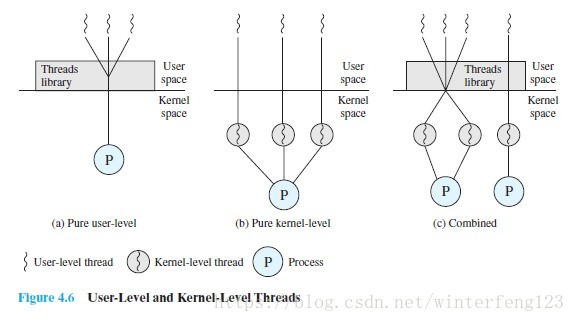

&nbsp;&nbsp;&nbsp;&nbsp;&nbsp;&nbsp;<b>用户级线程</b>（ULT：User Level Thread）和<b>内核级线程</b>（KLT：Kernel Level Thread）之间有什么关系和区别呢，跟进程呢？下面来看看详细介绍。

<!-- more -->

> 引言：
> &nbsp;&nbsp;&nbsp;&nbsp;&nbsp;&nbsp;本文涉及到操作系统的内核模式和用户模式，如果不太懂的话，可以参看看这篇文章：内核模式和用户模式，其中简单的进行了介绍。

# 1.进程和线程
&nbsp;&nbsp;&nbsp;&nbsp;&nbsp;&nbsp;首先说一下线程对于进程的优势，这其实就是线程出现的意义。
&nbsp;&nbsp;&nbsp;&nbsp;&nbsp;&nbsp;进程是资源拥有的基本单位，进程切换需要保存进程状态，会造成资源的消耗。同一进程中的线程，共享进程获取的部分资源。在同一进程中，线程的切换不会引起进程切换，线程的切换需要的资源少于进程切换，可以提高效率。

# 2.内核级线程（Kemel-Level Threads, KLT）
&nbsp;&nbsp;&nbsp;&nbsp;&nbsp;&nbsp;也有叫做内核支持的线程:
- 线程管理的所有工作（创建和撤销）由操作系统内核完成
- 操作系统内核提供一个应用程序设计接口API，供开发者使用KLT

&nbsp;&nbsp;&nbsp;&nbsp;&nbsp;&nbsp;<b>纯内核级线程特点</b>：

1. 进程中的一个线程被阻塞，内核能调度同一进程的其他线程（就绪态）占有处理器运行
2. 多处理器环境中，内核能同时调度同一进程的多线程，将这些线程映射到不同的处理器核心上，提高进程的执行效率。
3. 应用程序线程在用户态运行，线程调度和管理在内核实现。线程调度时，控制权从一个线程改变到另一线程，需要模式切换，系统开销较大。

# 3.用户级线程（User-Level Threads ULT）
&nbsp;&nbsp;&nbsp;&nbsp;&nbsp;&nbsp;用户空间运行线程库，任何应用程序都可以通过使用线程库被设计成多线程程序。线程库是用于用户级线程管理的一个例程包，它提供多线程应用程序的开发和运行支撑环境，包含：用于创建和销毁线程的代码、在线程间传递数据和消息的代码、调度线程执行的代码以及保存和恢复线程上下文的代码。
&nbsp;&nbsp;&nbsp;&nbsp;&nbsp;&nbsp;所以线程的创建，消息传递，调度，保存/恢复上下文都有线程库来完成。内核感知不到多线程的存在。内核继续以进程为调度单位，并且给该进程指定一个执行状态（就绪、运行、阻塞等）。

&nbsp;&nbsp;&nbsp;&nbsp;&nbsp;&nbsp;<b>纯用户级线程的特点</b>：

1. 线程切换不需要内核模式，能节省模式切换开销和内核资源。
2. 允许进程按照特定的需要选择不同的调度算法来调度线程。调度算法需要自己实现。
3. 由于其不需要内核进行支持，所以可以跨OS运行。
4. 不能利用多核处理器有点，OS调度进程，每个进程仅有一个ULT能执行
5. 一个ULT阻塞，将导致整个进程的阻塞。

&nbsp;&nbsp;&nbsp;&nbsp;&nbsp;&nbsp;jacketing技术可以解决ULT一个线程阻塞导致整个进程阻塞。
> jacketing的目标是把一个产生阻塞的系统调用转化成一个非阻塞的系统调用。例如,当进程中的一个线程调用IO中断钱，先调用一个应用级的I/O jacket例程，而不是直接调用一个系统I/O。让这个jacket例程检查并确定I/O设备是否忙。如果忙，则jacketing将控制权交给该进程的线程调度程序，决定该线程进入阻塞状态并将控制权传送给另一个线程（若无就绪态线程咋可能执行进程切换）。

# 4.线程实现的组合策略
&nbsp;&nbsp;&nbsp;&nbsp;&nbsp;&nbsp;可以看出，用户级线程和内核级线程都有各自的优点和缺点，在应用上主要表现为：

- 用户级多线程对于处理逻辑并行性问题有很好的效果。不擅长于解决物理并发问题。
- 内核级多线程适用于解决物理并行性问题。

&nbsp;&nbsp;&nbsp;&nbsp;&nbsp;&nbsp;组合策略：
&nbsp;&nbsp;&nbsp;&nbsp;&nbsp;&nbsp;由操作系统内核支持内核级多线程，由操作系统的程序库来支持用户级多线程，线程创建完全在用户空间创建，现成的调度也在应用程序内部进行，然后把用户级多线程映射到（或者说是绑定到）一些内核级多线程。编程人员可以针对不同的应用特点调节内核级线程的数目来达到物理并行性和逻辑并行性的最佳方案。

&nbsp;&nbsp;&nbsp;&nbsp;&nbsp;&nbsp;附上三种线程模式的图，帮助理解（来自网络，版权不可考，如发现出处可以联系作者删除或者增加版权说明）:

> 其实这里还有一个轻进程的概念，但是我觉得不写在本文中反而更好理解。另外如果有什么地方写的不好，欢迎大家评论交流。

- - -
<b>Believe yourself.</b>